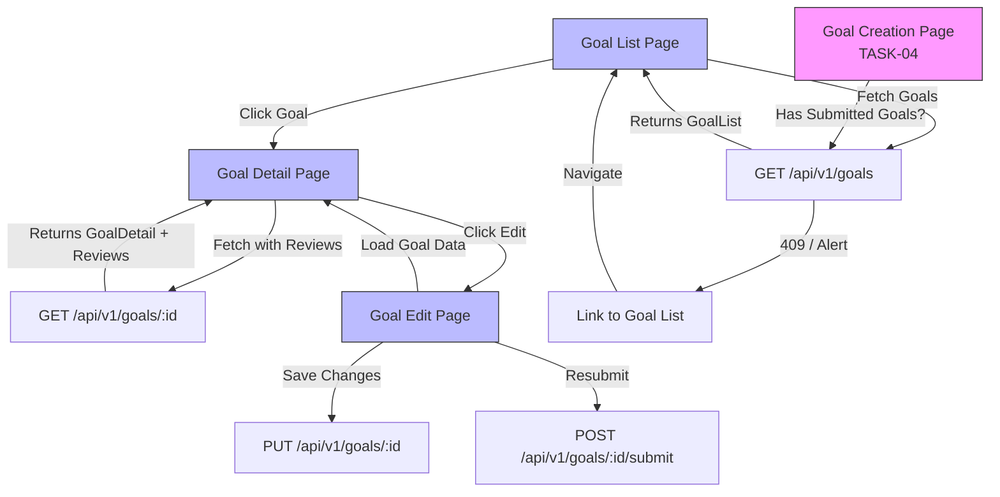

# Design Document: Improve Rejection Flow - Display Review Comments and Enable Resubmission

## 1. Overview

This document describes the technical design for implementing a complete UI/UX for viewing, editing, and resubmitting rejected goals. The solution focuses on frontend implementation while reusing existing backend APIs.

**Key Design Principles:**
- Reuse existing backend APIs (no new endpoints needed)
- Clear visual feedback for different goal statuses
- Prominent display of rejection comments
- Seamless integration with TASK-04 (duplicate prevention)
- Mobile-responsive and accessible UI

**Scope:**
- ✅ Frontend UI for goal list, detail, and edit pages
- ✅ Display supervisor reviews and comments
- ✅ Edit and resubmit rejected goals workflow
- ❌ Backend API changes (already exists)
- ❌ Notification system (out of scope)

## 2. Architecture Design

### 2.1. System Architecture Diagram



### 2.2. Technology Stack

- **Frontend:** Next.js 14 (App Router), TypeScript, React
- **UI Components:** shadcn/ui (Alert, Card, Badge, Button, Skeleton, Tabs)
- **State Management:** React hooks (useState, useEffect)
- **API Integration:** Existing endpoints + server actions
- **Styling:** Tailwind CSS
- **Icons:** Lucide React

**No Backend Changes Required** - All necessary APIs already exist.

## 3. Data Flow & API Usage

### 3.1. Existing Backend APIs (Reuse)

**GET /api/v1/goals**
- Fetch goals with filtering
- Query params: `periodId`, `status[]`, `goalCategory`
- Returns: `GoalList` (paginated)

**GET /api/v1/goals/{goal_id}**
- Fetch single goal with details
- Returns: `GoalDetail` (includes supervisor_reviews)

**PUT /api/v1/goals/{goal_id}**
- Update goal data
- Body: `GoalUpdate`
- Returns: Updated `Goal`

**POST /api/v1/goals/{goal_id}/submit**
- Change status from `draft`/`rejected` to `submitted`
- Returns: Updated `Goal`

**POST /api/v1/goals/{goal_id}/reject** (Supervisor only)
- Already exists, used by supervisors
- Body: `reason` (rejection comment)

### 3.2. Data Models

```typescript
// Frontend TypeScript types (already exist in project)

interface Goal {
  id: string;
  userId: string;
  periodId: string;
  goalCategory: '業績目標' | 'コンピテンシー' | 'コアバリュー';
  targetData: PerformanceGoalTargetData | CompetencyGoalTargetData;
  weight: number;
  status: 'draft' | 'submitted' | 'approved' | 'rejected';
  approvedBy?: string;
  approvedAt?: string;
  createdAt: string;
  updatedAt: string;
}

interface GoalDetail extends Goal {
  supervisorReviews?: SupervisorReview[];
  // ... other related data
}

interface SupervisorReview {
  id: string;
  goalId: string;
  supervisorId: string;
  subordinateId: string;
  action: 'APPROVED' | 'REJECTED' | 'PENDING';
  comment?: string;
  status: 'incomplete' | 'draft' | 'submitted';
  reviewedAt?: string;
  createdAt: string;
  updatedAt: string;
}
```

## 4. UI/UX Design

### 4.1. Goal List Page (`/goal-list`)

**New Page** - Primary interface for viewing all goals

**Layout:**
```
┌─────────────────────────────────────────────────────┐
│ 目標一覧 (Goal List)                    [New Goal] │
├─────────────────────────────────────────────────────┤
│ Filters:                                            │
│ [Period: 2025 Q2 ▼] [Status: All ▼] [Category: All ▼]│
├─────────────────────────────────────────────────────┤
│ ┌─ Goal Card (Rejected) ─────────────────────────┐ │
│ │ 🔴 差し戻し (Rejected)     業績目標   Weight: 50%│ │
│ │ 売上目標達成                                    │ │
│ │ 💬 Rejection: "目標が不明確です..."             │ │
│ │ Rejected by: 山田太郎  |  2025-10-01           │ │
│ │                    [View Details] [Edit & Resubmit]│ │
│ └───────────────────────────────────────────────┘ │
│ ┌─ Goal Card (Submitted) ────────────────────────┐ │
│ │ 🟡 承認待ち (Awaiting Approval)  コンピテンシー   │ │
│ │ リーダーシップ向上                              │ │
│ │ Submitted: 2025-10-05                          │ │
│ │                              [View Details]    │ │
│ └───────────────────────────────────────────────┘ │
│ ┌─ Goal Card (Approved) ─────────────────────────┐ │
│ │ 🟢 承認済み (Approved)       業績目標            │ │
│ │ 品質改善プロジェクト                            │ │
│ │ Approved by: 山田太郎  |  2025-10-03           │ │
│ │                              [View Details]    │ │
│ └───────────────────────────────────────────────┘ │
└─────────────────────────────────────────────────────┘
```

**Components:**
- `GoalListPage` - Main container
- `GoalFilterBar` - Filters (period, status, category)
- `GoalCard` - Individual goal display with status badge
- `RejectionCommentPreview` - Truncated comment with "Read more"
- `StatusBadge` - Color-coded status indicator

**Status Color Coding:**
- 🔴 Rejected (Red/Destructive)
- 🟡 Submitted (Yellow/Warning)
- 🟢 Approved (Green/Success)
- ⚪ Draft (Gray/Secondary)

### 4.2. Goal Detail Page (`/goal-detail/[id]`)

**Enhanced Existing Page** or **New Modal**

**Layout:**
```
┌─────────────────────────────────────────────────────┐
│ ← Back to List                                      │
│                                                     │
│ 業績目標: 売上目標達成                 🔴 差し戻し  │
│ Weight: 50% | Period: 2025 Q2                       │
├─────────────────────────────────────────────────────┤
│ ⚠️  Supervisor Review                               │
│ ┌───────────────────────────────────────────────┐  │
│ │ Action: REJECTED                               │  │
│ │ Comment:                                       │  │
│ │ "目標の数値が不明確です。120%の根拠を明記して" │  │
│ │ "ください。また、達成手段がより具体的である必要" │  │
│ │ "があります。"                                 │  │
│ │                                                │  │
│ │ Rejected by: 山田太郎 (Supervisor)             │  │
│ │ Date: 2025-10-01 14:30                         │  │
│ └───────────────────────────────────────────────┘  │
├─────────────────────────────────────────────────────┤
│ Goal Details                                        │
│ Title: 売上目標達成                                 │
│ Type: Quantitative                                  │
│ Specific Goal: Q2の売上を120%達成する               │
│ Achievement Criteria: 売上120%以上                  │
│ Means/Methods: 新規顧客開拓と既存顧客深耕           │
├─────────────────────────────────────────────────────┤
│                    [Close] [Edit & Resubmit]        │
└─────────────────────────────────────────────────────┘
```

**Components:**
- `GoalDetailView` - Main detail container
- `SupervisorReviewSection` - Display all reviews
- `RejectionAlert` - Prominent display for rejections
- `ApprovalBanner` - Positive banner for approvals
- `GoalFieldsDisplay` - Read-only goal data

### 4.3. Goal Edit/Resubmit Page

**Reuse Existing Goal Input Page** with modifications

**Modifications:**
- Show rejection comment at top (sticky banner)
- Pre-fill all fields with existing goal data
- Add "Save Draft" and "Resubmit for Approval" buttons
- Confirm dialog on navigation without saving

**Layout:**
```
┌─────────────────────────────────────────────────────┐
│ ⚠️  Rejection Feedback (Sticky Banner)              │
│ "目標の数値が不明確です。120%の根拠を明記してくだ"  │
│ "さい..."                            [Show Full ▼] │
├─────────────────────────────────────────────────────┤
│ Edit Goal: 売上目標達成                            │
│                                                     │
│ [Goal Input Form - Same as creation]               │
│ - Title                                            │
│ - Performance Goal Type                            │
│ - Specific Goal                                    │
│ - Achievement Criteria                             │
│ - Means/Methods                                    │
│                                                     │
├─────────────────────────────────────────────────────┤
│            [Cancel] [Save Draft] [Resubmit for Approval]│
└─────────────────────────────────────────────────────┘
```

**Flow:**
1. User clicks "Edit & Resubmit" on rejected goal
2. Navigate to `/goal-input?edit=<goal_id>&mode=resubmit`
3. Load goal data and rejection comments
4. Display sticky rejection banner
5. Enable all fields for editing
6. Two actions:
   - **Save Draft**: `PUT /api/v1/goals/:id` (status stays `rejected`)
   - **Resubmit**: `PUT` + `POST /submit` (status → `submitted`)

### 4.4. Integration with TASK-04 (Goal Creation Page)

**Modifications to Goal Creation Page:**

```typescript
// frontend/src/feature/goal-input/display/index.tsx

// Add at top of page
{hasSubmittedGoals && (
  <Alert variant="info">
    <AlertCircle className="h-4 w-4" />
    <AlertTitle>目標は既に提出されています</AlertTitle>
    <AlertDescription>
      提出済みの目標があるため、新しい目標を作成できません。
      <Link href="/goal-list" className="underline ml-1">
        目標一覧ページで確認してください
      </Link>
    </AlertDescription>
  </Alert>
)}

{hasRejectedGoals && !hasSubmittedGoals && (
  <Alert variant="warning">
    <AlertTriangle className="h-4 w-4" />
    <AlertTitle>差し戻された目標があります</AlertTitle>
    <AlertDescription>
      <Link href="/goal-list?status=rejected" className="underline">
        差し戻された目標を確認
      </Link>
      して編集・再提出してください。
      または、新しい目標を作成することもできます。
    </AlertDescription>
  </Alert>
)}
```

## 5. Component Design

### 5.1. Goal List Components

**`GoalListPage.tsx`**
```typescript
export default function GoalListPage() {
  const [goals, setGoals] = useState<Goal[]>([]);
  const [filters, setFilters] = useState({ status: 'all', period: currentPeriod });
  const [loading, setLoading] = useState(true);

  useEffect(() => {
    fetchGoals(filters);
  }, [filters]);

  return (
    <div className="container mx-auto p-6">
      <PageHeader title="目標一覧" action={<NewGoalButton />} />
      <GoalFilterBar filters={filters} onFilterChange={setFilters} />
      <GoalCardList goals={goals} loading={loading} />
    </div>
  );
}
```

**`GoalCard.tsx`**
```typescript
interface GoalCardProps {
  goal: Goal;
  showActions?: boolean;
}

export function GoalCard({ goal, showActions = true }: GoalCardProps) {
  // CRITICAL: Check for rejection based on SupervisorReview.action, not goal.status
  // This ensures comments remain visible even when status changes to "draft" during editing
  const latestReview = goal.supervisorReviews?.[0]; // Most recent review
  const hasRejectionFeedback = latestReview?.action === 'REJECTED';

  return (
    <Card className={cn("mb-4", getStatusBorderColor(goal.status))}>
      <CardHeader>
        <div className="flex justify-between items-start">
          <div>
            <StatusBadge status={goal.status} />
            <CardTitle>{getGoalTitle(goal)}</CardTitle>
            <CardDescription>
              {goal.goalCategory} | Weight: {goal.weight}%
            </CardDescription>
          </div>
        </div>
      </CardHeader>

      {/* Display rejection comment based on review action, NOT goal status */}
      {hasRejectionFeedback && (
        <CardContent>
          <RejectionCommentPreview review={latestReview} />
        </CardContent>
      )}

      {showActions && (
        <CardFooter className="flex gap-2">
          <Button variant="outline" asChild>
            <Link href={`/goal-detail/${goal.id}`}>View Details</Link>
          </Button>
          {/* Show edit button if there's rejection feedback, regardless of current status */}
          {hasRejectionFeedback && (
            <Button variant="default" asChild>
              <Link href={`/goal-input?edit=${goal.id}&mode=resubmit`}>
                Edit & Resubmit
              </Link>
            </Button>
          )}
        </CardFooter>
      )}
    </Card>
  );
}
```

**`StatusBadge.tsx`**
```typescript
const statusConfig = {
  draft: { label: '下書き', variant: 'secondary', icon: FileEdit },
  submitted: { label: '承認待ち', variant: 'warning', icon: Clock },
  approved: { label: '承認済み', variant: 'success', icon: CheckCircle },
  rejected: { label: '差し戻し', variant: 'destructive', icon: XCircle },
};

export function StatusBadge({ status }: { status: GoalStatus }) {
  const config = statusConfig[status];
  const Icon = config.icon;

  return (
    <Badge variant={config.variant} className="mb-2">
      <Icon className="w-3 h-3 mr-1" />
      {config.label}
    </Badge>
  );
}
```

**`RejectionCommentPreview.tsx`**
```typescript
export function RejectionCommentPreview({ review }: { review: SupervisorReview }) {
  const [expanded, setExpanded] = useState(false);
  const comment = review.comment || "コメントなし";
  const isTruncated = comment.length > 200;

  return (
    <Alert variant="destructive">
      <MessageCircle className="h-4 w-4" />
      <AlertTitle>Rejection Feedback</AlertTitle>
      <AlertDescription>
        <p className="text-sm">
          {expanded || !isTruncated ? comment : `${comment.slice(0, 200)}...`}
        </p>
        {isTruncated && (
          <Button
            variant="link"
            size="sm"
            onClick={() => setExpanded(!expanded)}
            className="p-0 h-auto"
          >
            {expanded ? 'Show less' : 'Read more'}
          </Button>
        )}
        <p className="text-xs text-muted-foreground mt-2">
          Rejected by: {review.supervisorName} | {formatDate(review.reviewedAt)}
        </p>
      </AlertDescription>
    </Alert>
  );
}
```

### 5.2. Filter Components

**`GoalFilterBar.tsx`**
```typescript
export function GoalFilterBar({ filters, onFilterChange }) {
  return (
    <div className="flex gap-4 mb-6">
      <Select
        value={filters.period}
        onValueChange={(period) => onFilterChange({ ...filters, period })}
      >
        <SelectTrigger className="w-[200px]">
          <SelectValue placeholder="Period" />
        </SelectTrigger>
        <SelectContent>
          {periods.map((p) => (
            <SelectItem key={p.id} value={p.id}>{p.name}</SelectItem>
          ))}
        </SelectContent>
      </Select>

      <Select
        value={filters.status}
        onValueChange={(status) => onFilterChange({ ...filters, status })}
      >
        <SelectTrigger className="w-[180px]">
          <SelectValue placeholder="Status" />
        </SelectTrigger>
        <SelectContent>
          <SelectItem value="all">All</SelectItem>
          <SelectItem value="draft">下書き</SelectItem>
          <SelectItem value="submitted">承認待ち</SelectItem>
          <SelectItem value="approved">承認済み</SelectItem>
          <SelectItem value="rejected">差し戻し</SelectItem>
        </SelectContent>
      </Select>

      {/* Category filter */}
    </div>
  );
}
```

## 6. State Management

### 6.1. Goal List State

```typescript
// Using React hooks (no global state needed)

const [goals, setGoals] = useState<Goal[]>([]);
const [filters, setFilters] = useState<GoalFilters>({
  periodId: currentPeriod,
  status: 'all',
  category: 'all',
});
const [loading, setLoading] = useState(false);
const [error, setError] = useState<string | null>(null);

// Fetch goals when filters change
useEffect(() => {
  async function loadGoals() {
    setLoading(true);
    const result = await getGoalsAction(filters);
    if (result.success) {
      setGoals(result.data.items);
    } else {
      setError(result.error);
    }
    setLoading(false);
  }
  loadGoals();
}, [filters]);
```

### 6.2. Edit & Resubmit State

```typescript
// In goal edit page
const [goalData, setGoalData] = useState<GoalUpdate | null>(null);
const [rejectionReview, setRejectionReview] = useState<SupervisorReview | null>(null);
const [isDirty, setIsDirty] = useState(false);

// Load goal and reviews
useEffect(() => {
  async function loadGoal() {
    const result = await getGoalByIdAction(goalId);
    if (result.success) {
      setGoalData(result.data);

      // CRITICAL: Store rejection review regardless of current goal status
      // This ensures comments remain visible even if status changes to "draft"
      const latestReview = result.data.supervisorReviews?.[0];
      if (latestReview?.action === 'REJECTED') {
        setRejectionReview(latestReview);
      }
    }
  }
  loadGoal();
}, [goalId]);

// Display rejection banner based on review existence
const showRejectionBanner = rejectionReview !== null;

// Handle navigation away
useEffect(() => {
  const handleBeforeUnload = (e: BeforeUnloadEvent) => {
    if (isDirty) {
      e.preventDefault();
      e.returnValue = '';
    }
  };
  window.addEventListener('beforeunload', handleBeforeUnload);
  return () => window.removeEventListener('beforeunload', handleBeforeUnload);
}, [isDirty]);
```

## 7. Routing & Navigation

### 7.1. New Routes

```typescript
// app/goal-list/page.tsx
export default function GoalListPage() { ... }

// app/goal-detail/[id]/page.tsx
export default function GoalDetailPage({ params }: { params: { id: string } }) { ... }
```

### 7.2. Navigation Flow

```
Goal Creation Page (TASK-04)
  ↓ (has submitted goals)
Alert with Link
  ↓
Goal List Page (/goal-list)
  ↓ (click goal)
Goal Detail (/goal-detail/:id)
  ↓ (click Edit & Resubmit)
Goal Edit (/goal-input?edit=:id&mode=resubmit)
  ↓ (resubmit)
Back to Goal List
```

## 8. Performance Considerations

### 8.1. Data Fetching

- **Server-side rendering** for initial goal list (SSR)
- **Client-side filtering** when possible (reduce API calls)
- **Pagination** for large goal lists (reuse existing pagination)
- **Caching** with React Query or SWR (optional enhancement)

### 8.2. Optimization

```typescript
// Memoize expensive computations
const filteredGoals = useMemo(() => {
  return goals.filter(g => matchesFilter(g, filters));
}, [goals, filters]);

// Lazy load goal details
const GoalDetail = lazy(() => import('./GoalDetail'));
```

## 9. Error Handling

### 9.1. Loading States

```typescript
{loading && <GoalListSkeleton />}
{error && <ErrorAlert message={error} onRetry={refetch} />}
{!loading && goals.length === 0 && <EmptyState />}
```

### 9.2. API Error Handling

```typescript
try {
  const result = await resubmitGoalAction(goalId);
  if (!result.success) {
    toast.error(`再提出に失敗しました: ${result.error}`);
    return;
  }
  toast.success('目標を再提出しました');
  router.push('/goal-list');
} catch (error) {
  toast.error('予期しないエラーが発生しました');
  console.error(error);
}
```

## 10. Accessibility

- Keyboard navigation (Tab, Enter, Escape)
- ARIA labels for screen readers
- Focus management (modals, alerts)
- Semantic HTML (`<nav>`, `<article>`, `<section>`)
- Color contrast ratio >4.5:1

## 11. Mobile Responsiveness

```css
/* Responsive layout */
.goal-list-container {
  @apply grid grid-cols-1 md:grid-cols-2 lg:grid-cols-3 gap-4;
}

.goal-card {
  @apply w-full;
}

/* Mobile: Stack actions vertically */
@media (max-width: 640px) {
  .card-footer {
    @apply flex-col;
  }
}
```

## 12. Testing Strategy

### 12.1. Component Tests (Optional - No frontend tests currently)

If tests are added in future:
- GoalCard renders correctly for each status
- Rejection comment truncation works
- Filter changes update list
- Navigation to edit page works

### 12.2. Manual E2E Testing (Required)

See tasks.md for detailed E2E scenarios.

## 13. Critical Implementation Note: Review Display Logic

**⚠️ IMPORTANT UX REQUIREMENT:**

Rejection comments MUST remain visible even when goal status changes during editing. This is critical for user experience.

### The Problem
When a subordinate edits a rejected goal:
1. Goal status changes from `rejected` → `draft`
2. If UI only checks `goal.status === 'rejected'`, comments disappear
3. Subordinate loses context of supervisor feedback

### The Solution
**Display logic based on SupervisorReview existence, NOT goal status:**

```typescript
// ❌ WRONG - Comments disappear when status changes
{goal.status === 'rejected' && goal.supervisorReview && (
  <RejectionAlert comment={goal.supervisorReview.comment} />
)}

// ✅ CORRECT - Comments persist regardless of status
{goal.supervisorReview?.action === 'REJECTED' && (
  <RejectionAlert
    comment={goal.supervisorReview.comment}
    reviewedAt={goal.supervisorReview.reviewedAt}
  />
)}
```

### Implementation Checklist
- [ ] GoalCard: Check `supervisorReview.action === 'REJECTED'`
- [ ] GoalDetailView: Display reviews based on review.action
- [ ] GoalEditPage: Show rejection banner based on review existence
- [ ] RejectionAlert: Include timestamp for context
- [ ] All components: Never rely solely on `goal.status` for review display

### Database Persistence
SupervisorReview records persist in the database even when goal.status changes. The relationship is maintained through foreign keys, ensuring historical review data is never lost during status transitions.

## 14. Future Enhancements

### 14.1. Review Timeline/History

**Current State:** 1:1 relationship (goal ↔ supervisorReview)
**Future Enhancement:** Allow multiple review cycles with full history

```typescript
interface GoalWithReviewHistory {
  goal: Goal;
  reviews: SupervisorReview[]; // Ordered by reviewedAt DESC
}

// Timeline UI showing all review iterations
{reviews.map((review, index) => (
  <TimelineItem
    key={review.id}
    iteration={reviews.length - index}
    action={review.action}
    comment={review.comment}
    reviewedAt={review.reviewedAt}
    reviewerName={review.supervisorName}
  />
))}
```

This would require backend schema changes to support multiple SupervisorReview records per goal.

### 14.2. Real-time Updates

- WebSocket notifications when supervisor reviews goal
- Auto-refresh goal list when status changes

### 14.3. Bulk Operations

- Select multiple rejected goals
- Bulk edit and resubmit

### 14.4. Version Comparison

- Show goal edit history
- Compare versions before/after rejection
- Highlight what changed since last review

### 14.5. Comments Thread

- Allow subordinates to reply to supervisor comments
- Two-way communication within rejection flow
