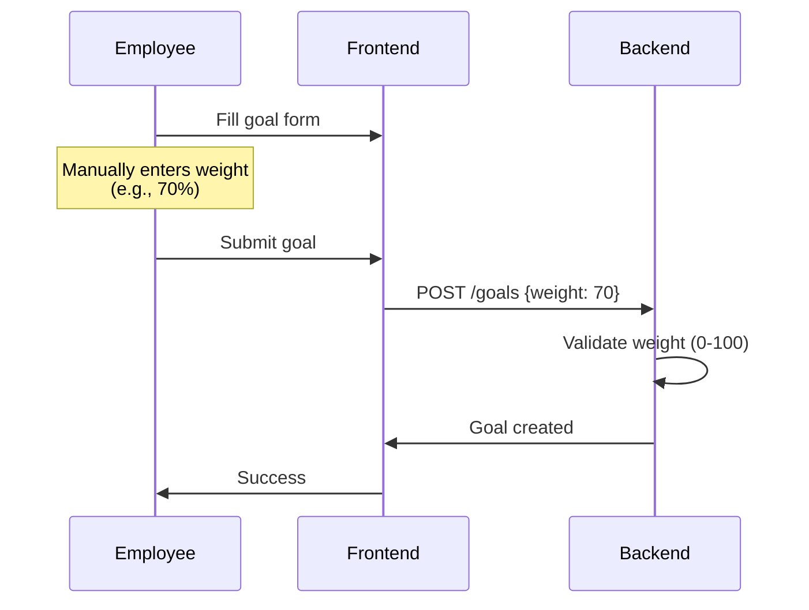
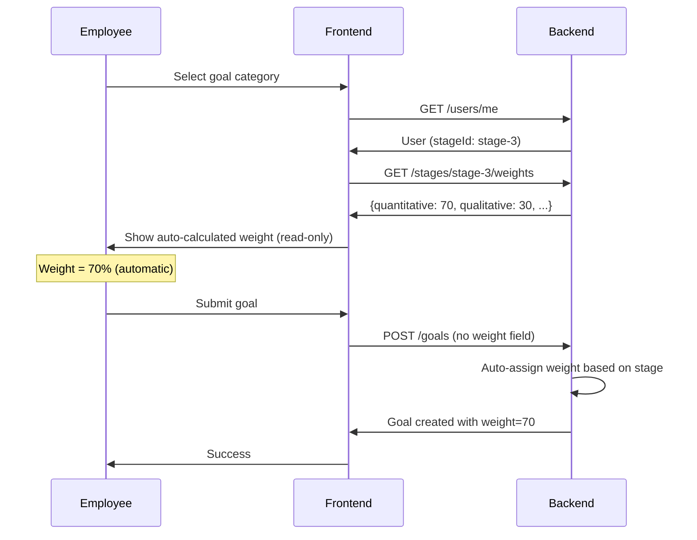

# Context: HR Evaluation System Goal Weights

## 📋 Overview

This document provides context about the current HR evaluation system's goal weighting mechanism and why automatic stage-based weight configuration is needed.

**GitHub Issue**: [#305](https://github.com/shintairiku/evaluation-system/issues/305)

---

## 🏗️ Current System Architecture

### Goal Categories and Weights

The evaluation system supports three types of goals:

1. **業績目標 (Performance Goals)** - Two subtypes:
   - **定量目標 (Quantitative)**: Measurable, numerical targets (e.g., "Increase sales by 20%")
   - **定性目標 (Qualitative/PJ)**: Qualitative project-based goals (e.g., "Lead team training initiative")

2. **コンピテンシー (Competency Goals)**:
   - Behavioral skills and competencies aligned with employee's stage
   - Linked to stage-specific competency framework

3. **コアバリュー (Core Value Goals)**:
   - Company core values embodiment goals
   - Currently supported in schema but not actively used

### Current Weight System

**Database Model** ([goal.py:26](backend/app/database/models/goal.py#L26)):
```python
class Goal(Base):
    weight = Column(DECIMAL(5, 2), nullable=False)  # 0-100
    # Constraint: weight >= 0 AND weight <= 100
```

**API Schema** ([goal.py:84](backend/app/schemas/goal.py#L84)):
```python
class GoalCreate(BaseModel):
    weight: float = Field(..., ge=0, le=100)
```

**Current Behavior:**
- Employees manually enter weight when creating each goal
- No automatic validation of weight distribution
- No stage-based defaults
- System allows any weight 0-100 per individual goal

---

## 🎭 User Roles and Stages

### Stage Hierarchy

The organization uses a 9-stage career progression system:

| Stage Range | Typical Roles | Responsibilities |
|-------------|---------------|------------------|
| **Stage 1-3** | Junior, Intermediate | Individual contributors, some project leadership |
| **Stage 4-5** | Senior, Team Lead | Team management, strategic projects |
| **Stage 6-9** | Manager, Director, Executive | Department/org management, company strategy |

**Stage Model** ([stage_competency.py:9-23](backend/app/database/models/stage_competency.py#L9-23)):
```python
class Stage(Base):
    __tablename__ = "stages"

    id = Column(UUID, primary_key=True)
    organization_id = Column(String(50), ForeignKey("organizations.id"))
    name = Column(Text, nullable=False)
    description = Column(Text)
    # NO WEIGHT FIELDS YET (to be added)
```

**User-Stage Relationship** ([user.py](backend/app/database/models/user.py)):
```python
class User(Base):
    stage_id = Column(UUID, ForeignKey("stages.id"))
    stage = relationship("Stage", back_populates="users")
```

---

## 📊 Current Weight Distribution Problems

### Problem 1: Manual Input Errors

**Example Scenario:**
```
Employee: Tanaka-san (Stage 3)
Creating 3 performance goals:

Goal 1 (定量): Weight = 60%  ← Manually entered
Goal 2 (定量): Weight = 65%  ← Typo! Should be 70%
Goal 3 (定性): Weight = 25%  ← Manually entered

Total: 150% ❌ INVALID (but system allows it per-goal)
```

**Issues:**
- No validation that total weights across all goals = 100%
- Employees confused about correct weights for their stage
- Typos and calculation errors common

### Problem 2: Inconsistent Evaluations

**Example Scenario:**
```
Two employees at same stage (Stage 3):

Employee A:
- Quantitative goals: 70% total
- Qualitative goals: 20% total
- Competency goals: 10% total

Employee B:
- Quantitative goals: 50% total
- Qualitative goals: 40% total
- Competency goals: 10% total

Same stage, different weight distributions → Unfair comparison
```

### Problem 3: Cognitive Load

Employees must remember:
- Which weight percentages apply to their stage
- How to split weights across multiple goals in same category
- What happens if they create fewer/more goals than expected

Current process:
1. Employee starts creating a goal
2. Stops to look up correct weight for their stage
3. Calculates weight for this specific goal
4. Enters weight manually
5. Hopes they got it right

**Time waste**: 15-20 seconds per goal × 6-8 goals = 2-3 minutes extra per evaluation period

---

## 🎯 Organizational Weight Policy

Based on the organizational evaluation framework, the desired weight distribution is:

### Stage 1-3 (Junior/Intermediate)
- **定量 (Quantitative)**: 70% of evaluation
  - Focus on measurable output and task completion
  - Individual performance metrics
- **定性/PJ (Qualitative)**: 30% of evaluation
  - Small project contributions
  - Team collaboration
- **コンピテンシー (Competency)**: 10% of evaluation
  - Skill development
  - Behavioral competencies

### Stage 4-5 (Senior/Team Lead)
- **定量 (Quantitative)**: 80% of evaluation
  - Higher accountability for measurable results
  - Team/project KPIs
- **定性/PJ (Qualitative)**: 20% of evaluation
  - Cross-functional project leadership
- **コンピテンシー (Competency)**: 10% of evaluation
  - Leadership competencies
  - Mentoring skills

### Stage 6-9 (Manager/Executive)
- **定量 (Quantitative)**: 100% of evaluation
  - Pure results-driven evaluation
  - Strategic KPIs and business outcomes
- **定性/PJ (Qualitative)**: Not applicable
  - At this level, all work is quantifiable
- **コンピテンシー (Competency)**: 10% of evaluation
  - Strategic thinking
  - Organizational leadership

**Note**: These percentages represent the weight distribution across goal types, not individual goal weights.

---

## 🔄 Weight Calculation Logic

### Current System (Manual)

```typescript
// frontend: Goal creation form
function createGoal(formData) {
  return {
    goalCategory: "業績目標",
    performanceGoalType: "quantitative",
    weight: 70, // ← Employee types this in manually
    // ... other fields
  }
}
```

### Proposed System (Automatic)

```python
# backend: Auto-assign weight based on user's stage
def create_goal(goal_data: GoalCreate, user_id: UUID):
    user = get_user(user_id)
    stage_config = get_stage_weight_config(user.stage_id)

    # Auto-calculate weight based on goal category and type
    if goal_data.goal_category == "業績目標":
        if goal_data.performance_goal_type == "quantitative":
            auto_weight = stage_config.quantitative_weight  # e.g., 70.0
        elif goal_data.performance_goal_type == "qualitative":
            auto_weight = stage_config.qualitative_weight   # e.g., 30.0
    elif goal_data.goal_category == "コンピテンシー":
        auto_weight = stage_config.competency_weight        # e.g., 10.0

    # Override user-provided weight with automatic value
    goal_data.weight = auto_weight

    return save_goal(goal_data)
```

---

## 🔧 Technical Components to Modify

### Backend Changes Required

1. **Database Schema** ([stage_competency.py](backend/app/database/models/stage_competency.py)):
   ```python
   class Stage(Base):
       # ADD these fields:
       quantitative_weight = Column(DECIMAL(5,2))
       qualitative_weight = Column(DECIMAL(5,2))
       competency_weight = Column(DECIMAL(5,2))
   ```

2. **API Schemas** ([stage_competency.py](backend/app/schemas/stage_competency.py)):
   ```python
   class StageWeightConfig(BaseModel):
       quantitative_weight: float
       qualitative_weight: float
       competency_weight: float

   class StageUpdate(BaseModel):
       # ADD optional weight fields
       quantitative_weight: Optional[float] = None
       qualitative_weight: Optional[float] = None
       competency_weight: Optional[float] = None
   ```

3. **Goal Service** ([goal_service.py](backend/app/services/goal_service.py)):
   ```python
   class GoalService:
       async def create_goal(self, goal_data, user_id):
           # ADD auto-weight logic
           user = await self.user_repo.get_user(user_id)
           stage_weights = await self.stage_repo.get_weights(user.stage_id)
           goal_data.weight = self._calculate_weight(goal_data, stage_weights)
   ```

4. **API Endpoints** (New):
   ```python
   # GET /api/v1/stages/{stage_id}/weights
   # PATCH /api/v1/stages/{stage_id}/weights (admin only)
   ```

### Frontend Changes Required

1. **Types** ([frontend/src/api/types/](frontend/src/api/types/)):
   ```typescript
   // ADD new type
   export interface StageWeightConfig {
     quantitativeWeight: number;
     qualitativeWeight: number;
     competencyWeight: number;
   }

   export interface Stage {
     id: string;
     name: string;
     // ADD:
     quantitativeWeight?: number;
     qualitativeWeight?: number;
     competencyWeight?: number;
   }
   ```

2. **Goal Creation Form** (to be located):
   - Remove manual weight input field
   - Add read-only weight display
   - Fetch and show auto-calculated weight

3. **Admin Stage Management** (New page):
   - Display stage list with weight configuration
   - Edit modal for weight configuration
   - Validation and save functionality

---

## 🎯 User Flows

### Current Flow: Create Goal (Employee)



**Pain Points:**
- Employee must know correct weight
- Manual entry error-prone
- No stage-based validation

### Proposed Flow: Create Goal (Employee)



**Benefits:**
- Zero manual input
- Automatic stage-based weight
- Consistent across all employees

---

## 📊 Migration Considerations

### Existing Goals

**Question**: What happens to goals created before this feature?

**Options:**

1. **Leave as-is** (Recommended):
   - Existing goals keep their manually-entered weights
   - Only new goals use automatic weights
   - Pros: No data migration risk, historical consistency
   - Cons: Inconsistency between old and new goals

2. **Force migration**:
   - Update all existing goals to use stage-based weights
   - Pros: Complete consistency
   - Cons: Changes historical data, may affect completed evaluations

3. **Optional admin migration**:
   - Provide admin tool to update specific goals/periods
   - Pros: Flexibility, controlled migration
   - Cons: More complex implementation

**Recommendation**: Option 1 (leave as-is) for initial release, Option 3 for future enhancement

---

## 🔗 Related System Components

### Competency Framework

Competencies are already stage-based:
- Each stage has specific competencies ([Competency model](backend/app/database/models/stage_competency.py))
- Competency goals reference these stage competencies
- Weight standardization completes the stage-based evaluation framework

### Evaluation Periods

Goals are created within evaluation periods:
- Typically 2 evaluation periods per year (mid-year, year-end)
- Weight configuration should remain consistent within a period
- Admin can adjust weights between periods if policy changes

### Supervisor Approval

Supervisors approve employee goals:
- Currently check weights manually during approval
- With automatic weights, approval faster (one less thing to verify)
- Rejection comments no longer need to mention weight errors

---

## 🚀 Success Vision

### Before (Current State)

```
Employee creates 6 goals:
- 3 quantitative: Manually enters 70%, 70%, 65% (typo!)
- 2 qualitative: Manually enters 30%, 30%
- 1 competency: Manually enters 10%

Total: 275% ❌ Invalid
Supervisor rejects → Employee fixes → Resubmits
Time wasted: 10+ minutes
```

### After (Automatic Weights)

```
Employee creates 6 goals:
- 3 quantitative: Weight = 70% (automatic)
- 2 qualitative: Weight = 30% (automatic)
- 1 competency: Weight = 10% (automatic)

Total: Configured per stage ✅
Supervisor approves immediately
Time saved: 10 minutes
```

---

## 📝 Assumptions & Constraints

### Assumptions

1. **Stage-based policy**: Weight distribution is determined by employee stage, not department or role
2. **Consistent within stage**: All employees at same stage have same weight distribution
3. **Admin configurability**: Admins can adjust default weights per stage as policy evolves
4. **No per-goal splitting**: If employee creates multiple quantitative goals, each gets full quantitative weight (not split)

### Constraints

1. **Backward compatibility**: Existing goals must remain unchanged
2. **Performance**: Weight calculation must not add noticeable latency to goal creation
3. **Validation**: System must prevent invalid weight configurations at admin level
4. **Audit trail**: Changes to stage weight configuration should be logged

---

## 🔍 References

**Related Code:**
- Goal model: `backend/app/database/models/goal.py`
- Goal schemas: `backend/app/schemas/goal.py`
- Stage model: `backend/app/database/models/stage_competency.py`
- Stage schemas: `backend/app/schemas/stage_competency.py`
- Goal service: `backend/app/services/goal_service.py`

**Related Documentation:**
- Stage-competency management spec: `.kiro/specs/stage-competency-management/`
- RBAC permissions: `backend/app/security/permissions.py`

---

**Last Updated**: 2024-11-06
**Status**: 📋 Context Complete
**Next Steps**: Review requirements.md for detailed functional requirements
