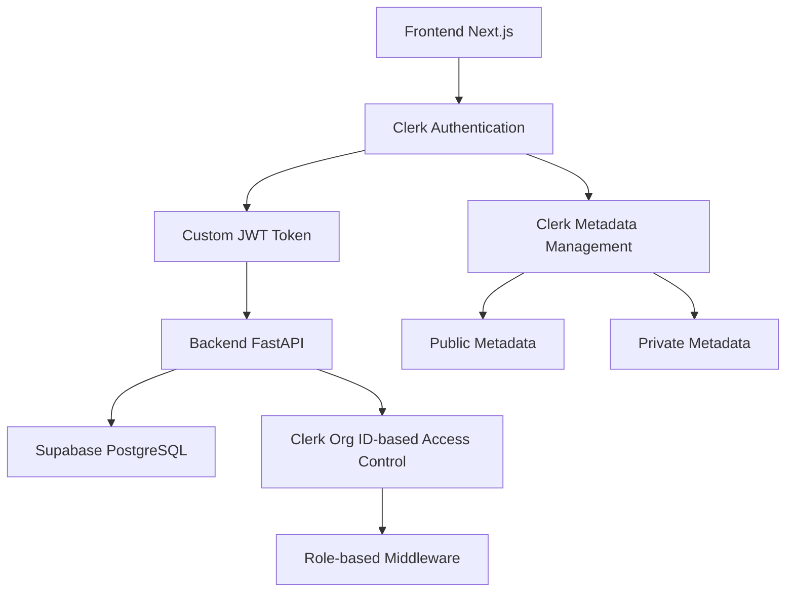
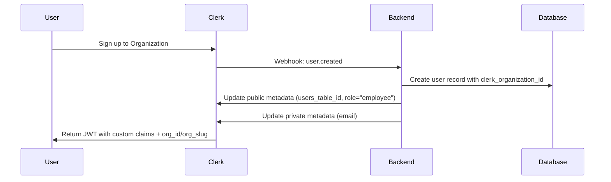
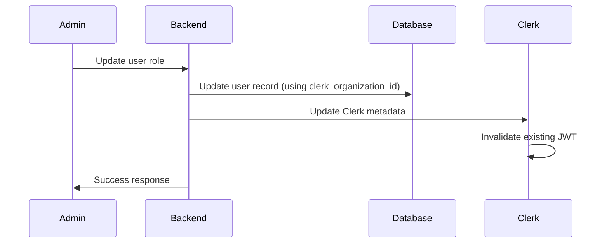

# 設計書: Custom JWT Token Enhancement with Organization Support

## 1. 概要

このドキュメントは、要件定義書に基づいてClerkのカスタムJWTトークン拡張と組織機能の有効化に関するシステム設計を記述するものです。JWTトークンへのユーザー情報追加、メタデータ管理、組織ベースのマルチテナント機能、管理者機能の実装について技術的な仕様を定義します。組織の識別にはClerkが発行するOrganization IDを直接使用し、内部で独自の組織IDは発行しません。

## 2. アーキテクチャ設計

### 2.1. システム構成図


### 2.2. 技術スタック
- **認証:** Clerk with Organizations enabled
- **JWTトークン拡張:** Clerk Custom Claims
- **フロントエンド:** Next.js App Router, TypeScript
- **バックエンド:** FastAPI with Clerk organization ID-aware middleware
- **データベース:** Supabase PostgreSQL with Clerk organization_id filtering

## 3. Clerk設定設計

### 3.1. 組織機能設定
- **Organizations:** 有効化
- **Organization roles:** Admin, Member
- **Organization permissions:** 組織ごとのデータアクセス制御

### 3.2. Custom JWT Claims設定
```json
{
  "user_id": "{{user.public_metadata.users_table_id}}",
  "email": "{{user.private_metadata.email}}",
  "role": "{{user.public_metadata.role}}",
  "organization_id": "{{user.org_id}}",
  "organization_name": "{{user.org_slug}}"
}
```

### 3.3. メタデータ構造設計

#### Public Metadata
```typescript
interface PublicMetadata {
  users_table_id: string;  // 内部ユーザーテーブルのID
  role: string;            // "admin" | "manager" | "employee"
}
```

#### Private Metadata
```typescript
interface PrivateMetadata {
  email: string;
}
```

## 4. データベース設計

### 4.1. 既存テーブルの更新

#### `users` テーブル拡張
| カラム名 | データ型 | 説明 | 制約 |
|---|---|---|---|
| 既存カラム | ... | ... | ... |
| `clerk_organization_id` | `VARCHAR(255)` | Clerkの組織ID | `NOT NULL` |

**注意:** 内部独自の組織IDは作成せず、Clerkの`organization_id`を直接使用します。

#### `organizations` テーブル（新規作成）
| カラム名 | データ型 | 説明 | 制約 |
|---|---|---|---|
| `clerk_organization_id` | `VARCHAR(255)` | Clerkの組織ID | `PRIMARY KEY` |
| `name` | `VARCHAR(255)` | 組織名 | `NOT NULL` |
| `created_at` | `TIMESTAMP` | 作成日時 | `DEFAULT CURRENT_TIMESTAMP` |
| `updated_at` | `TIMESTAMP` | 更新日時 | `DEFAULT CURRENT_TIMESTAMP` |

## 5. APIエンドポイント設計

### 5.1. 認証ミドルウェア更新

#### 組織認証ミドルウェア
```python
class OrganizationAuthMiddleware:
    def verify_organization_access(self, jwt_token: str, required_clerk_org_id: str) -> bool:
        # JWTトークンからClerk組織IDを抽出
        # 要求されたClerk組織IDと一致するかチェック
        pass
    
    def verify_admin_access(self, jwt_token: str) -> bool:
        # JWTトークンからroleを抽出
        # "admin"ロールかチェック
        pass
```

### 5.2. 新規管理者エンドポイント

#### `POST /api/admin/users`
- **説明:** 管理者が組織内の新規ユーザーを作成
- **認証:** 管理者ロール必須
- **リクエストボディ:**
  ```json
  {
    "email": "string",
    "role": "admin" | "manager" | "employee",
    "name": "string"
  }
  ```

#### `GET /api/admin/organizations/{clerk_org_id}/users`
- **説明:** 組織内のユーザー一覧取得
- **認証:** 管理者ロール必須
- **レスポンス:**
  ```json
  {
    "users": [
      {
        "id": "string",
        "email": "string",
        "name": "string",
        "role": "string",
        "clerk_organization_id": "string",
        "created_at": "string"
      }
    ]
  }
  ```

### 5.3. メタデータ同期エンドポイント

#### `PUT /api/users/{user_id}/metadata`
- **説明:** ユーザー情報更新時のClerkメタデータ同期
- **内部処理:**
  1. データベースの更新（Clerk organization IDを使用）
  2. Clerk Public/Private Metadataの更新
  3. JWTトークンの無効化（次回ログイン時に最新情報を取得）

## 6. フロントエンド設計

### 6.1. JWTトークン活用

#### カスタムフック: `useJWTUserInfo`
```typescript
interface JWTUserInfo {
  user_id: string;
  email: string;
  role: string;
  organization_id: string;  // Clerk Organization ID
  organization_name: string;
}

export function useJWTUserInfo(): JWTUserInfo | null {
  // Clerkからアクセストークンを取得
  // JWTをデコードしてユーザー情報を返す
}
```

#### 管理者ルート保護
```typescript
// /src/app/admin/layout.tsx
export default function AdminLayout() {
  const userInfo = useJWTUserInfo();
  
  if (userInfo?.role !== 'admin') {
    redirect('/unauthorized');
  }
  
  return <>{children}</>;
}
```

### 6.2. 組織切り替え機能

#### 組織セレクター
```typescript
// /src/components/OrganizationSelector.tsx
export function OrganizationSelector() {
  // Clerkの組織機能を使用
  // 現在の組織表示と切り替え機能
  // Clerk Organization IDを直接使用
}
```

## 7. セキュリティ設計

### 7.1. データアクセス制御

#### Repository層での組織フィルタリング
```python
class BaseRepository:
    def filter_by_clerk_organization(self, query, clerk_organization_id: str):
        return query.filter(clerk_organization_id=clerk_organization_id)
```

#### Service層での権限チェック
```python
class UserService:
    def get_users_by_organization(self, clerk_organization_id: str, requesting_user_role: str):
        # 管理者権限チェック
        if requesting_user_role not in ['admin', 'manager']:
            raise PermissionError()
        
        # Clerk組織IDでフィルタリング
        return self.user_repository.get_by_clerk_organization(clerk_organization_id)
```

### 7.2. JWTトークンセキュリティ

- **Public Metadata:** 機密性の低い情報のみ（user_id, role）
- **Private Metadata:** より機密な情報（email）
- **Clerk Native Claims:** 組織情報はClerkのネイティブクレーム（org_id, org_slug）を使用
- **トークン更新:** メタデータ変更時の自動無効化

## 8. 運用設計

### 8.1. ユーザーサインアップフロー


### 8.2. メタデータ更新フロー


### 8.3. 組織データ管理

- **組織作成:** Clerkで組織が作成された際のWebhookでorganizationsテーブルに記録
- **組織削除:** Clerkで組織が削除された際の関連ユーザーデータのクリーンアップ
- **組織移動:** ユーザーの組織移動時のデータ整合性確保