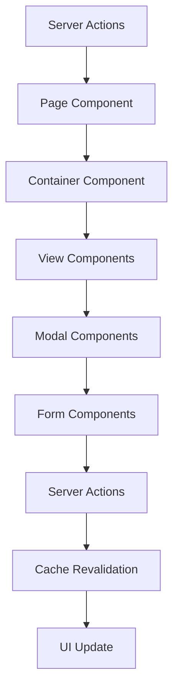

# Design Document

## Overview

The Evaluation Period Management feature provides a comprehensive administrative interface for managing evaluation periods within the HR evaluation system. This feature integrates seamlessly with the existing admin interface, following established patterns from the stage management and department management systems. The design emphasizes user experience with dual-view capabilities (calendar and list), smart form interactions, and detailed analytics through goal statistics modals.

## Architecture

### Component Hierarchy

```
EvaluationPeriodManagementPage (Server Component)
├── EvaluationPeriodManagementContainer (Client Component)
    ├── EvaluationPeriodManagementHeader
    │   ├── ViewToggle (Calendar/List)
    │   └── CreatePeriodButton
    ├── EvaluationPeriodCalendarView
    │   ├── CalendarComponent
    │   └── PeriodEventCard
    ├── EvaluationPeriodListView
    │   ├── PeriodCategorySection (現在/予定/完了/キャンセル)
    │   └── PeriodCard
    │       ├── PeriodInfo
    │       ├── GoalStatistics
    │       └── ActionButtons (編集/削除)
    ├── CreateEditPeriodModal
    │   ├── PeriodForm
    │   │   ├── BasicInfoFields
    │   │   ├── DateFields
    │   │   └── SmartDateCalculation
    │   └── FormActions
    ├── DeleteConfirmationModal
    └── GoalStatisticsModal
        ├── StatisticsHeader
        ├── UserActivityTable
        └── FilterControls
```

### Data Flow



## Components and Interfaces

### Core Components

#### 1. EvaluationPeriodManagementPage (Server Component)
```typescript
// app/evaluation-period-management/page.tsx
interface EvaluationPeriodManagementPageProps {
  searchParams: {
    view?: 'calendar' | 'list';
    period?: string;
  };
}
```

**Responsibilities:**
- Fetch initial data using server actions
- Handle URL search parameters for view state
- Pass data to client components

#### 2. EvaluationPeriodManagementContainer (Client Component)
```typescript
interface EvaluationPeriodManagementContainerProps {
  initialPeriods: CategorizedEvaluationPeriods;
  initialView: 'calendar' | 'list';
}
```

**Responsibilities:**
- Manage view state (calendar vs list)
- Handle modal state management
- Coordinate between child components
- Handle optimistic updates

#### 3. EvaluationPeriodCalendarView
```typescript
interface CalendarViewProps {
  periods: EvaluationPeriod[];
  onPeriodClick: (period: EvaluationPeriod) => void;
  onDateClick: (date: Date) => void;
}
```

**Features:**
- Full calendar display with month/week/day views
- Color-coded periods based on status
- Click handlers for periods and dates
- Responsive design for mobile devices

#### 4. EvaluationPeriodListView
```typescript
interface ListViewProps {
  categorizedPeriods: CategorizedEvaluationPeriods;
  onEditPeriod: (period: EvaluationPeriod) => void;
  onDeletePeriod: (period: EvaluationPeriod) => void;
  onViewGoalStats: (period: EvaluationPeriod) => void;
}
```

**Features:**
- Categorized sections (現在/予定/完了/キャンセル)
- Period cards with essential information
- Goal statistics with clickable counts
- Action buttons for edit/delete operations

#### 5. CreateEditPeriodModal
```typescript
interface CreateEditPeriodModalProps {
  isOpen: boolean;
  onClose: () => void;
  period?: EvaluationPeriod; // undefined for create mode
  onSubmit: (data: EvaluationPeriodCreate | EvaluationPeriodUpdate) => Promise<void>;
}

interface PeriodFormData {
  name: string;
  period_type: 'HALF_TERM' | 'MONTHLY' | 'QUARTERLY' | 'YEARLY' | 'OTHER';
  start_date: Date;
  end_date: Date;
  goal_submission_deadline: Date;
  evaluation_deadline: Date;
}
```

**Smart Date Calculation Logic:**
```typescript
const calculateEndDate = (startDate: Date, periodType: string): Date => {
  const start = new Date(startDate);
  switch (periodType) {
    case 'HALF_TERM': return addMonths(start, 6);
    case 'MONTHLY': return addMonths(start, 1);
    case 'QUARTERLY': return addMonths(start, 3);
    case 'YEARLY': return addYears(start, 1);
    case 'OTHER': return start; // No calculation
    default: return start;
  }
};
```

#### 6. GoalStatisticsModal
```typescript
interface GoalStatisticsModalProps {
  isOpen: boolean;
  onClose: () => void;
  period: EvaluationPeriod;
  goalStats: GoalStatistics;
}

interface GoalStatistics {
  total: number;
  byStatus: Record<string, number>;
  userActivities: UserActivity[];
}

interface UserActivity {
  userId: UUID;
  userName: string;
  userRole: string;
  subordinateName?: string;
  supervisorName?: string;
  lastGoalSubmission?: Date;
  lastReviewSubmission?: Date;
  goalCount: number;
  goalStatuses: Record<string, number>;
}
```

### Navigation Integration

#### Routes Configuration Update
```typescript
// frontend/src/components/constants/routes.ts
{
  title: '管理者機能',
  links: [
    {
      href: '/user-management',
      label: 'ユーザー管理',
      sublabel: 'User Management',
      icon: 'user-cog',
      permission: 'admin'
    },
    {
      href: '/department-management',
      label: '部門管理',
      sublabel: 'Department Management',
      icon: 'building',
      permission: 'admin'
    },
    {
      href: '/evaluation-period-management', // NEW
      label: '評価期間設定',
      sublabel: 'Evaluation Period Management',
      icon: 'calendar', // NEW ICON
      permission: 'admin'
    },
    {
      href: '/stage-management',
      label: 'ステージ管理',
      sublabel: 'Stage Management',
      icon: 'trending-up',
      permission: 'admin'
    },
    // ... rest of admin links
  ]
}
```

#### Icon Addition
```typescript
// frontend/src/components/display/sidebar.tsx
import { Calendar } from 'lucide-react'; // ADD

const iconMap: Record<string, React.ReactElement> = {
  // ... existing icons
  'calendar': <Calendar size={20} />, // ADD
};
```

## Data Models

### Enhanced Server Actions

#### Goal Statistics Server Action
```typescript
// frontend/src/api/server-actions/evaluation-periods.ts
export const getEvaluationPeriodGoalStatisticsAction = cache(async (
  periodId: UUID
): Promise<{
  success: boolean;
  data?: GoalStatistics;
  error?: string;
}> => {
  try {
    // Fetch goals for the period
    const goalsResponse = await getGoalsAction({ periodId });
    if (!goalsResponse.success || !goalsResponse.data) {
      return { success: false, error: 'Failed to fetch goals' };
    }

    // Fetch users for detailed activity information
    const usersResponse = await getUsersAction();
    if (!usersResponse.success || !usersResponse.data) {
      return { success: false, error: 'Failed to fetch users' };
    }

    // Process and aggregate data
    const goalStats = processGoalStatistics(goalsResponse.data, usersResponse.data);
    
    return { success: true, data: goalStats };
  } catch (error) {
    console.error('Get evaluation period goal statistics error:', error);
    return {
      success: false,
      error: 'An unexpected error occurred while fetching goal statistics'
    };
  }
});
```

### Type Definitions

```typescript
// frontend/src/api/types/evaluation-periods.ts
export interface EvaluationPeriodFormData {
  name: string;
  period_type: PeriodType;
  start_date: string; // ISO date string
  end_date: string;
  goal_submission_deadline: string;
  evaluation_deadline: string;
}

export type PeriodType = 'HALF_TERM' | 'MONTHLY' | 'QUARTERLY' | 'YEARLY' | 'OTHER';

export const PERIOD_TYPE_LABELS: Record<PeriodType, string> = {
  HALF_TERM: '半期',
  MONTHLY: '月次',
  QUARTERLY: '四半期',
  YEARLY: '年次',
  OTHER: 'その他'
};

export interface GoalStatistics {
  periodId: UUID;
  total: number;
  byStatus: {
    draft: number;
    pending_approval: number;
    approved: number;
    rejected: number;
    completed: number;
  };
  userActivities: UserActivity[];
}

export interface UserActivity {
  userId: UUID;
  userName: string;
  employeeCode: string;
  userRole: string;
  departmentName: string;
  subordinateName?: string;
  supervisorName?: string;
  lastGoalSubmission?: string; // ISO date string
  lastReviewSubmission?: string;
  goalCount: number;
  goalStatuses: Record<string, number>;
}
```

## Error Handling

### Form Validation
```typescript
interface FormErrors {
  name?: string;
  period_type?: string;
  start_date?: string;
  end_date?: string;
  goal_submission_deadline?: string;
  evaluation_deadline?: string;
}

const validatePeriodForm = (data: EvaluationPeriodFormData): FormErrors => {
  const errors: FormErrors = {};
  
  if (!data.name.trim()) {
    errors.name = '期間名は必須です';
  }
  
  if (!data.period_type) {
    errors.period_type = '期間タイプを選択してください';
  }
  
  if (!data.start_date) {
    errors.start_date = '開始日は必須です';
  }
  
  if (!data.end_date) {
    errors.end_date = '終了日は必須です';
  } else if (new Date(data.end_date) <= new Date(data.start_date)) {
    errors.end_date = '終了日は開始日より後の日付を選択してください';
  }
  
  if (data.goal_submission_deadline && new Date(data.goal_submission_deadline) > new Date(data.end_date)) {
    errors.goal_submission_deadline = '目標提出期限は終了日以前に設定してください';
  }
  
  if (data.evaluation_deadline && new Date(data.evaluation_deadline) > new Date(data.end_date)) {
    errors.evaluation_deadline = '評価期限は終了日以前に設定してください';
  }
  
  return errors;
};
```

### Error States
- Network errors with retry functionality
- Validation errors with field-specific messages
- Permission errors with appropriate redirects
- Loading states with skeleton components

## Testing Strategy

### Unit Tests
- Form validation logic
- Date calculation utilities
- Data transformation functions
- Component rendering with various props

### Integration Tests
- Server action integration
- Modal interactions
- Form submission flows
- Calendar and list view switching

### E2E Tests
- Complete CRUD operations
- Goal statistics modal functionality
- Navigation integration
- Responsive behavior

### Test Files Structure
```
frontend/src/__tests__/
├── feature/
│   └── evaluation-period-management/
│       ├── EvaluationPeriodManagementContainer.test.tsx
│       ├── CreateEditPeriodModal.test.tsx
│       ├── GoalStatisticsModal.test.tsx
│       └── utils/
│           ├── dateCalculation.test.ts
│           └── validation.test.ts
├── api/
│   └── server-actions/
│       └── evaluation-periods.test.ts
└── e2e/
    └── evaluation-period-management.spec.ts
```

## Performance Considerations

### Caching Strategy
- Server-side caching for evaluation periods data
- Client-side caching for goal statistics
- Optimistic updates for better UX
- Cache invalidation on data mutations

### Code Splitting
- Lazy loading of calendar component
- Dynamic imports for modal components
- Separate bundles for admin-only features

### Data Loading
- Parallel data fetching where possible
- Pagination for large datasets
- Skeleton loading states
- Error boundaries for graceful degradation

## Accessibility

### ARIA Labels
- Proper labeling for form controls
- Screen reader announcements for status changes
- Keyboard navigation support
- Focus management in modals

### Color and Contrast
- High contrast mode support
- Color-blind friendly status indicators
- Text alternatives for visual information

### Keyboard Navigation
- Tab order optimization
- Escape key handling for modals
- Enter key submission for forms
- Arrow key navigation in calendar

## Security Considerations

### Permission Checks
- Server-side permission validation
- Client-side UI hiding for unauthorized features
- Route protection for admin-only pages

### Data Validation
- Input sanitization
- SQL injection prevention
- XSS protection
- CSRF token validation

### Audit Trail
- Action logging for admin operations
- User activity tracking
- Change history maintenance