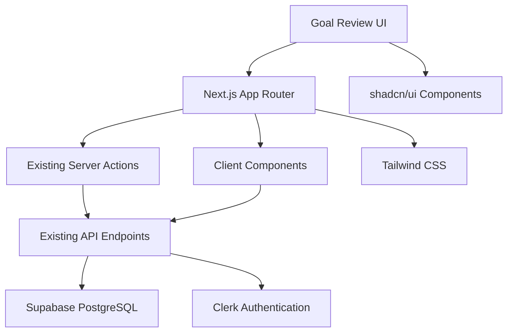

# 設計書: Goal Review UI

## 1. 概要
このドキュメントは、目標承認UIの要件定義書に基づいてシステムの技術的設計を記述するものです。既存のHR評価システムに新たに追加される上司向けの目標承認ページの設計を定義し、既存のAPIエンドポイントとサーバーアクションを活用したフロントエンドコンポーネントの設計を明確にします。

## 2. アーキテクチャ設計

### 2.1. システム構成図


### 2.2. 技術スタック
- **フロントエンド:** Next.js 14 (App Router), TypeScript, Tailwind CSS, shadcn/ui
- **既存APIレイヤー:** `/src/api` (endpoints, server-actions, types)
- **認証:** Clerk（既存システム活用）
- **UIコンポーネント:** shadcn/ui, Lucide React (icons)
- **状態管理:** React State + 既存Server Actions (SSR優先)

### 2.3. 既存システムとの統合
- 既存の `/src/api/server-actions` を活用
- 既存の `/src/api/endpoints` を必要に応じて使用
- 既存の `/src/api/types` のTypeScript型定義を活用
- 既存の認証システム（Clerk）との統合

## 3. データベース設計

### 3.1. 既存テーブル活用
既存のデータベーススキーマを活用：
- `users` テーブル（ユーザー情報、上司-部下関係）
- `goals` テーブル（目標情報）
- `supervisor_reviews` テーブル（承認・差し戻し情報）
- `evaluation_periods` テーブル（評価期間）

## 4. 既存API活用とサーバーアクション

### 4.1. 既存サーバーアクションの活用
既存の `/src/api/server-actions/` から以下を活用予定：
- ユーザー関連のサーバーアクション
- 目標関連のサーバーアクション
- レビュー関連のサーバーアクション

### 4.2. 必要に応じた新規サーバーアクション
以下が必要な場合は追加実装を検討：
- `getSupervisorPendingReviews()` - 承認待ち目標取得
- `submitGoalReview()` - 目標承認・差し戻し実行

### 4.3. 既存エンドポイント活用
既存の `/src/api/endpoints/` から関連エンドポイント関数を活用し、必要に応じてClient Componentで使用

## 5. UI/UX設計

### 5.1. ページ構造
- **Route:** `/(evaluation)/(supervisor)/goal-review`
- **Page Component:** `frontend/src/app/(evaluation)/(supervisor)/goal-review/page.tsx`
- **Main Display Component:** `frontend/src/feature/evaluation/superviser/goal-review/display/index.tsx`
- **Layout:** 既存のメインアプリケーションレイアウトを継承
- **Title:** "目標承認 | HR評価システム"

### 5.2. コンポーネント設計階層

```
page.tsx (Server Component)
├── GoalReviewDisplay (Main Feature Component)
│   ├── PageHeader
│   │   ├── Title: "目標承認"
│   │   ├── Description: "Goal Approval" 
│   │   └── PendingCountBadge
│   ├── GuidelinesAlert
│   │   └── ApprovalCriteriaText
│   ├── EmployeeTabNavigation (Client Component)
│   │   └── EmployeeTab[]
│   ├── EmployeeInfoHeader
│   │   ├── Avatar (共有コンポーネント)
│   │   ├── EmployeeName
│   │   ├── EmployeeId  
│   │   └── EmploymentType
│   ├── GoalApprovalList
│   │   └── GoalApprovalCard[]
│   │       ├── GoalHeader
│   │       │   ├── CategoryIcon
│   │       │   ├── CategoryName
│   │       │   ├── WeightDisplay
│   │       │   ├── SubmissionDate
│   │       │   └── StatusBadge (共有コンポーネント)
│   │       ├── GoalContent (Gray Box)
│   │       │   ├── GoalTitle
│   │       │   └── GoalDetails
│   │       └── ApprovalForm
│   │           ├── CommentInput
│   │           └── ActionButtons
│   │               ├── RejectButton (共有コンポーネント)
│   │               └── ApproveButton (共有コンポーネント)
│   └── ApprovalGuidelinesPanel
│       ├── DetailedApprovalCriteria
│       └── DetailedRejectionCriteria
```

### 5.3. ファイル構成と主要コンポーネント仕様

#### **ページとメインコンポーネント**
```typescript
// frontend/src/app/(evaluation)/(supervisor)/goal-review/page.tsx
import GoalReviewDisplay from '@/feature/evaluation/superviser/goal-review/display';
import { getSupervisorPendingReviews } from '@/api/server-actions/reviews';

export default async function GoalReviewPage() {
  const pendingReviews = await getSupervisorPendingReviews();
  return <GoalReviewDisplay data={pendingReviews} />;
}
```

```typescript
// frontend/src/feature/evaluation/superviser/goal-review/display/index.tsx
interface GoalReviewDisplayProps {
  data: SupervisorPendingReviewsResponse;
}
export default function GoalReviewDisplay({ data }: GoalReviewDisplayProps) {
  // メインの表示ロジック
}
```

#### **専用コンポーネント (goal-review専用)**
```typescript
// frontend/src/feature/evaluation/superviser/goal-review/components/EmployeeTabNavigation/
interface EmployeeTabNavigationProps {
  employees: EmployeeWithGoals[];
  activeEmployeeId: string;
  onEmployeeChange: (employeeId: string) => void;
}
```

```typescript
// frontend/src/feature/evaluation/superviser/goal-review/components/GoalApprovalCard/
interface GoalApprovalCardProps {
  goal: Goal;
  employee: Employee;
}
```

```typescript
// frontend/src/feature/evaluation/superviser/goal-review/components/ApprovalForm/
interface ApprovalFormProps {
  goalId: string;
  onSubmit: (action: 'APPROVED' | 'REJECTED', comment?: string) => Promise<void>;
}
```

#### **共有コンポーネント活用**
- `frontend/src/components/ui/button.tsx` - 承認・差し戻しボタン
- `frontend/src/components/ui/badge.tsx` - ステータスバッジ、承認待ち件数
- `frontend/src/components/ui/avatar.tsx` - 従業員アバター
- `frontend/src/components/ui/tabs.tsx` - 従業員タブ切り替え

### 5.4. shadcn/ui コンポーネント活用

#### **使用予定のコンポーネント**
- `Badge` - ステータス表示、承認待ち件数
- `Button` - 承認・差し戻しボタン
- `Card` - 目標カード、ガイドラインパネル
- `Tabs` - 従業員タブ切り替え
- `Textarea` - コメント入力
- `Alert` - ガイドライン表示
- `Avatar` - 従業員アバター
- `Dialog` - 確認ダイアログ

#### **カスタムスタイリング**
- 承認ボタン: `variant="default"` + 緑色カスタム
- 差し戻しボタン: `variant="destructive"`
- 目標内容: グレーボックススタイル

### 5.5. アイコン設計（Lucide React）
- **カテゴリアイコン:**
  - 業績目標: `Target` (24px)
  - コンピテンシー: `User` (24px)
- **アクションアイコン:**
  - 承認: `Check` (16px)
  - 差し戻し: `X` (16px)
- **その他:**
  - 承認待ち: `Clock` (16px)
  - 情報: `Info` (16px)

### 5.6. レスポンシブデザイン設計

#### **ブレークポイント戦略**
```css
/* モバイル優先 */
.goal-card {
  @apply w-full;
}

/* タブレット以上 */
@media (min-width: 768px) {
  .goal-list {
    @apply grid grid-cols-1;
  }
}

/* デスクトップ */
@media (min-width: 1024px) {
  .goal-list {
    @apply grid-cols-2 gap-6;
  }
}
```

## 6. 状態管理設計

### 6.1. Server State（既存活用）
```typescript
// 既存のサーバーアクションを活用
import { getSupervisorPendingReviews } from '@/api/server-actions/reviews';

// Server Component でデータ取得
const data = await getSupervisorPendingReviews();
```

### 6.2. Client State
```typescript
// ローカルUI状態
const [activeEmployeeId, setActiveEmployeeId] = useState<string>('');
const [isSubmitting, setIsSubmitting] = useState<boolean>(false);

// 楽観的更新
import { useOptimistic } from 'react';
const [optimisticReviews, addOptimisticReview] = useOptimistic(reviews);
```

### 6.3. Form Management
```typescript
// React Hook Form + Zod
import { useForm } from 'react-hook-form';
import { z } from 'zod';

const reviewSchema = z.object({
  action: z.enum(['APPROVED', 'REJECTED']),
  comment: z.string().min(1, "差し戻し時はコメントが必要です").optional()
});
```

## 7. パフォーマンス設計

### 7.1. サーバーサイド最適化
- Server Component を最大活用
- 既存のキャッシュ戦略を継承
- `loading.tsx` でローディング状態提供

### 7.2. クライアントサイド最適化
- 必要最小限のClient Component
- `useTransition` for 非同期操作
- 楽観的更新でUX向上

### 7.3. データ取得最適化
- 既存のサーバーアクションを活用
- 必要に応じた追加フィールドのみAPI修正検討

## 8. 実装フェーズでの考慮事項

### 8.1. 既存API確認事項
実装時に以下を確認し、不足があればAPI修正を検討：
- 承認待ち目標の取得APIの詳細仕様
- 従業員情報（アバター、雇用形態）の取得
- 目標カテゴリ情報の詳細
- 承認・差し戻し実行APIの仕様

### 8.2. 追加が必要になる可能性のある要素
- 承認ガイドライン情報のAPI
- プロフィール画像のURL取得
- 目標カテゴリごとの表示設定
- 承認完了後の通知機能

### 8.3. TypeScript型定義
既存の `/src/api/types` を確認し、不足する型定義があれば追加：
```typescript
// 追加が必要になる可能性のある型
interface SupervisorPendingReviewsResponse {
  employees: EmployeeWithGoals[];
  pendingCount: number;
  period: EvaluationPeriod;
}

interface GoalReviewSubmission {
  goalId: string;
  action: 'APPROVED' | 'REJECTED';
  comment?: string;
}
```