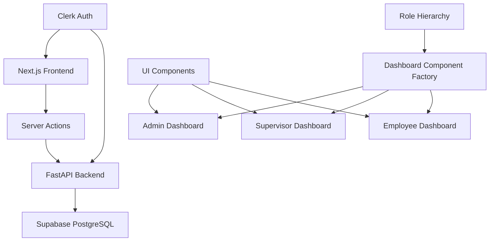
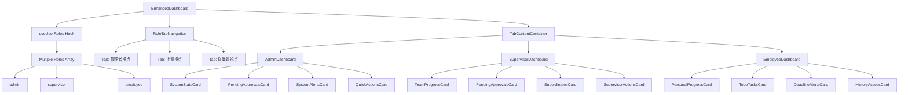

# 設計書: ホームページUI

## 1. 概要
このドキュメントは、要件定義書に基づいてホームページ（ダッシュボード）の設計を記述するものです。現在のシンプルな歓迎メッセージから、ユーザーの役職・権限に応じた価値のある情報を提供するダッシュボードへの改良設計を定義します。

## 2. アーキテクチャ設計

### 2.1. システム構成図


### 2.2. 技術スタック
- **フロントエンド:** Next.js 15.3.2 (App Router), TypeScript, Tailwind CSS, shadcn/ui
- **バックエンド:** FastAPI, Python 3.12, Supabase PostgreSQL
- **認証:** Clerk Authentication
- **UI コンポーネント:** shadcn/ui (Radix UI based)
- **アイコン:** Lucide React
- **スタイリング:** Tailwind CSS with CSS Grid & Flexbox

## 3. コンポーネント設計

### 3.1. マルチロール対応ダッシュボード構造


### 3.2. マルチロール対応コンポーネント
- **RoleTabNavigation:** 役職切り替えタブ
- **TabContentContainer:** タブコンテンツのコンテナ
- **useUserRoles Hook:** ユーザーの複数役職を管理するフック
- **RolePermissionGuard:** 役職別表示制御コンポーネント

### 3.3. 共通UIコンポーネント
- **DashboardCard:** 統一されたカードレイアウト
- **StatisticsBadge:** 数値表示用バッジ
- **AlertIndicator:** 注意喚起用インジケーター
- **QuickActionButton:** アクション実行ボタン
- **ProgressBar:** 進捗表示
- **DeadlineAlert:** 期限警告コンポーネント

### 3.4. レスポンシブレイアウト設計
```css
/* モバイル (< 768px): 1カラム縦並び */
.dashboard-mobile {
  display: grid;
  grid-template-columns: 1fr;
  gap: 1rem;
}

/* タブレット (768px-1024px): 2カラム */
.dashboard-tablet {
  display: grid;
  grid-template-columns: repeat(2, 1fr);
  gap: 1.5rem;
}

/* デスクトップ (> 1024px): 3カラム */
.dashboard-desktop {
  display: grid;
  grid-template-columns: repeat(3, 1fr);
  gap: 2rem;
}
```

## 4. データ取得設計

### 4.1. Server Actions
マルチロール対応のServer Actionsを作成:

```typescript
// /src/api/server-actions/dashboard.ts
export async function getUserRoles(userId: string): Promise<UserRole[]>
export async function getMultiRoleDashboardData(userId: string): Promise<MultiRoleDashboardData>
export async function getAdminDashboardData(): Promise<AdminDashboardData>
export async function getSupervisorDashboardData(userId: string): Promise<SupervisorDashboardData>
export async function getEmployeeDashboardData(userId: string): Promise<EmployeeDashboardData>
```

### 4.2. データ型定義
```typescript
interface UserRole {
  role: 'admin' | 'manager' | 'supervisor' | 'employee' | 'viewer' | 'parttime';
  label: string;
  hierarchyLevel: number;
}

interface MultiRoleDashboardData {
  userRoles: UserRole[];
  dashboardData: {
    admin?: AdminDashboardData;
    supervisor?: SupervisorDashboardData;
    employee?: EmployeeDashboardData;
  };
}

interface AdminDashboardData {
  systemStats: {
    totalUsers: number;
    totalDepartments: number;
    activeEvaluationPeriods: number;
  };
  pendingApprovals: {
    users: number;
    evaluations: number;
  };
  systemAlerts: Alert[];
}

interface SupervisorDashboardData {
  teamProgress: {
    totalSubordinates: number;
    goalsCompleted: number;
    evaluationsCompleted: number;
  };
  pendingTasks: {
    goalApprovals: number;
    evaluationFeedbacks: number;
  };
  subordinates: SubordinateStatus[];
}

interface EmployeeDashboardData {
  currentPeriod: EvaluationPeriod;
  personalProgress: {
    goalsSet: boolean;
    evaluationCompleted: boolean;
  };
  todos: TodoTask[];
  deadlines: Deadline[];
}
```

## 5. 新規APIエンドポイント設計

### `GET /api/dashboard/admin`
- **説明:** 管理者用ダッシュボードデータを取得
- **認証:** admin権限必須
- **レスポンス (200 OK):**
  ```json
  {
    "system_stats": {
      "total_users": 150,
      "total_departments": 8,
      "active_evaluation_periods": 2
    },
    "pending_approvals": {
      "users": 5,
      "evaluations": 23
    },
    "system_alerts": [
      {
        "type": "warning",
        "message": "評価期限まで3日です",
        "count": 12
      }
    ]
  }
  ```

### `GET /api/dashboard/supervisor/{user_id}`
- **説明:** 上司用ダッシュボードデータを取得
- **認証:** supervisor権限必須
- **レスポンス (200 OK):**
  ```json
  {
    "team_progress": {
      "total_subordinates": 8,
      "goals_completed": 6,
      "evaluations_completed": 4
    },
    "pending_tasks": {
      "goal_approvals": 2,
      "evaluation_feedbacks": 3
    },
    "subordinates": [
      {
        "user_id": "uuid",
        "name": "田中太郎",
        "status": "goal_approval_needed",
        "priority": "high"
      }
    ]
  }
  ```

### `GET /api/dashboard/employee/{user_id}`
- **説明:** 従業員用ダッシュボードデータを取得
- **認証:** 本人または上司の権限必須
- **レスポンス (200 OK):**
  ```json
  {
    "current_period": {
      "id": "uuid",
      "name": "2024年度上期評価",
      "deadline": "2024-09-30"
    },
    "personal_progress": {
      "goals_set": true,
      "evaluation_completed": false
    },
    "todos": [
      {
        "task": "評価入力の完了",
        "deadline": "2024-09-30",
        "priority": "high"
      }
    ]
  }
  ```

## 6. UI/UX設計

### 6.1. デザインシステム
- **カラーパレット:** 既存のTailwind CSS設定を活用
- **タイポグラフィ:** システム標準フォント
- **アイコン:** Lucide React統一使用
- **レイアウト:** CSS Grid + Flexbox

### 6.2. タブナビゲーション設計
```tsx
<Tabs defaultValue={defaultRole} className="w-full">
  <TabsList className="grid w-full grid-cols-{roleCount}">
    {userRoles.map(role => (
      <TabsTrigger key={role.role} value={role.role}>
        {role.label}
      </TabsTrigger>
    ))}
  </TabsList>

  <TabsContent value="admin">
    <AdminDashboard />
  </TabsContent>
  <TabsContent value="supervisor">
    <SupervisorDashboard />
  </TabsContent>
  <TabsContent value="employee">
    <EmployeeDashboard />
  </TabsContent>
</Tabs>
```

### 6.3. 主要コンポーネントの視覚設計

#### DashboardCard
```tsx
<Card className="p-6 hover:shadow-lg transition-shadow">
  <CardHeader>
    <CardTitle className="flex items-center gap-2">
      <Icon />
      タイトル
    </CardTitle>
  </CardHeader>
  <CardContent>
    コンテンツ
  </CardContent>
  <CardFooter>
    <Button variant="outline" size="sm">
      詳細を見る
    </Button>
  </CardFooter>
</Card>
```

#### AlertBadge
```tsx
<Badge variant={priority === 'high' ? 'destructive' : 'secondary'}>
  {count}
</Badge>
```

### 6.4. アニメーション・インタラクション
- **ローディング:** Skeleton UIを使用
- **ホバー効果:** shadow-lg transition
- **データ更新:** fade-in animation
- **タブ切り替え:** smooth transition between role views
- **レスポンシブ:** smooth layout transitions

## 7. パフォーマンス設計

### 7.1. 最適化戦略
- **初期読み込み:** Server-side rendering (SSR)
- **データキャッシュ:** SWR pattern実装
- **画像最適化:** Next.js Image component
- **コード分割:** Dynamic imports for dashboard components
- **タブ別遅延読み込み:** Only load data when tab is accessed
- **役職別キャッシュ:** Cache dashboard data per role independently

### 7.2. ローディング戦略
```tsx
// Suspense境界を使用したローディング
<Suspense fallback={<DashboardSkeleton />}>
  <EnhancedDashboard />
</Suspense>
```

### 7.3. エラーハンドリング
```tsx
// Error Boundary implementation
<ErrorBoundary fallback={<DashboardErrorState />}>
  <EnhancedDashboard />
</ErrorBoundary>
```

## 8. セキュリティ設計

### 8.1. 権限チェック
- サーバーサイドでの権限検証
- Clerk認証との統合
- 役職階層に基づくデータフィルタリング

### 8.2. データアクセス制御
```typescript
// 権限ベースのデータ取得
async function getDashboardData(userId: string, userRole: string) {
  const hierarchyLevel = getRoleHierarchyLevel(userRole);

  // 権限に応じたデータ取得ロジック
  switch (userRole) {
    case 'admin':
      return getAdminDashboardData();
    case 'supervisor':
      return getSupervisorDashboardData(userId);
    default:
      return getEmployeeDashboardData(userId);
  }
}
```