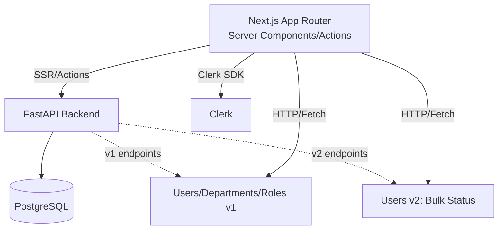

# 設計書: Organization Management

## 1. 概要
本ドキュメントは、要件定義書（`.kiro/specs/org-management/requirements.md`）に基づき、管理者専用の「組織管理（/org-management）」ページの実装設計を示します。技術的な意思決定、バックエンド API 設計（v2 の一括更新 API を含む）、UI コンポーネント構成、フォルダ構成、権限と整合性の考慮点を明確にします。

主な機能:
- タブ構成（ユーザー管理、部門管理、ロール管理）
- ユーザー管理タブ: 表内インライン編集（部門/ロール/ステージ/上長/部下/ステータス）、ステータスのワンクリック切替、最大100件の一括ステータス更新（v2 API）
- 部門管理タブ: モーダルによる作成/更新/削除、ユーザー数表示、ユーザーの追加/削除（ユーザー更新 API を用いた実装）
- ロール管理タブ: ロールのユーザー割当のみ（CRUDは範囲外）、ユーザー数モーダル、複数ロール対応
- ルーティング/権限制御: `/department-management` の廃止、サイドバーを「組織管理」へ差替、`/org-management` を admin ルートへ追加

## 2. アーキテクチャ設計

### 2.1. システム構成図


### 2.2. 技術スタック
- フロントエンド: Next.js (App Router), TypeScript, React Server Components, Server Actions, Tailwind
- 認証/認可: Clerk（フロント）, FastAPI 側は `AuthContext` と `require_admin` によるRBAC
- バックエンド: FastAPI, SQLAlchemy (Async), Pydantic v2, PostgreSQL
- 開発/運用: Docker Compose、pytest、ESLint、Vercel/Render(想定)

### 2.3. 設計方針
- データ取得はサーバーコンポーネント/Server Actionsで行い、UI はスケルトン/ストリーミングで体験を最適化
- 重要更新時は Server Actions 側で適切な revalidateTag を実行し、一覧の鮮度を維持
- バルク更新は v2 API として提供（`/api/v2/users/bulk-status`）し、組織スコープ制限と最大件数(100)を実装

## 3. データベース設計

本機能に伴う新規テーブル追加は不要。既存の以下スキーマを利用:
- `users`: `status` は `'pending_approval' | 'active' | 'inactive'`（CHECK制約あり）。`department_id`、`stage_id`、`supervisor_id` など関連カラムを利用。
- `departments`: 部門情報。ユーザーとの 1対多。
- `roles` / `user_roles`: ロールとユーザーの多対多割当。

整合性:
- すべての操作は `organization_id` によるスコープ制御が必要。
- 部門削除は「アクティブユーザー数 0」を満たすことが必須（転出/削除を先に実施）。

## 4. API エンドポイント設計

### 4.1. 追加: v2 ユーザー一括ステータス更新
- メソッド/URL: `PATCH /api/v2/users/bulk-status`
- 権限: Admin 限定（`org:admin`）かつ組織スコープ強制
- 入力（JSON）:
```json
[
  { "userId": "550e8400-e29b-41d4-a716-446655440000", "newStatus": "active" },
  { "userId": "550e8400-e29b-41d4-a716-446655440001", "newStatus": "inactive" }
]
```
- バリデーション:
  - 配列サイズは 1〜100
  - 許可遷移: `pending_approval -> active`, `active -> inactive`, `inactive -> active`
  - すべて同一 `organization_id` であること
- 出力（200 OK）:
```json
{
  "results": [
    { "userId": "550e8400-e29b-41d4-a716-446655440000", "success": true },
    { "userId": "550e8400-e29b-41d4-a716-446655440001", "success": false, "error": "User not in your organization" }
  ],
  "successCount": 1,
  "failureCount": 1
}
```
- 失敗時:
  - 422: 入力不正（配列サイズ超過/ステータス値不正）
  - 403: 権限/組織スコープ違反
  - 207 Multi-Status は使用せず、成功/失敗は `results` に集約

実装ポイント（Backend）:
- ルータ: `backend/app/api/v2/users.py` に `bulk_status_update` を追加
- スキーマ: `backend/app/schemas/user.py` に `BulkUserStatusUpdateItem`, `BulkUserStatusUpdateResponse`, `BulkUserStatusUpdateResult` を追加
- サービス: `backend/app/services/user_service.py` に `bulk_update_user_statuses(items, context)` を追加（単一 DB セッション/トランザクションで実行）
- 効率性: 1回の検証用 `SELECT`（組織スコープ/存在チェック）+ 1回の `UPDATE ... CASE` による一括更新 + 単一 `COMMIT`

参考 SQL（擬似コード）:
```sql
-- 事前検証: 許可されたID集合を抽出（組織スコープ）
SELECT id FROM users 
WHERE organization_id = :org_id AND id IN (:ids);

-- 一括更新: 許可IDのみ対象に CASE でステータスを設定
UPDATE users
SET status = CASE id
  WHEN :id1 THEN :status1
  WHEN :id2 THEN :status2
  -- ...
END
WHERE id IN (:allowed_ids);
```

### 4.2. 既存 API の利用
- 部門関連: `v1 /api/v1/departments`（作成/更新/削除/詳細取得）
- ロール関連: `v1 /api/v1/roles`（本画面では CRUD は行わず、ユーザーへの割当のみ実施）
- ユーザー更新: `v1 /api/v1/users/{id}`（`department_id`/`role_ids`/`stage_id`/`supervisor_id`/`subordinate_ids` の更新に利用）

## 5. UI/UX 設計

### 5.1. 画面/遷移
- `/org-management`（Admin 専用）: タブ切り替え
  - ユーザー管理: 表+インライン編集
  - 部門管理: 表+モーダル編集
  - ロール管理: 表+ユーザー数モーダル（割当操作）

### 5.2. インタラクション
- ユーザー管理
  - 列: 名前（閲覧のみ）, メール（閲覧のみ）, 部門, ロール, ステージ, ステータス, 上長, 部下, アクション
  - インライン編集対象: 部門/ロール/ステージ/上長/部下/ステータス
  - ステータス切替: `pending_approval->active` は即時、`active->inactive` は確認モーダル、`inactive->active` は即時
  - 一括更新: 行選択+一括ステータス変更UI → Server Action 経由で v2 API 呼出
- 部門管理
  - 作成/編集はモーダル（誤操作抑止）
  - ユーザー数クリックで所属ユーザー一覧モーダル
  - ユーザー追加/削除はモーダル（ユーザー更新 API を順次/小分割で実行）
  - 削除は確認モーダル+「アクティブユーザー0」必須
- ロール管理
  - CRUD は行わない（一覧/ユーザー数のみ）
  - ユーザー数クリックでそのロールを持つユーザー一覧モーダル
  - 複数ロール割当対応。割当/解除はユーザー更新 API を利用

### 5.3. 権限/ナビゲーション
- ミドルウェア: `/org-management` を admin ルートに追加、未認可は `/access-denied` へ
- サイドバー: 「部門管理」を削除し「組織管理」へ差替（リンク: `/org-management`）

### 5.4. フィードバック/状態管理
- ローディング: タブごとにスケルトン/ストリーミング
- エラー: 行単位/モーダル単位でトーストと詳細表示
- キャッシュ: 変更後は `USERS`/`DEPARTMENTS`/`ROLES` の関連タグを再検証

## 6. ディレクトリ構成（変更対象）

### 6.1. Frontend
```
frontend/
  src/
    app/
      (evaluation)/
        (admin)/
          org-management/
            page.tsx                         # サーバーコンポーネント。初期データ取得 & Admin保護

    feature/
      org-management/
        index.ts
        OrgManagementContainer.tsx           # 状態管理・タブ切替
        OrgManagementView.tsx                # プレゼンテーション

        user-management-tab/
          UserTable.tsx                      # 表+インライン編集
          UserBulkStatusBar.tsx              # 選択行対象の一括変更UI
          UserRoleEditor.tsx                 # ロール編集（インライン/ポップオーバー）
          UserDepartmentEditor.tsx           # 部門編集
          UserStageEditor.tsx                # ステージ編集
          UserSupervisorEditor.tsx           # 上長/部下編集
          StatusBadge.tsx                    # ステータス表示+切替
          hooks/
            useUserManagement.ts             # データ取得/操作集約

        department-management-tab/
          DepartmentTable.tsx
          DepartmentEditModal.tsx
          DepartmentUsersModal.tsx           # ユーザー一覧 + 追加/削除
          DepartmentDeleteModal.tsx
          hooks/
            useDepartmentManagement.ts

        role-management-tab/
          RoleTable.tsx
          RoleUsersModal.tsx                 # ユーザー一覧 + 割当/解除
          hooks/
            useRoleManagement.ts

    api/
      endpoints/
        users.ts                             # v2 bulkStatus エンドポイントメソッド追加
      server-actions/
        users.ts                             # bulkUpdateUserStatusesAction を追加

    components/
      constants/
        routes.ts                            # 「組織管理」エントリへ差替、旧「部門管理」削除

    middleware.ts                            # isAdminRoute に /org-management を追加
```

補足: 既存のユーザー/部門/ロールの Server Action と UI を最大限再利用し、差分最小で追加します。

### 6.2. Backend
```
backend/
  app/
    api/
      v2/
        users.py                             # PATCH /api/v2/users/bulk-status を実装

    services/
      user_service.py                        # bulk_update_user_statuses(...) を追加

    schemas/
      user.py                                # BulkUserStatusUpdateItem/Result/Response を追加

    security/
      dependencies.py                        # 既存の require_admin を利用
```

実装方針:
- Repository に `batch_update_user_statuses(organization_id: str, updates: dict[UUID, UserStatus])` を追加し、単一セッション/単一コミットで実行。
- 手順: (1) 入力 `ids` を `SELECT` で組織スコープ検証し許可ID集合を取得、(2) `UPDATE ... CASE` を用いた 1 ステートメントで一括更新、(3) 成功/未許可/不正ID をレスポンスに集計。
- 監査が必要な場合は、サービス層で操作ログを 1 トランザクション内に集計保存（将来対応）。

## 7. キャッシュ/パフォーマンス/整合性
- Server Actions 実行後の再検証:
  - ユーザー変更（単体/一括）: `USERS` タグ（必要に応じてユーザー詳細タグも）
  - 部門ユーザー操作/削除: `USERS`, `DEPARTMENTS`
  - ロール割当/解除: `USERS`, `ROLES`
- 一括更新は 100 件まで、進捗と結果サマリを UI で提示
- 競合時は最新データの再フェッチを優先し、差分を再適用

## 8. セキュリティ/権限
- フロント: ミドルウェアで `/org-management` を admin 限定に制御
- バック: `require_admin` + `AuthContext` による組織スコープ検証
- 監査: ステータス変更は監査対象（任意）。将来的な監査ログ出力ポイントをサービス層に配置可能

## 9. テスト計画
- Backend
  - v2 `bulk-status` 正常/異常（サイズ超過、無権限、クロス組織、無効ステータス、部分失敗集計）
  - サービス単体: item 毎の例外隔離と集計の妥当性
- Frontend
  - ユーザー表のインライン編集操作（ロール/部門/ステージ/上長/部下/ステータス）
  - 一括更新 UI → Server Action → v2 API 呼出の成功/部分失敗表示
  - 部門削除フロー（アクティブユーザー存在時のブロック）
  - ロールのユーザー数モーダルと割当/解除

## 10. デプロイ/移行
- ルーティング変更: `/department-management` を廃止し、サイドバーを「組織管理」に差替
- ミドルウェア: `isAdminRoute` に `/org-management` を追加
- DB 変更: なし
- ロールバック: 旧リンクに依存する導線がある場合は一時リダイレクトを検討

## 11. 受入基準との対応
- 要件の Acceptance Criteria を満たす操作が UI と API 双方で実現可能であること
- とくに `PATCH /api/v2/users/bulk-status` の最大 100 件、組織スコープ、部分成功レスポンスを満たすこと


