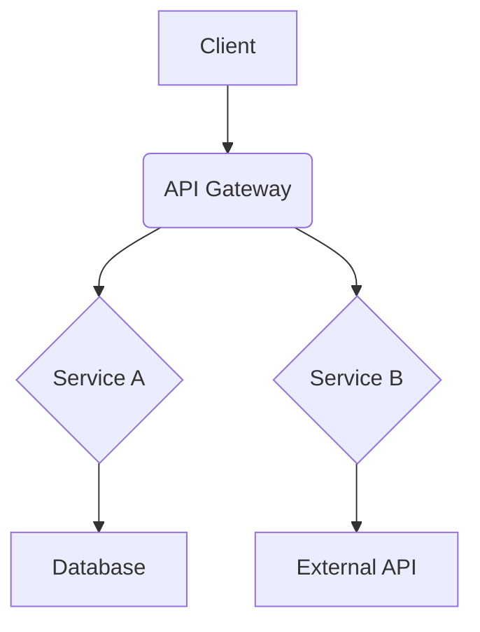
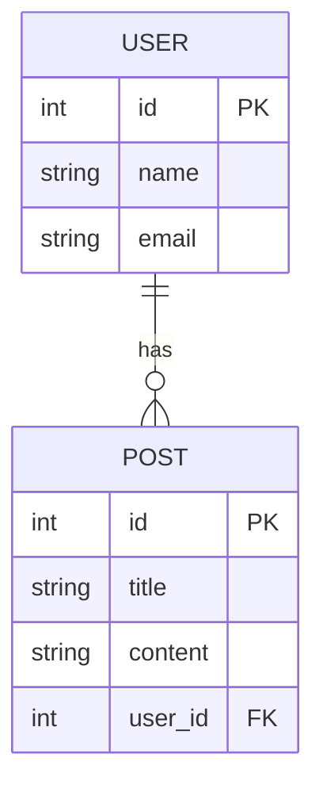

# Design Document: [Project Name]

## 1. Overview
[This document describes the system design based on the requirements document. It clarifies technical decisions, architecture, and interactions between components.]

## 2. Architecture Design
[Describe the overall system architecture diagrams and major technology choices (frameworks, databases, libraries, etc.) and their rationale.]

### 2.1. System Architecture Diagram


### 2.2. Technology Stack
- **Frontend:** [e.g., Next.js, TypeScript, Tailwind CSS]
- **Backend:** [e.g., FastAPI, Python, PostgreSQL]
- **Infrastructure:** [e.g., Docker, AWS ECS, S3]

## 3. Database Design
[Describe database schemas, table definitions, relationships, etc. Including ER diagrams makes it easier to understand.]

### 3.1. ER Diagram


### 3.2. Table Definition: `users`
| Column Name | Data Type | Description | Constraints |
|---|---|---|---|
| `id` | `INTEGER` | User ID | `PRIMARY KEY` |
| `name` | `VARCHAR(255)` | Full Name | `NOT NULL` |
| `email` | `VARCHAR(255)` | Email Address | `NOT NULL`, `UNIQUE` |
| `created_at` | `TIMESTAMP` | Creation Date | `DEFAULT CURRENT_TIMESTAMP` |

## 4. API Endpoint Design
[Describe specifications for each API endpoint. Clarify requests, responses, authentication requirements, etc.]

### `POST /api/users`
- **Description:** Creates a new user.
- **Authentication:** Not required
- **Request Body:**
  ```json
  {
    "name": "string",
    "email": "string"
  }
  ```
- **Response (201 Created):**
  ```json
  {
    "id": 1,
    "name": "John Doe",
    "email": "john.doe@example.com"
  }
  ```
- **Error Response (400 Bad Request):**
  ```json
  {
    "error": "Invalid email format"
  }
  ```

## 5. UI/UX Design
[Describe links to screen wireframes or mockups, design of major UI components, etc.]

- **Login Screen:** [Link to Figma, Sketch or other design tools]
- **Dashboard:** [Link to Figma, Sketch or other design tools]
- **Major Components:**
  - **Button:** [Define variations like primary, secondary, etc.]
  - **Form:** [Define styles for input fields, labels, validation messages]