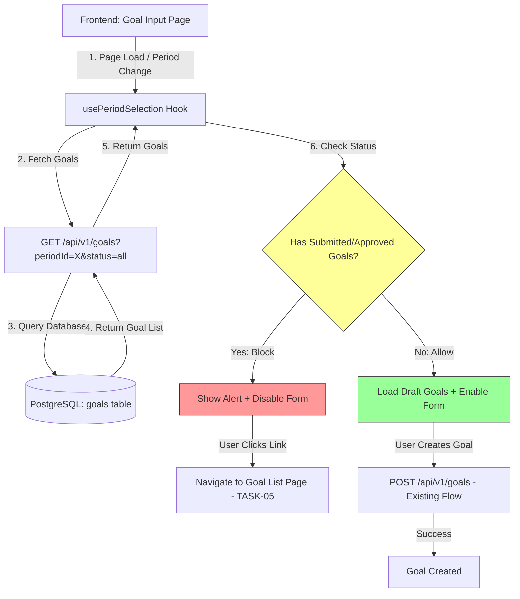

# Design Document: Prevent Duplicate Goal Creation After Submission

## 1. Overview

This document describes the **simplified frontend-first** technical design for preventing duplicate Goal creation after submission. The solution reuses existing API endpoints and implements validation at the frontend layer for fast delivery with minimal risk.

**Key Design Principles:**
- **Frontend-first validation** for immediate user feedback
- **Reuse existing APIs** - no new backend endpoints or database changes
- Clear error messaging in Japanese
- Zero performance impact (reuses existing data fetches)
- Quick to implement and test (time-constrained)

**Implementation Strategy:**
✅ **Primary:** Frontend validation using existing GET /api/v1/goals endpoint
✅ **Optional:** Backend validation as future safety net (not required for MVP)
✅ **Efficient:** No new database queries or API endpoints needed
✅ **Fast delivery:** Reduced complexity, faster testing

**Scope Limitation:**
This task (TASK-04) implements **blocking logic only**. The complete UX for viewing, editing, and resubmitting goals is deferred to TASK-05 (Improve rejection flow).

**Out of Scope:**
- ❌ Detailed UI for displaying submitted goals list
- ❌ Supervisor rejection comments display
- ❌ Edit workflow for rejected goals
- ❌ Complete resubmission flow with notifications
- ❌ New backend validation endpoints or repository functions

**What TASK-04 Delivers:**
- ✅ Frontend validation prevents duplicate creation
- ✅ Clear alert messages with link to goal list (TASK-05)
- ✅ Form disabled when blocking goals exist
- ✅ Client-side check for submitted/approved goals
- ⚠️ Minimal UI - just error feedback, not full goal management

## 2. Architecture Design

### 2.1. System Architecture Diagram (Simplified Frontend-First Approach)



**Key Changes from Original Design:**
- ❌ No new `check_submitted_goals_exist()` repository function
- ❌ No service layer validation changes
- ❌ No ConflictError handling in API (already exists, but not used here)
- ✅ Reuses existing GET endpoint with status filtering
- ✅ Client-side validation in React hook
- ✅ Simpler, faster to implement and test

### 2.2. Technology Stack

- **Frontend:** Next.js 14 (App Router), TypeScript, React
- **UI Components:** shadcn/ui (Alert, Badge, Button)
- **API Client:** Existing HTTP client with Clerk auth
- **Backend:** No changes required (reuses existing endpoints)

## 3. Database Design

### 3.1. Existing Schema (No Changes Required)

The existing `goals` table already has all necessary fields and indexes for the frontend validation approach:

```sql
-- Existing goals table (already supports filtering by status and period)
CREATE TABLE goals (
    id UUID PRIMARY KEY DEFAULT gen_random_uuid(),
    user_id UUID NOT NULL REFERENCES users(id) ON DELETE CASCADE,
    period_id UUID NOT NULL REFERENCES evaluation_periods(id) ON DELETE CASCADE,
    goal_category VARCHAR(100) NOT NULL,
    target_data JSONB NOT NULL,
    weight DECIMAL(5, 2) NOT NULL,
    status VARCHAR(50) NOT NULL DEFAULT 'draft',
    approved_by UUID REFERENCES users(id),
    approved_at TIMESTAMP WITH TIME ZONE,
    created_at TIMESTAMP WITH TIME ZONE NOT NULL DEFAULT NOW(),
    updated_at TIMESTAMP WITH TIME ZONE NOT NULL DEFAULT NOW(),

    -- Existing constraints
    CONSTRAINT check_status_values CHECK (status IN ('draft', 'submitted', 'approved', 'rejected')),
    CONSTRAINT check_individual_weight_bounds CHECK (weight >= 0 AND weight <= 100)
);

-- Existing indexes (already optimal for GET queries with filtering)
CREATE INDEX idx_goals_user_period ON goals(user_id, period_id);
CREATE INDEX idx_goals_status_category ON goals(status, goal_category);
```

**No Database Changes Needed** - The existing schema and indexes fully support the validation approach.

## 4. API Endpoint Design (Reusing Existing Endpoints)

### 4.1. GET /api/v1/goals (Existing - No Changes)

**Endpoint:** `GET /api/v1/goals`

**Description:** Fetches goals with optional filtering by period and status (already implemented).

**Usage for Validation:**
```typescript
// Frontend will use this existing endpoint
const response = await getGoalsAction({
  periodId: selectedPeriod.id,
  status: ['draft', 'submitted', 'approved', 'rejected'] // Fetch all to check
});

// Then check client-side
const hasBlockingGoals = response.data.items.some(
  goal => goal.status === 'submitted' || goal.status === 'approved'
);
```

### 4.2. POST /api/v1/goals (No Changes Required)

**Endpoint:** `POST /api/v1/goals`

**Description:** Creates a new goal (existing implementation, no validation changes needed).

**Note:** Frontend validation prevents the POST request from being made when blocking goals exist, so the backend flow remains unchanged.

## 5. Frontend Implementation Design (Primary Focus)

### 5.1. usePeriodSelection Hook Modification

**File:** `frontend/src/feature/goal-input/hooks/usePeriodSelection.ts`

**Current Logic (Line ~82):**
```typescript
const result = await getGoalsAction({
  periodId: period.id,
  status: ['draft', 'rejected'] // Only loads editable goals
});
```

**New Logic:**
```typescript
// Fetch ALL goals to check for blocking statuses
const result = await getGoalsAction({
  periodId: period.id,
  status: ['draft', 'submitted', 'approved', 'rejected'] // Fetch all
});

if (!result.success) {
  toast.error('Failed to load goals');
  return;
}

const goals = result.data.items;

// Check for blocking statuses
const hasSubmittedGoals = goals.some(g => g.status === 'submitted');
const hasApprovedGoals = goals.some(g => g.status === 'approved');

if (hasSubmittedGoals || hasApprovedGoals) {
  // BLOCK goal creation
  setHasBlockingGoals(true);
  setBlockingMessage(
    hasApprovedGoals
      ? "目標は既に承認されています。承認済みの目標がある場合、新しい目標を作成することはできません。"
      : "目標は既に提出されています。提出済みの目標がある場合、新しい目標を作成することはできません。"
  );
  setGoalFormData([]); // Clear form
  return; // Stop processing
}

// ALLOW: Load only draft/rejected goals into form (normal flow)
const editableGoals = goals.filter(g =>
  g.status === 'draft' || g.status === 'rejected'
);
loadGoalsIntoForm(editableGoals);
```

**State Management:**
```typescript
const [hasBlockingGoals, setHasBlockingGoals] = useState(false);
const [blockingMessage, setBlockingMessage] = useState('');
```

### 5.2. Goal Input Page UI Modification

**File:** `frontend/src/feature/goal-input/display/index.tsx`

**Add Alert Component:**
```tsx
import { Alert, AlertCircle, AlertTitle, AlertDescription } from '@/components/ui/alert';
import Link from 'next/link';

// At the top of the page, before the form
{hasBlockingGoals && (
  <Alert variant="destructive" className="mb-6">
    <AlertCircle className="h-4 w-4" />
    <AlertTitle>新しい目標を作成できません</AlertTitle>
    <AlertDescription>
      {blockingMessage}
      <Link href="/goal-list" className="underline ml-2 font-medium">
        目標一覧ページで確認してください
      </Link>
    </AlertDescription>
  </Alert>
)}

{/* Disable form when blocking */}
<GoalInputForm disabled={hasBlockingGoals} />
```

**Form Disable Logic:**
```typescript
// Pass disabled prop to all form components
<ConfirmationStep
  disabled={hasBlockingGoals}
  onSubmit={handleSubmit}
/>
```

### 5.3. Visual Feedback States

**State 1: No Blocking Goals (Normal Flow)**
- Form enabled
- User can create/edit draft goals
- Submit button active

**State 2: Submitted Goals Exist (Blocked)**
- Red alert banner displayed at top
- Form disabled (grayed out)
- Link to goal list page visible
- Clear error message in Japanese

**State 3: Approved Goals Exist (Blocked)**
- Red alert banner with different message
- Form disabled
- Message indicates goals are already approved
- Link to view approved goals

## 6. User Experience Flow

### 6.1. Happy Path (No Blocking Goals)

```
1. User navigates to Goal Input page
2. Selects evaluation period
3. System fetches goals (only draft/rejected exist)
4. Form loads with editable goals
5. User creates/edits goals normally
6. User submits goals successfully
```

### 6.2. Blocked Path (Submitted Goals Exist)

```
1. User navigates to Goal Input page
2. Selects evaluation period
3. System fetches goals (submitted goals found)
4. Alert banner appears: "目標は既に提出されています"
5. Form is disabled (cannot edit)
6. User clicks "目標一覧ページで確認してください"
7. Navigates to Goal List page (TASK-05)
```

### 6.3. Blocked Path (Approved Goals Exist)

```
1. User navigates to Goal Input page
2. Selects evaluation period
3. System fetches goals (approved goals found)
4. Alert banner appears: "目標は既に承認されています"
5. Form is disabled
6. User views approved goals via link
```

## 7. Error Messages (Japanese)

### 7.1. Submitted Goals Blocking

```
目標は既に提出されています。提出済みの目標がある場合、新しい目標を作成することはできません。
```

### 7.2. Approved Goals Blocking

```
目標は既に承認されています。承認済みの目標がある場合、新しい目標を作成することはできません。
```

### 7.3. API Fetch Error

```
目標の読み込みに失敗しました。ページを再読み込みしてください。
```

## 8. Testing Strategy

### 8.1. Manual E2E Testing (Primary)

**Test Scenarios:**

1. **TC1: Create goal when no submitted goals exist**
   - GIVEN: User has only draft goals for period
   - WHEN: User navigates to goal input page
   - THEN: Form is enabled, user can create goals

2. **TC2: Blocked by submitted goals**
   - GIVEN: User has submitted goals for period
   - WHEN: User navigates to goal input page
   - THEN: Alert displayed, form disabled, link to goal list shown

3. **TC3: Blocked by approved goals**
   - GIVEN: User has approved goals for period
   - WHEN: User navigates to goal input page
   - THEN: Alert displayed with "承認済み" message, form disabled

4. **TC4: Different periods**
   - GIVEN: User has submitted goals for Period A
   - WHEN: User selects Period B (no submitted goals)
   - THEN: Form enabled for Period B

5. **TC5: Only rejected goals**
   - GIVEN: User has only rejected goals for period
   - WHEN: User navigates to goal input page
   - THEN: Form enabled, rejected goals loaded for editing

6. **TC6: Period switching**
   - GIVEN: User is on goal input page
   - WHEN: User switches from period with no blocking goals to period with submitted goals
   - THEN: Alert appears, form disables dynamically

7. **TC7: Link navigation**
   - GIVEN: Blocking alert is displayed
   - WHEN: User clicks "目標一覧ページで確認してください"
   - THEN: Navigates to goal list page (TASK-05)

8. **TC8: API error handling**
   - GIVEN: API fails to fetch goals
   - WHEN: Error occurs
   - THEN: Error toast displayed, form disabled safely

### 8.2. Backend Tests (Optional - Not Required for MVP)

Since no backend logic is added, backend tests are **optional** and can be deferred to future safety net implementation.

## 9. Performance Considerations

### 9.1. Query Performance

- **Existing endpoint reused**: GET /api/v1/goals already optimized
- **Indexed columns**: user_id, period_id, status (existing indexes)
- **Expected response time**: <200ms (already meets SLA)
- **No additional queries**: Validation uses data already fetched

### 9.2. Client-Side Performance

- **Array filtering**: O(n) where n = number of goals (typically <10)
- **Instant validation**: No network delay (uses cached data)
- **No state management overhead**: Simple useState hooks

## 10. Integration with TASK-05

### 10.1. Link to Goal List Page

The alert message includes a link to `/goal-list` which will be implemented in TASK-05:

```tsx
<Link href="/goal-list" className="underline ml-2">
  目標一覧ページで確認してください
</Link>
```

### 10.2. Future Enhancement Path

**TASK-04 (This Task):**
- ✅ Block duplicate creation
- ✅ Show alert with link

**TASK-05 (Next Task):**
- ✅ Build goal list page
- ✅ Display rejection comments
- ✅ Enable edit/resubmit workflow
- ✅ Complete UX for managing submitted/rejected goals

## 11. Implementation Checklist

### Frontend Changes

- [ ] Modify `usePeriodSelection.ts` to fetch all goal statuses
- [ ] Add blocking logic for submitted/approved goals
- [ ] Add state for `hasBlockingGoals` and `blockingMessage`
- [ ] Update Goal Input Page to display alert component
- [ ] Pass `disabled` prop to form components
- [ ] Add Link component to goal list page
- [ ] Test period switching behavior
- [ ] Test error handling for API failures

### UI Components

- [ ] Import Alert components from shadcn/ui
- [ ] Style alert with destructive variant
- [ ] Add AlertCircle icon
- [ ] Format Japanese error messages properly
- [ ] Ensure responsive layout on mobile
- [ ] Test accessibility (keyboard navigation, screen readers)

### Testing

- [ ] Execute all 8 manual E2E test scenarios
- [ ] Document test results
- [ ] Fix any issues found during testing
- [ ] Get approval from stakeholders

### Backend Changes

- [ ] **NONE** - No backend changes required for MVP

## 12. Future Considerations (Post-MVP)

### 12.1. Optional Backend Validation

If additional safety is needed, can add backend validation later:

```python
# backend/app/services/goal_service.py
async def create_goal(self, goal_data: GoalCreate, context: AuthContext) -> Goal:
    # Check for blocking goals
    existing_goals = await self.goal_repo.get_goals(
        user_id=context.user_id,
        period_id=goal_data.period_id,
        status=['submitted', 'approved']
    )

    if existing_goals:
        raise ConflictError("目標は既に提出されています...")

    # Continue with creation...
```

This can be added incrementally without breaking the frontend implementation.

### 12.2. Real-time Validation

- WebSocket notifications when goals are submitted/approved
- Auto-disable form when supervisor approves goals
- Real-time sync across multiple tabs/devices

### 12.3. Soft Blocking vs Hard Blocking

- **Current:** Hard blocking (form completely disabled)
- **Future:** Soft blocking (show warning but allow override with confirmation)

## 13. Summary

**Implementation Approach:**
- ✅ Frontend-first validation using existing APIs
- ✅ Zero backend changes required
- ✅ Fast to implement and test
- ✅ Low risk (no breaking changes)
- ✅ Meets all requirements from requirements.md

**Estimated Effort:**
- Frontend changes: 2-3 hours
- Manual testing: 1-2 hours
- **Total: 3-5 hours** (vs. 2-3 days for full backend implementation)

**Benefits:**
- Quick delivery within time constraints
- Minimal risk of breaking existing functionality
- Easy to test and verify
- Can add backend validation later if needed
- Maintains separation between TASK-04 (blocking) and TASK-05 (UX)
