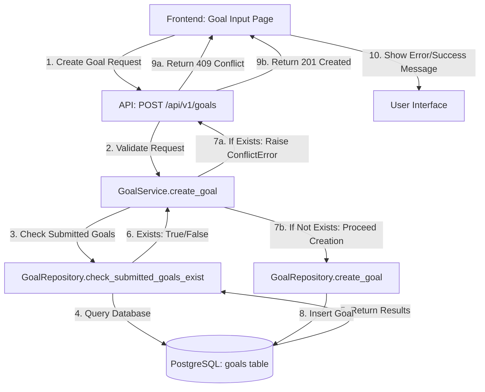

# Design Document: Prevent Duplicate Goal Creation After Submission

## 1. Overview

This document describes the technical design for preventing duplicate Goal creation after submission. The solution implements validation at both backend and frontend layers to ensure data integrity and provide clear user feedback.

**Key Design Principles:**
- Backend-first validation for data integrity
- Frontend validation for improved UX
- Clear error messaging in Japanese
- Minimal performance impact
- Maintain existing Goal lifecycle workflows

## 2. Architecture Design

### 2.1. System Architecture Diagram



### 2.2. Technology Stack

- **Backend:** FastAPI, Python 3.12, SQLAlchemy (async)
- **Frontend:** Next.js 14 (App Router), TypeScript, React
- **Database:** PostgreSQL (via Supabase)
- **Authentication:** Clerk
- **Error Handling:** Custom exceptions (ConflictError)

## 3. Database Design

### 3.1. Existing Schema (No Changes Required)

The existing `goals` table already has all necessary fields and indexes:

```sql
-- Existing goals table
CREATE TABLE goals (
    id UUID PRIMARY KEY DEFAULT gen_random_uuid(),
    user_id UUID NOT NULL REFERENCES users(id) ON DELETE CASCADE,
    period_id UUID NOT NULL REFERENCES evaluation_periods(id) ON DELETE CASCADE,
    goal_category VARCHAR(100) NOT NULL,
    target_data JSONB NOT NULL,
    weight DECIMAL(5, 2) NOT NULL,
    status VARCHAR(50) NOT NULL DEFAULT 'draft',
    approved_by UUID REFERENCES users(id),
    approved_at TIMESTAMP WITH TIME ZONE,
    created_at TIMESTAMP WITH TIME ZONE NOT NULL DEFAULT NOW(),
    updated_at TIMESTAMP WITH TIME ZONE NOT NULL DEFAULT NOW(),

    -- Existing constraints
    CONSTRAINT check_status_values CHECK (status IN ('draft', 'submitted', 'approved', 'rejected')),
    CONSTRAINT check_individual_weight_bounds CHECK (weight >= 0 AND weight <= 100)
);

-- Existing indexes (will be used for validation query)
CREATE INDEX idx_goals_user_period ON goals(user_id, period_id);
CREATE INDEX idx_goals_status_category ON goals(status, goal_category);
```

### 3.2. Validation Query Design

The validation will use an efficient query leveraging existing indexes:

```sql
-- Query to check if submitted goals exist
SELECT EXISTS(
    SELECT 1
    FROM goals
    WHERE user_id = $1
      AND period_id = $2
      AND status IN ('submitted', 'approved')
    LIMIT 1
) AS has_submitted_goals;
```

**Query Performance:**
- Uses composite index `idx_goals_user_period` for fast lookup
- Additional filter on `status` uses `idx_goals_status_category`
- `EXISTS` with `LIMIT 1` stops at first match (optimal)
- Expected execution time: <10ms for typical datasets

## 4. API Endpoint Design

### 4.1. POST /api/v1/goals (Modified Behavior)

**Endpoint:** `POST /api/v1/goals`

**Description:** Creates a new goal with validation to prevent duplicates when submitted goals exist.

**Authentication:** Required (Clerk JWT)

**Request Body:**
```json
{
  "periodId": "uuid",
  "goalCategory": "業績目標",
  "weight": 50,
  "status": "draft",
  "title": "売上目標達成",
  "performanceGoalType": "quantitative",
  "specificGoalText": "Q2の売上を120%達成する",
  "achievementCriteriaText": "売上120%以上",
  "meansMethodsText": "新規顧客開拓と既存顧客深耕"
}
```

**Success Response (201 Created):**
```json
{
  "id": "uuid",
  "userId": "uuid",
  "periodId": "uuid",
  "goalCategory": "業績目標",
  "weight": 50,
  "status": "draft",
  "title": "売上目標達成",
  "performanceGoalType": "quantitative",
  "specificGoalText": "Q2の売上を120%達成する",
  "achievementCriteriaText": "売上120%以上",
  "meansMethodsText": "新規顧客開拓と既存顧客深耕",
  "createdAt": "2025-10-06T10:00:00Z",
  "updatedAt": "2025-10-06T10:00:00Z"
}
```

**Error Response (409 Conflict) - NEW:**
```json
{
  "detail": "目標は既に提出されています。提出済みの目標がある場合、新しい目標を作成することはできません。"
}
```

**Error Response (400 Bad Request):**
```json
{
  "detail": "Invalid goal data: <error details>"
}
```

**Validation Flow:**
1. Authenticate user via Clerk
2. Validate request schema (existing)
3. **NEW: Check if submitted/approved goals exist for user + period**
4. If exists: Raise `ConflictError` → Return 409
5. If not exists: Proceed with existing validation
6. Create goal in database
7. Return created goal

## 5. Backend Implementation Design

### 5.1. GoalRepository (New Method)

**File:** `backend/app/database/repositories/goal_repo.py`

**New Method:**
```python
async def check_submitted_goals_exist(
    self,
    user_id: UUID,
    period_id: UUID,
    org_id: str
) -> bool:
    """
    Check if user has any submitted or approved goals for the period.

    Returns:
        bool: True if submitted/approved goals exist, False otherwise
    """
```

**Implementation Details:**
- Uses SQLAlchemy async query with `EXISTS` clause
- Filters by `user_id`, `period_id`, `org_id` (via user relationship)
- Checks for status in `['submitted', 'approved']`
- Returns boolean directly
- Leverages existing composite indexes for performance

### 5.2. GoalService (Modified Method)

**File:** `backend/app/services/goal_service.py`

**Modified Method:** `create_goal`

**Changes:**
```python
async def create_goal(
    self,
    goal_data: GoalCreate,
    current_user_context: AuthContext
) -> Goal:
    """Create a new goal with validation and business rules."""
    try:
        target_user_id = current_user_context.user_id
        org_id = current_user_context.organization_id

        if not org_id:
            raise PermissionDeniedError("Organization context required")

        # NEW VALIDATION: Check for submitted/approved goals
        has_submitted = await self.goal_repo.check_submitted_goals_exist(
            target_user_id,
            goal_data.period_id,
            org_id
        )

        if has_submitted:
            raise ConflictError(
                "目標は既に提出されています。提出済みの目標がある場合、"
                "新しい目標を作成することはできません。"
            )

        # Existing validation continues...
        await self._validate_goal_creation(goal_data, target_user_id, org_id)
        # ... rest of existing code
```

**Error Handling:**
- `ConflictError` is caught by endpoint and converted to HTTP 409
- Error message is in Japanese for user-facing display
- Existing error handling patterns maintained

### 5.3. API Endpoint (No Changes Required)

**File:** `backend/app/api/v1/goals.py`

The endpoint already handles `ConflictError` and converts it to HTTP 409:

```python
@router.post("/", response_model=Goal)
async def create_goal(...):
    try:
        result = await service.create_goal(goal_create, context)
        return result
    except ConflictError as e:  # Already handles ConflictError
        raise HTTPException(
            status_code=http_status.HTTP_409_CONFLICT,
            detail=str(e)
        )
```

**No modification needed** - existing error handling is sufficient.

## 6. Frontend Implementation Design

### 6.1. Goal Creation Flow

**File:** `frontend/src/feature/goal-input/display/index.tsx`

**Enhancement Strategy:**
- Add early validation when period is selected
- Check for submitted goals via API
- Display informational banner if submitted goals exist
- Prevent access to goal creation form (optional, based on UX decision)

### 6.2. API Error Handling

**File:** `frontend/src/api/endpoints/goals.ts`

**Current Implementation:**
```typescript
createGoal: async (data: GoalCreateRequest): Promise<ApiResponse<GoalResponse>> => {
  return httpClient.post<GoalResponse>(API_ENDPOINTS.GOALS.CREATE, data);
}
```

**No changes needed** - existing error handling in HTTP client will surface 409 errors.

### 6.3. User Feedback Design

**Component:** Goal Input Page

**Scenarios:**

1. **Proactive Check (on period selection):**
   ```typescript
   // Check for submitted goals when period is selected
   const response = await getGoalsAction({
     periodId,
     status: ['submitted', 'approved']
   });

   if (response.success && response.data.items.length > 0) {
     setHasSubmittedGoals(true);
     toast.info('目標は既に提出されています。承認をお待ちください。');
   }
   ```

2. **Reactive Handling (on creation attempt):**
   ```typescript
   // Handle 409 error from API
   try {
     await createGoal(goalData);
   } catch (error) {
     if (error.status === 409) {
       toast.error(error.detail); // Shows Japanese message from backend
     }
   }
   ```

3. **Visual Indicator:**
   ```tsx
   {hasSubmittedGoals && (
     <Alert variant="info">
       <AlertTitle>目標は既に提出されています</AlertTitle>
       <AlertDescription>
         承認待ちの目標を編集する場合は、目標一覧から編集してください。
       </AlertDescription>
     </Alert>
   )}
   ```

## 7. Testing Strategy

### 7.1. Backend Tests

**Unit Tests** (`test_goal_repo.py`):
```python
async def test_check_submitted_goals_exist_returns_true():
    """Test detection of submitted goals"""

async def test_check_submitted_goals_exist_returns_false():
    """Test when no submitted goals exist"""

async def test_check_submitted_goals_exist_ignores_draft():
    """Test that draft goals don't block creation"""

async def test_check_submitted_goals_exist_ignores_rejected():
    """Test that rejected goals don't block creation"""
```

**Service Tests** (`test_goal_service.py`):
```python
async def test_create_goal_raises_conflict_when_submitted_exists():
    """Test ConflictError is raised when submitted goal exists"""

async def test_create_goal_succeeds_when_no_submitted_exists():
    """Test goal creation succeeds when no submitted goals"""

async def test_create_goal_allows_different_period():
    """Test goal creation for different period is allowed"""
```

**API Tests** (`test_goals_api.py`):
```python
async def test_create_goal_returns_409_when_submitted_exists():
    """Test API returns 409 Conflict with submitted goals"""

async def test_create_goal_error_message_in_japanese():
    """Test error message is in Japanese"""
```

### 7.2. Frontend Tests

**Component Tests:**
- Test that submitted goals trigger UI warning
- Test that creation button is disabled/hidden when appropriate
- Test error toast displays on 409 response

**Integration Tests:**
- E2E test: Create goal → Submit → Attempt creation → Verify blocked
- E2E test: Create goal → Reject → Attempt creation → Verify allowed

## 8. Performance Considerations

### 8.1. Database Query Optimization

- **Index Usage:** Query leverages `idx_goals_user_period` composite index
- **Query Complexity:** O(log n) lookup due to B-tree index
- **Result Set Size:** `EXISTS` stops at first match, minimal data transfer
- **Expected Performance:** <10ms for typical datasets (<1M goals)

### 8.2. Caching Strategy

**Not Recommended for Initial Implementation:**
- Cache invalidation complexity
- Risk of stale data during concurrent operations
- Validation is already fast enough (<10ms)

**Future Optimization (if needed):**
- Short-lived Redis cache (TTL: 30s)
- Cache key: `goals:submitted:{user_id}:{period_id}`
- Invalidate on goal status change

## 9. Security Considerations

### 9.1. Authorization

- User can only create goals for themselves
- Organization scoping prevents cross-org access
- RBAC permissions already enforced via `@require_any_permission` decorator

### 9.2. Race Condition Prevention

**Scenario:** Two concurrent requests to create goals

**Mitigation:**
1. Database transaction isolation (READ COMMITTED)
2. Validation happens within same transaction as creation
3. Unique constraints on goals table prevent duplicates at DB level

**Potential Enhancement (if needed):**
- Add database-level unique constraint: `UNIQUE(user_id, period_id, status)` where `status='submitted'`
- This would provide additional safety at DB level

## 10. Rollback Plan

In case of issues, rollback is straightforward:

1. **Backend:** Remove validation check from `GoalService.create_goal`
2. **Frontend:** Remove proactive checking and UI changes
3. **Database:** No schema changes, no rollback needed
4. **Deploy:** Standard deployment process

**Risk:** Low - validation is additive, doesn't modify existing data or flows.

## 11. Future Enhancements

### 11.1. Bulk Goal Submission

Currently goals are submitted individually. Future enhancement:
- Add bulk submission endpoint: `POST /api/v1/goals/bulk-submit`
- Atomic transaction: all goals submitted or none
- Simplifies validation logic

### 11.2. Goal Versioning

Track goal versions when edited after submission:
- Add `version` field to goals table
- Create `goal_history` table for audit trail
- Display version history in UI

### 11.3. Configurable Validation Rules

Make validation rules configurable per organization:
- Add `organization_settings` table
- Allow admins to configure whether submitted goals block creation
- Support different workflows per org
