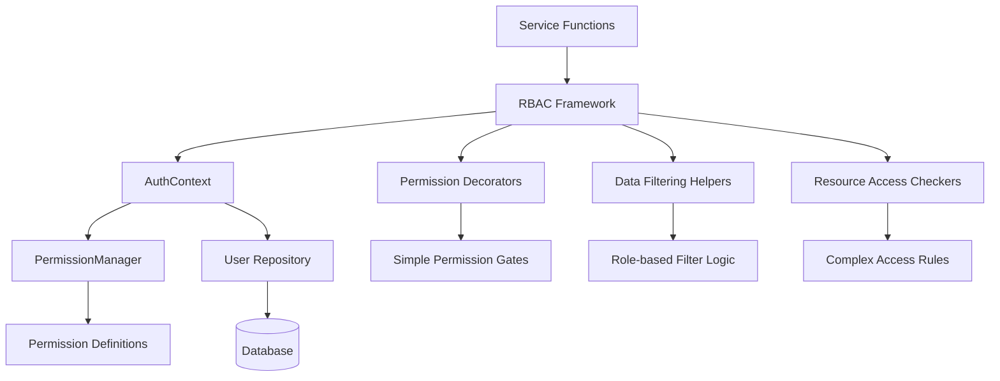

# 設計書: RBAC統一化フレームワーク

## 1. 概要
この設計書は、HR評価システムのバックエンドサービス層における役割ベースアクセス制御（RBAC）を統一化するフレームワークの技術設計を記述します。現在のサービス層で個別実装されている権限チェックとデータフィルタリングロジックを、再利用可能で保守しやすい標準化されたパターンに置き換えることを目的としています。

## 2. アーキテクチャ設計

### 2.1. システム構成図


### 2.2. 技術スタック
- **言語:** Python 3.12
- **フレームワーク:** FastAPI
- **ORM:** SQLAlchemy (既存)
- **権限管理:** 既存のapp.security.permissions拡張
- **キャッシュ:** cachetools (既存パターンを踏襲)
- **デコレーター:** functools.wraps ベース
- **型ヒント:** typing完全対応

### 2.3. コンポーネント設計原則
1. **段階的導入**: 既存サービスと完全に互換性を保ち、段階的なリファクタリングを可能にする
2. **単一責任**: 各ヘルパー関数は明確に定義された単一の責任を持つ
3. **データ駆動**: 権限ロジックは設定可能で、ハードコードを避ける
4. **パフォーマンス重視**: 既存の実装と同等以上のパフォーマンスを維持

## 3. コンポーネント設計

### 3.1. RBACHelper クラス設計

```python
class RBACHelper:
    """統一化されたRBAC操作のためのヘルパークラス"""
    
    @staticmethod
    async def get_accessible_user_ids(
        auth_context: AuthContext, 
        target_user_id: Optional[UUID] = None
    ) -> Optional[List[UUID]]:
        """ユーザーがアクセス可能なユーザーIDリストを返す"""
        
    @staticmethod
    async def get_accessible_resource_ids(
        auth_context: AuthContext,
        resource_type: ResourceType,
        target_user_id: Optional[UUID] = None
    ) -> Optional[List[UUID]]:
        """特定リソースタイプのアクセス可能IDリストを返す"""
        
    @staticmethod
    async def can_access_resource(
        auth_context: AuthContext,
        resource_id: UUID,
        resource_type: ResourceType,
        owner_user_id: Optional[UUID] = None
    ) -> bool:
        """特定リソースへのアクセス権限チェック"""
```

### 3.2. デコレーター設計

```python
def require_permission(permission: Permission):
    """単一権限要求デコレーター"""
    def decorator(func):
        @wraps(func)
        async def wrapper(*args, **kwargs):
            auth_context = extract_auth_context(args, kwargs)
            auth_context.require_permission(permission)
            return await func(*args, **kwargs)
        return wrapper
    return decorator

def require_any_permission(permissions: List[Permission]):
    """複数権限のいずれか要求デコレーター"""
    def decorator(func):
        @wraps(func)
        async def wrapper(*args, **kwargs):
            auth_context = extract_auth_context(args, kwargs)
            auth_context.require_any_permission(permissions)
            return await func(*args, **kwargs)
        return wrapper
    return decorator
```

### 3.3. リソースタイプ定義

```python
class ResourceType(Enum):
    """アクセス制御対象のリソースタイプ"""
    USER = "user"
    GOAL = "goal" 
    EVALUATION = "evaluation"
    ASSESSMENT = "assessment"
    DEPARTMENT = "department"
    
class ResourcePermissionMap:
    """リソースタイプごとの権限マッピング"""
    PERMISSION_MAP = {
        ResourceType.USER: {
            "read_all": Permission.USER_READ_ALL,
            "read_subordinates": Permission.USER_READ_SUBORDINATES,
            "read_self": Permission.USER_READ_SELF
        },
        ResourceType.GOAL: {
            "read_all": Permission.GOAL_READ_ALL,
            "read_subordinates": Permission.GOAL_READ_SUBORDINATES,
            "read_self": Permission.GOAL_READ_SELF
        }
        # ... 他のリソースタイプ
    }
```

### 3.4. データフィルタリング戦略

```python
class FilteringStrategy:
    """役割ベースデータフィルタリング戦略の基底クラス"""
    
    @staticmethod
    async def apply_user_filtering(
        auth_context: AuthContext,
        target_user_id: Optional[UUID] = None
    ) -> Optional[List[UUID]]:
        """ユーザーデータの役割ベースフィルタリング"""
        
        if auth_context.has_permission(Permission.USER_READ_ALL):
            return None  # フィルタリングなし（全ユーザー）
        elif auth_context.has_permission(Permission.USER_READ_SUBORDINATES):
            return await get_subordinate_user_ids(auth_context.user_id)
        elif auth_context.has_permission(Permission.USER_READ_SELF):
            return [auth_context.user_id]
        else:
            raise PermissionDeniedError("No user read permission")
```

## 4. データベース設計への影響

このフレームワークは既存のデータベーススキーマを変更しません。以下の既存テーブルを活用します：

### 4.1. 活用する既存テーブル
- `users`: ユーザー情報とロール関係
- `user_supervisors`: 部下-上司関係
- `user_roles`: ユーザーロール割り当て
- `roles`: ロール定義

### 4.2. 既存権限システムとの統合
```python
# 既存のPermissionManagerとの連携
class RBACHelper:
    @staticmethod
    def _has_permission(auth_context: AuthContext, permission: Permission) -> bool:
        # 既存のPermissionManager.has_permission()を活用
        return PermissionManager.has_permission(
            auth_context.role_names[0],  # Primary role
            permission
        )
```

## 5. APIインターフェース設計

### 5.1. サービス関数との統合パターン

#### パターン1: デコレーター使用（単純な権限チェック）
```python
@require_permission(Permission.USER_MANAGE)
async def delete_user(
    user_id: UUID,
    current_user_context: AuthContext
) -> bool:
    # 権限チェックは自動実行済み
    return await user_repo.delete_user(user_id)
```

#### パターン2: ヘルパー使用（データフィルタリング）
```python
async def get_users(
    current_user_context: AuthContext,
    # ... その他パラメータ
) -> PaginatedResponse[UserDetailResponse]:
    # 統一化されたフィルタリングロジック
    accessible_user_ids = await RBACHelper.get_accessible_user_ids(
        current_user_context,
        target_user_id
    )
    
    # リポジトリ層への委譲（既存パターン）
    users = await user_repo.search_users(
        user_ids=accessible_user_ids,
        # ... その他フィルター
    )
```

#### パターン3: リソースアクセスチェック（複雑な権限ロジック）
```python
async def get_user_by_id(
    user_id: UUID,
    current_user_context: AuthContext
) -> UserDetailResponse:
    # 統一化されたリソースアクセスチェック
    can_access = await RBACHelper.can_access_resource(
        current_user_context,
        user_id,
        ResourceType.USER
    )
    
    if not can_access:
        raise PermissionDeniedError(f"Cannot access user {user_id}")
    
    # 既存のリポジトリロジック
    user = await user_repo.get_user_by_id(user_id)
    return await enrich_user_data(user)
```

## 6. パフォーマンス設計

### 6.1. キャッシュ戦略
```python
# 部下関係キャッシュ（既存パターンを踏襲）
subordinate_cache = TTLCache(maxsize=100, ttl=300)  # 5分間

class RBACHelper:
    @staticmethod
    async def get_subordinate_user_ids(supervisor_id: UUID) -> List[UUID]:
        cache_key = f"subordinates_{supervisor_id}"
        if cached_result := subordinate_cache.get(cache_key):
            return cached_result
            
        # データベースクエリ
        subordinates = await user_repo.get_subordinates(supervisor_id)
        result = [sub.id for sub in subordinates]
        
        subordinate_cache[cache_key] = result
        return result
```

### 6.2. パフォーマンス目標
- 既存実装との性能差: ±5%以内
- キャッシュヒット率: 80%以上
- デコレーターオーバーヘッド: 1ms未満

## 7. エラーハンドリング設計

### 7.1. 統一エラーレスポンス
```python
class RBACError(Exception):
    """RBAC関連エラーの基底クラス"""
    pass

class InsufficientPermissionError(RBACError, PermissionDeniedError):
    """権限不足エラー"""
    def __init__(self, required_permission: Permission, user_roles: List[str]):
        super().__init__(
            f"Permission {required_permission.value} required. "
            f"User has roles: {user_roles}"
        )

class ResourceAccessDeniedError(RBACError, PermissionDeniedError):
    """リソースアクセス拒否エラー"""
    def __init__(self, resource_type: ResourceType, resource_id: UUID):
        super().__init__(
            f"Access denied to {resource_type.value} resource {resource_id}"
        )
```

### 7.2. ログ出力設計
```python
import structlog

rbac_logger = structlog.get_logger("rbac")

class RBACHelper:
    @staticmethod
    async def _log_access_check(
        auth_context: AuthContext,
        resource_type: ResourceType,
        resource_id: UUID,
        result: bool
    ):
        rbac_logger.info(
            "resource_access_check",
            user_id=auth_context.user_id,
            user_roles=auth_context.role_names,
            resource_type=resource_type.value,
            resource_id=str(resource_id),
            access_granted=result
        )
```

## 8. テスト設計

### 8.1. テスト戦略
- **単体テスト**: 各ヘルパーメソッドとデコレーターの動作確認
- **統合テスト**: 既存サービス関数との互換性確認
- **パフォーマンステスト**: 既存実装との性能比較
- **セキュリティテスト**: 権限バイパスの防止確認

### 8.2. テストケース例
```python
class TestRBACHelper:
    @pytest.mark.asyncio
    async def test_admin_gets_all_user_access(self):
        admin_context = create_admin_auth_context()
        result = await RBACHelper.get_accessible_user_ids(admin_context)
        assert result is None  # 全ユーザーアクセス可能
        
    @pytest.mark.asyncio
    async def test_employee_gets_self_only_access(self):
        employee_context = create_employee_auth_context()
        result = await RBACHelper.get_accessible_user_ids(employee_context)
        assert result == [employee_context.user_id]
```

## 9. 移行計画

### 9.1. 段階的導入手順
1. **Phase 1**: RBACHelperクラスの実装とテスト
2. **Phase 2**: 既存サービス関数との互換性確認
3. **Phase 3**: 1つのサービス（user_service）での試験導入
4. **Phase 4**: 段階的に他のサービスに拡張
5. **Phase 5**: 既存の冗長なコードの削除

### 9.2. 後方互換性保証
- 既存のAuthContext APIは維持
- 既存のPermissionManager呼び出しは継続動作
- 段階的リファクタリングが可能