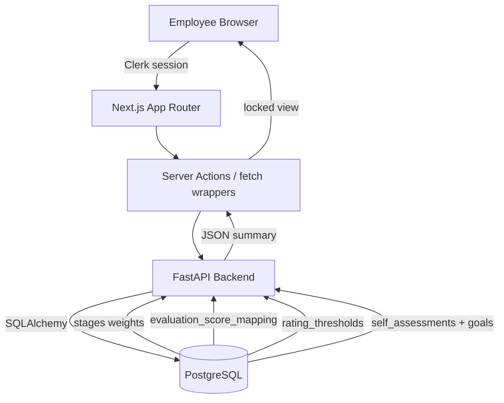

# 設計書: DB-Driven Self-Assessment Scoring & UI

## 1. 概要
This design translates the requirements from issue #355, the HR meeting, and the spreadsheet screenshots into concrete changes to our FastAPI + Next.js stack. It introduces rating master tables, a scoring service that consumes stage weights, policy-aware submission summaries, and a production-ready `/self-assessment` UI with autosave.

## 2. アーキテクチャ設計

### 2.1. システム構成図


### 2.2. 技術スタック
- **Frontend:** Next.js 15 App Router, React Server Components, shadcn/ui, TanStack Query (existing), Tailwind.
- **Backend:** FastAPI 0.110, SQLAlchemy async session, Pydantic v2 schemas, cachetools (already present for TTL caches).
- **DB:** Supabase PostgreSQL with pgcrypto; migrations managed in `backend/app/database/migrations`.

## 3. データベース設計

### 3.1. 新テーブル: `evaluation_score_mapping`
| Column | Type | Description |
| --- | --- | --- |
| `id` | UUID PK default `gen_random_uuid()` | |
| `rating_code` | TEXT UNIQUE | `SS`, `S`, `A+`, `A`, `A-`, `B`, `C`, `D` |
| `rating_label` | TEXT | Localized label (JP/EN) |
| `score_value` | DECIMAL(3,1) | Numeric score from spreadsheet (SS=7 … D=0) |
| `is_active` | BOOLEAN default TRUE | Allows soft deactivation |
| `updated_at` | TIMESTAMPTZ default now | |

Seed script sets the 8 canonical rows. Repository: `ScoreMappingRepository.get_score(code)` & `.list_scores()`.

### 3.2. 新テーブル: `rating_thresholds`
| Column | Type | Description |
| --- | --- | --- |
| `id` | UUID PK |
| `rating_code` | TEXT UNIQUE FK -> `evaluation_score_mapping.rating_code` |
| `min_score` | DECIMAL(3,2) | Lower bound (SS ≥ 6.50 etc.) |
| `note` | TEXT | e.g., "Spreadsheet 2025Q4" |
| `updated_at` | TIMESTAMPTZ |

Data seeded from spreadsheet screenshot (SS 6.5 / S 5.5 / A+ 4.5 / A 3.7 / A- 2.7 / B 1.7 / C 1.0 / fallback D). Index on `min_score DESC` for efficient lookup.

### 3.3. 新テーブル: `evaluation_policy_flags`
| Column | Type | Description |
| --- | --- | --- |
| `key` | TEXT PK | e.g., `mbo_d_is_fail`
| `value` | JSONB | `{ "enabled": true, "forced_rating": "D" }`
| `updated_at` | TIMESTAMPTZ | |

Helps us store toggles without redeploys. Additional policies (future) can be inserted as rows.

### 3.4. 新テーブル: `level_adjustment_master`
| Column | Type | Description |
| --- | --- | --- |
| `rating_code` | TEXT PK |
| `level_delta` | INTEGER | e.g., `SS=+10`, `S=+8`, `D=-8` from spreadsheet column "レベル増減" |
| `notes` | TEXT | |
| `updated_at` | TIMESTAMPTZ | |

### 3.5. 集計テーブル: `self_assessment_summaries`
Stores the computed payload returned on submission.

| Column | Type | Description |
| --- | --- | --- |
| `id` | UUID PK |
| `user_id` | UUID | FK -> users |
| `period_id` | UUID | FK -> evaluation_periods |
| `stage_id` | UUID | FK -> stages (snapshot) |
| `stage_weights` | JSONB | `{ "quantitative": 80, ... }` |
| `per_bucket` | JSONB | `[ { "bucket": "quantitative", "weight": 80, "avg": 6.2, "contribution": 4.96 }, ... ]` |
| `weighted_total` | DECIMAL(4,2) | Sum contributions |
| `final_rating_code` | TEXT | e.g., `S` |
| `flags` | JSONB | `{ "fail": true, "notes": ["MBO rating D"] }` |
| `level_adjustment_preview` | JSONB | `{ "rating": "S", "delta": 8 }` |
| `submitted_at` | TIMESTAMPTZ | duplicates self_assessment timestamp |
| `created_at / updated_at` | TIMESTAMPTZ | |
| Unique index | `(user_id, period_id)` ensures one summary per employee per cycle |

### 3.6. 最新承認ゴールビュー
Create a SQL view `latest_approved_goals` to simplify queries:
```sql
CREATE OR REPLACE VIEW latest_approved_goals AS
WITH RECURSIVE chain AS (
  SELECT g.id, g.previous_goal_id, g.user_id, g.period_id, g.status, g.goal_category,
         ROW_NUMBER() OVER (PARTITION BY g.user_id, g.goal_category, g.period_id ORDER BY g.created_at DESC) AS rn
  FROM goals g
  WHERE g.status = 'approved'
)
SELECT * FROM chain WHERE rn = 1;
```
This view is scoped via `GoalRepository.apply_org_scope_via_user`.

## 4. バックエンド設計

### 4.1. ScoreMappingRepository & ScoringService
- **`backend/app/database/repositories/score_mapping_repo.py`**: CRUD for `evaluation_score_mapping` & `rating_thresholds`.
- **`backend/app/services/scoring_service.py`** (new):
  1. `get_score_for_rating(code)` → Decimal.
  2. `compute_bucket_average(items)` → convert each SS–D rating to numeric via repo, average.
  3. `apply_stage_weights(buckets, stage_weights)` → multiply per spec; skip weight==0 buckets.
  4. `map_numeric_to_grade(total)` → read thresholds ordered by `min_score DESC`, first match.
  5. `evaluate_policy_flags(context)` → e.g., `mbo_d_is_fail` checks any quantitative item rating `D`, overrides `final_rating` and sets fail note.
  6. `attach_level_preview(final_rating)` → read `level_adjustment_master`.

### 4.2. SelfAssessmentService updates
File: `backend/app/services/self_assessment_service.py`
- Extend `SelfAssessmentService` with a dependency on `ScoringService` (lazy init to keep constructor backwards-compatible).
- New method `build_self_assessment_payload(user_id, period_id)` returning `{ goals, draft, stage_weights }`:
  - Goals = join `latest_approved_goals` + `GoalRepository` (fetch target data + competency IDs) filtered by organization & period.
  - Draft = `SelfAssessmentRepository` storing JSON per goal (new column? reuse existing `self_rating/self_comment`). We'll store textual rating & comment per bucket in a new DTO, but DB remains per-goal because `self_assessments` already exists. Add `self_rating_text` column to `self_assessments` (nullable) so we can store SS–D while keeping numeric in summary.
- Submission flow:
  1. Validate every bucket with `stage_weight > 0` has ratings for all associated goals.
  2. Persist `self_rating_text` & `self_comment` per goal (existing table) as part of draft upserts.
  3. Call `ScoringService` with bucketized data to obtain summary.
  4. Insert/Upsert row in `self_assessment_summaries` keyed by `(user_id, period_id)`.
  5. Update `self_assessments.status = submitted`, set `submitted_at`, keep existing auto creation of `SupervisorFeedback`.

### 4.3. API エンドポイント
Extend `backend/app/api/v1/self_assessments.py`:
- `GET /self-assessments/current`: returns `{ goals, draft, stageWeights, thresholds, summary? }` for the authenticated user + active period.
- `POST /self-assessments/draft`: body `{ goalEntries: [{ goalId, bucket, ratingCode, comment }] }` with idempotent upsert. Response includes `{ saved: true, updatedAt }`.
- `POST /self-assessments/submit`: triggers scoring, returns summary payload from Table 3.5.
- `GET /self-assessments/summary/{periodId}`: allow admins/supervisors to see employee summaries (RBAC via `Permission.ASSESSMENT_READ_ALL`).

These routes reuse existing dependencies (`get_auth_context`, `get_db_session`) and Pydantic schemas under a new module `backend/app/schemas/self_assessment_summary.py`.

### 4.4. Validation & Error Handling
- Missing stage weights ⇒ `BadRequestError("Stage weights not configured for stage Stage6")`.
- Empty rating master ⇒ `BadRequestError("Score mapping missing")`.
- Autosave conflict (same payload submitted twice) handled by checking `self_assessment_summaries.updated_at` and returning HTTP 409.

## 5. フロントエンド設計

### 5.1. ルーティング
- Add `frontend/src/app/(evaluation)/(employee)/self-assessment/page.tsx` that renders `<SelfAssessmentPage />` from `frontend/src/feature/evaluation/employee/self-assessment/display`.
- Update `routes.ts` and sidebar groups to include `/self-assessment` under 人事評価システム.

### 5.2. Feature Module Structure
```
frontend/src/feature/evaluation/employee/self-assessment/
  display/SelfAssessmentPage.tsx
  components/
    BucketSection.tsx
    RatingRadioGroup.tsx
    AssessmentSummaryPanel.tsx
    GradeLadder.tsx
    AutosaveToast.tsx
  hooks/
    useSelfAssessmentData.ts
    useAutosaveDraft.ts
    useGradePreview.ts
  types/
    index.ts (Bucket enum, Draft shape)
```

### 5.3. Data Flow
1. Server Component fetches `getSelfAssessmentContextAction()` (new server action calling `GET /self-assessments/current`).
2. Client component hydrates with `{ goals, draft, stageWeights, thresholds, summary }`.
3. `useSelfAssessmentData` groups goals by bucket (quantitative, qualitative, competency) and handles 0% buckets by filtering.
4. `useAutosaveDraft` debounce logic:
```typescript
const requestIdRef = useRef(0);
const saveDraft = useDebouncedCallback(async (payload) => {
  const rid = ++requestIdRef.current;
  const result = await postDraft(payload, rid);
  if (rid !== requestIdRef.current) return; // drop stale
  setLastSaved(result.updatedAt);
}, 1200);
```
5. On submit, call server action `submitSelfAssessmentAction`, display summary, lock UI.

### 5.4. UI States
- **Editing:** Radios (SS–D) per goal, optional comment textarea, stage weight badges, bucket subtotals.
- **Draft Saved:** Autosave toast "下書きを保存しました" with timestamp.
- **Read-only:** All inputs disabled, summary panel shows data from backend (no longer recomputed client-side).
- **Fail flag:** Red badge referencing spreadsheet note (e.g., “MBO D評価フラグがオンのため降格基準に該当”).

### 5.5. Grade Ladder Component
Consumes `rating_thresholds` to build a vertical ladder (SS→D). Current numeric total is plotted as a marker. When the spreadsheet changes, ladder automatically reflects updated thresholds because data flows from API.

### 5.6. i18n & Accessibility
- Labels stored in `frontend/src/feature/evaluation/employee/self-assessment/constants.ts` with `ja`/`en` fields.
- Radios leverage `aria-labelledby`, focus ring classes from shadcn.
- Summary table uses `<dl>` for responsive mobile layout and `<table>` for desktop.

## 6. テスト戦略
- **Unit (backend):**
  - `tests/services/test_scoring_service.py` covering forward mapping, reverse thresholds, 0% bucket, policy overrides.
  - `tests/services/test_self_assessment_summary.py` verifying summary JSON persists and round-trips.
- **Integration:**
  - API tests under `backend/tests/api/test_self_assessment_summary.py` for draft → submit flow, RBAC checks, missing weights scenario.
  - Fixture parity test loaded from spreadsheet sample rows (e.g., Employee 00001 S=6.0, Employee 00002 D=0.5 w/ MBO D flag).
- **Frontend:**
  - Component tests with React Testing Library for `GradeLadder` and `BucketSection` (ensures hidden buckets when weight=0).
  - Cypress (or Playwright) smoke test for autosave race conditions using mocked server responses.

## 7. 運用・監視
- Log `ScoringService` outputs at INFO level only when `flags.fail = true` or when totals differ >0.1 from previous summary (helps debug data regressions without spamming).
- Add metrics counter `self_assessment_submission_total` (Prometheus) tagged by `stage_id` and `final_rating_code` for HR insights.
