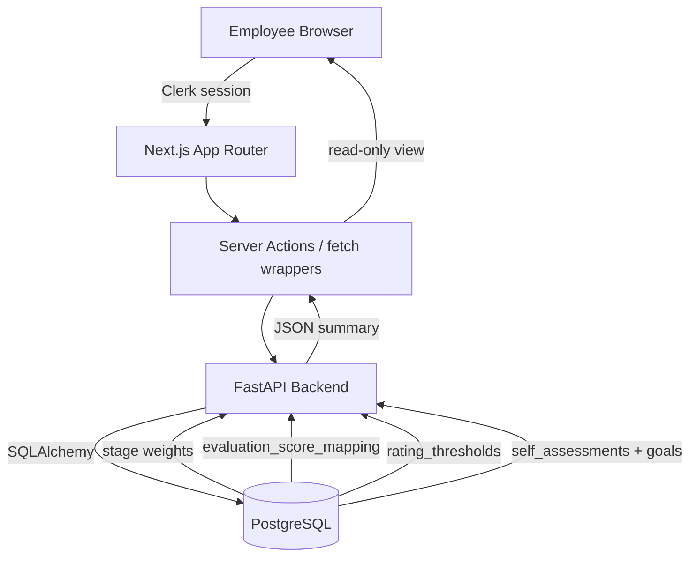

# Design Document: DB-Driven Self-Assessment Scoring & UI

## 1. Overview
This design turns the requirements from issue #355, the HR workshop, and the spreadsheet screenshots into concrete changes for our FastAPI + Next.js stack. It introduces rating master tables, a scoring service that consumes stage weights, policy-aware submission summaries, and a production-ready `/self-assessment` UI with autosave.

## 2. Architecture

### 2.1. System Diagram


### 2.2. Technology Stack
- **Frontend:** Next.js 15 App Router, React Server Components, shadcn/ui, TanStack Query, Tailwind CSS.
- **Backend:** FastAPI 0.110, SQLAlchemy (async), Pydantic v2 schemas, cachetools (already used for TTL caches).
- **Database:** Supabase PostgreSQL with pgcrypto; migrations stored under `backend/app/database/migrations`.

## 3. Database Design

### 3.1. Table: `evaluation_score_mapping`
| Column | Type | Description |
| --- | --- | --- |
| `id` | UUID PK default `gen_random_uuid()` | Primary key |
| `organization_id` | VARCHAR(50) FK → `organizations.id` | Tenant that owns this mapping |
| `rating_code` | TEXT | `SS`, `S`, `A+`, `A`, `A-`, `B`, `C`, `D` |
| `rating_label` | TEXT | Localized display label |
| `score_value` | DECIMAL(3,1) | Numeric score (SS=7 … D=0) |
| `is_active` | BOOLEAN default TRUE | Soft toggle |
| `updated_at` | TIMESTAMPTZ default now | Audit |

Unique constraint: `(organization_id, rating_code)` so each organization can customize labels without colliding. Index on `organization_id` to support API scoping, mirroring how `stages` is already multi-tenant.

Seed data inserts the eight canonical rows. Repository: `ScoreMappingRepository.get_score(code)` / `.list_scores()`.

### 3.2. Table: `rating_thresholds`
| Column | Type | Description |
| --- | --- | --- |
| `id` | UUID PK |
| `organization_id` | VARCHAR(50) FK → `organizations.id` | Matches the tenant of the mapping |
| `rating_code` | TEXT FK → `evaluation_score_mapping.rating_code` |
| `min_score` | DECIMAL(3,2) | Lower bound (SS ≥ 6.50, etc.) |
| `note` | TEXT | e.g., "Sheet 2025Q4" |
| `updated_at` | TIMESTAMPTZ | Audit |

Unique constraint `(organization_id, rating_code)` keeps thresholds tenant-specific, and an index on `(organization_id, min_score DESC)` accelerates grade lookups.

Data originates from the spreadsheet ladder (SS 6.5 / S 5.5 / … / C 1.0, default D). Index on `min_score DESC` for fast lookup.

### 3.3. Table: `evaluation_policy_flags`
| Column | Type | Description |
| --- | --- | --- |
| `organization_id` | VARCHAR(50) FK → `organizations.id` | Tenant scope |
| `key` | TEXT | e.g., `mbo_d_is_fail` |
| `value` | JSONB | `{ "enabled": true, "forced_rating": "D" }` |
| `updated_at` | TIMESTAMPTZ | Audit |

Composite primary key `(organization_id, key)` ensures independence per organization. Stores optional toggles so HR can change policy without redeploying.

### 3.4. Table: `level_adjustment_master`
| Column | Type | Description |
| --- | --- | --- |
| `organization_id` | VARCHAR(50) FK → `organizations.id` | Tenant scope |
| `rating_code` | TEXT | e.g., `SS`, `S`, `A+`, etc. |
| `level_delta` | INTEGER | e.g., `SS=+10`, `S=+8`, `D=-8` (from Level Delta column) |
| `notes` | TEXT | Optional context |
| `updated_at` | TIMESTAMPTZ | Audit |

Composite primary key `(organization_id, rating_code)` mirrors the other masters.

### 3.5. Table: `self_assessment_summaries`
Stores the payload returned when an assessment is submitted.

| Column | Type | Description |
| --- | --- | --- |
| `id` | UUID PK |
| `organization_id` | VARCHAR(50) FK → `organizations.id` | Ensures summaries stay within tenant boundaries |
| `user_id` | UUID FK → users |
| `period_id` | UUID FK → evaluation_periods |
| `stage_id` | UUID FK → stages (snapshot) |
| `stage_weights` | JSONB | `{ "quantitative": 80, ... }` |
| `per_bucket` | JSONB | `[ { "bucket": "quantitative", "weight": 80, "avg": 6.2, "contribution": 4.96 }, ... ]` |
| `weighted_total` | DECIMAL(4,2) | Sum of contributions |
| `final_rating_code` | TEXT | `S`, `A-`, etc. |
| `flags` | JSONB | `{ "fail": true, "notes": ["MBO rating D"] }` |
| `level_adjustment_preview` | JSONB | `{ "rating": "S", "delta": 8 }` |
| `submitted_at` | TIMESTAMPTZ | Mirrors `self_assessments.submitted_at` |
| `created_at` / `updated_at` | TIMESTAMPTZ | Audit |
| Unique index | `(organization_id, user_id, period_id)` ensures one summary per employee per cycle and tenant |

### 3.6. View: `latest_approved_goals`
A SQL view isolates the newest approved goal per chain:
```sql
CREATE OR REPLACE VIEW latest_approved_goals AS
WITH RECURSIVE chain AS (
  SELECT g.id,
         g.previous_goal_id,
         g.user_id,
         g.period_id,
         g.status,
         g.goal_category,
         ROW_NUMBER() OVER (
             PARTITION BY g.user_id, g.goal_category, g.period_id
             ORDER BY g.created_at DESC
         ) AS rn
  FROM goals g
  WHERE g.status = 'approved'
)
SELECT * FROM chain WHERE rn = 1;
```
`GoalRepository` scopes it via `apply_org_scope_via_user`, so every query automatically filters by `organization_id` inherited from the linked user.

## 4. Backend Design

### 4.1. Score Mapping & Scoring Service
- **Repository:** `backend/app/database/repositories/score_mapping_repo.py` provides `get_score`, `list_scores`, `list_thresholds`.
- **Service:** `backend/app/services/scoring_service.py` (new) exposes:
  1. `get_score_for_rating(code)` → Decimal
  2. `compute_bucket_average(items)` → convert SS–D to numeric averages
  3. `apply_stage_weights(buckets, stage_weights)` → multiply by weight/100, skip zero-weight buckets
  4. `map_numeric_to_grade(total)` → iterate thresholds ordered by `min_score DESC`
  5. `evaluate_policy_flags(context)` → e.g., `mbo_d_is_fail` forces final grade to D and sets fail notes
  6. `attach_level_preview(final_rating)` → fetch delta from `level_adjustment_master`

### 4.2. SelfAssessmentService Changes
File: `backend/app/services/self_assessment_service.py`.
- Inject `ScoringService` (lazy initialization to keep constructor compatibility).
- New helper `get_self_assessment_context(user_id, period_id)` returning `{ goals, draft, stage_weights, thresholds }`.
  - Goals sourced via `latest_approved_goals` view and hydrated through `GoalRepository`.
  - Stage data loaded from `StageRepository` using the employee’s `stage_id` at request time.
- Draft persistence: add `self_rating_text` column to `self_assessments` to store SS–D alongside `self_rating` (numeric) and comments.
- Submission flow:
  1. Validate that every bucket with `weight > 0` has ratings for all included goals.
  2. Persist per-goal ratings/comments (draft or final).
  3. Call `ScoringService` to compute per-bucket averages, totals, grade, flags, level preview.
  4. Upsert into `self_assessment_summaries` keyed by `(user_id, period_id)`.
  5. Mark each `self_assessment` as submitted (existing logic also auto-creates `SupervisorFeedback`).

### 4.3. API Endpoints
Extend `backend/app/api/v1/self_assessments.py`:
- `GET /self-assessments/current` → `{ goals, draft, stageWeights, thresholds, summary? }` for the authenticated user + active period.
- `POST /self-assessments/draft` → idempotent upsert `{ goalEntries: [{ goalId, bucket, ratingCode, comment }] }`, returns `{ saved: true, updatedAt }`.
- `POST /self-assessments/submit` → runs scoring pipeline and returns the summary payload stored in `self_assessment_summaries`.
- `GET /self-assessments/summary/{periodId}` → admin/supervisor visibility with RBAC via `Permission.ASSESSMENT_READ_ALL` + subordinate checks.

New Pydantic schemas live in `backend/app/schemas/self_assessment_summary.py` to keep API responses typed.

### 4.4. Validation & Errors
- Missing stage weights → `BadRequestError("Stage weights not configured for stage Stage6")`.
- Empty rating master or thresholds → `BadRequestError("Score mapping missing")`.
- Autosave conflicts → return HTTP 409 when incoming payload is identical to the latest saved state.

## 5. Frontend Design

### 5.1. Routing
- Add `frontend/src/app/(evaluation)/(employee)/self-assessment/page.tsx` that renders `<SelfAssessmentPage />` from `frontend/src/feature/evaluation/employee/self-assessment/display`.
- Update `routes.ts` and the navigation sidebar to include `/self-assessment` (icon: clipboard-check).

### 5.2. Feature Module Structure
```
frontend/src/feature/evaluation/employee/self-assessment/
  display/SelfAssessmentPage.tsx
  components/
    BucketSection.tsx
    RatingRadioGroup.tsx
    AssessmentSummaryPanel.tsx
    GradeLadder.tsx
    AutosaveToast.tsx
  hooks/
    useSelfAssessmentData.ts
    useAutosaveDraft.ts
    useGradePreview.ts
  types/
    index.ts (Bucket enum, Draft shape)
```

### 5.3. Data Flow
1. The server component fetches `getSelfAssessmentContextAction()` (new server action hitting `GET /self-assessments/current`).
2. The client component hydrates with `{ goals, draft, stageWeights, thresholds, summary }`.
3. `useSelfAssessmentData` groups goals by bucket and filters out zero-weight buckets.
4. `useAutosaveDraft` debounces payloads and drops stale responses:
```typescript
const requestIdRef = useRef(0);
const saveDraft = useDebouncedCallback(async (payload) => {
  const rid = ++requestIdRef.current;
  const result = await postDraft(payload, rid);
  if (rid !== requestIdRef.current) return; // drop stale response
  setLastSaved(result.updatedAt);
}, 1200);
```
5. `submitSelfAssessmentAction` sends the final payload; on success the UI switches to read-only and renders the backend summary.

### 5.4. UI States
- **Editing:** SS–D radio groups per goal, optional comment textarea, stage weight badges, bucket subtotals.
- **Draft saved:** Autosave toast “Draft saved at 12:34” with clock icon.
- **Error:** Callout banner when autosave fails; retry button triggers the hook again.
- **Read-only:** Inputs disabled, summary panel displays backend truth, fail badge visible when `flags.fail` is true.

### 5.5. Grade Ladder Component
Consumes `rating_thresholds` to draw the ladder (SS→D). Highlights the current numeric total and shows each cutoff. Because data comes from the API, ladder updates automatically after HR edits thresholds.

### 5.6. i18n & Accessibility
- Copy file `copy.ts` stores strings for `ja` and `en`; components read from the existing locale context.
- Radio groups use `aria-labelledby` and shadcn focus styles; summary tables use semantic `<table>` on desktop and `<dl>` fallback on mobile.

## 6. Testing Strategy
- **Backend unit tests:** `tests/services/test_scoring_service.py` covering mapping, thresholds, zero-weight buckets, policy overrides.
- **Backend integration:** `backend/tests/api/test_self_assessment_summary.py` exercising draft → submit → summary, including fixture parity with the spreadsheet (Employee 00001 success, Employee 00002 fail due to MBO D).
- **Frontend tests:** React Testing Library for `BucketSection` (hides zero-weight buckets) and `GradeLadder`; Playwright scenario for autosave race conditions and read-only lock.

## 7. Operations & Monitoring
- Log `ScoringService` output at INFO only when `flags.fail = true` or totals differ by >0.1 from the previous summary.
- Emit Prometheus counter `self_assessment_submission_total{stage_id="...", final_rating="S"}` for HR analytics.
- Create `docs/operations/self-assessment.md` explaining how HR updates thresholds/policies and how to backfill summaries.
