# Domain Model: Self-Assessment Feature

**Feature:** Self-Assessment UI with Mock Data
**Branch:** `feat/self-assessment-ui-mock`
**Date:** 2024-12-02
**Status:** Draft
**Phase:** Phase 1 - Domain Modeling

---

## 📋 Table of Contents

1. [Business Context](#business-context)
2. [Core Entities](#core-entities)
3. [Entity Relationships](#entity-relationships)
4. [Business Rules](#business-rules)
5. [State Transitions](#state-transitions)
6. [Rating System](#rating-system)
7. [Stage Weights](#stage-weights)
8. [Calculation Logic](#calculation-logic)
9. [Open Questions](#open-questions)

---

## 🎯 Business Context

### Problem Statement

The HR Evaluation System requires employees to conduct self-assessments of their performance goals at the end of each evaluation period. This self-assessment is a critical input for the supervisor's review process and final performance evaluation.

### Business Goals

1. **Employee Self-Reflection**: Enable employees to evaluate their own performance against approved goals
2. **Structured Input**: Provide supervisors with structured, category-based employee input for review
3. **Transparent Process**: Make the evaluation criteria and scoring system visible to employees
4. **Draft Support**: Allow employees to save progress and refine their assessments before submission
5. **Supervisor Review**: Enable supervisors to review, approve, or reject employee assessments with feedback

### User Roles

1. **Employee**: Completes self-assessment for their approved goals
2. **Supervisor**: Reviews employee self-assessments and provides feedback/ratings

### Evaluation Flow

```
1. Employee has approved goals for current evaluation period
2. Employee completes self-assessment (rating + comments)
3. System calculates weighted scores per category (bucket)
4. Employee submits self-assessment
5. Supervisor reviews employee's self-assessment
6. Supervisor provides ratings and comments per category
7. Supervisor approves or rejects
8. If rejected: Employee revises and resubmits
9. If approved: Assessment is locked and feeds into final performance review
```

---

## 📦 Core Entities

### 1. SelfAssessment

**Purpose**: Represents an employee's self-evaluation for a specific evaluation period.

**Attributes**:
- `id`: UUID (Primary Key)
- `organizationId`: string (Organization scope)
- `userId`: UUID (Employee being assessed)
- `periodId`: UUID (Evaluation period)
- `stageId`: UUID (Employee's stage at submission - snapshot)
- `status`: enum ('draft' | 'submitted' | 'approved' | 'rejected')
- `submittedAt`: timestamp (When submitted for review)
- `createdAt`: timestamp
- `updatedAt`: timestamp

**Lifecycle**: draft → submitted → (approved | rejected → draft)

**Business Rules**:
- One self-assessment per employee per period
- Can only be edited in 'draft' or 'rejected' status
- Once 'approved', becomes read-only forever
- Stage snapshot is captured at submission time

---

### 2. SelfAssessmentEntry

**Purpose**: Individual rating and comment for each goal within a self-assessment.

**Attributes**:
- `id`: UUID (Primary Key)
- `organizationId`: string
- `assessmentId`: UUID (FK to SelfAssessment)
- `goalId`: UUID (FK to Goal)
- `bucket`: string ('quantitative' | 'qualitative' | 'competency')
- `ratingCode`: string ('SS' | 'S' | 'A+' | 'A' | 'A-' | 'B' | 'C' | 'D')
- `selfRating`: decimal (Numeric score: 0-7)
- `comment`: text (Employee's comment, max 500 chars)
- `createdAt`: timestamp
- `updatedAt`: timestamp

**Business Rules**:
- One entry per goal per assessment
- `bucket` must match goal's category
- `ratingCode` is required for submission (optional for draft)
- `selfRating` is calculated from `ratingCode`

---

### 3. Goal

**Purpose**: Performance objective that employee is evaluated against.

**Attributes** (relevant for self-assessment):
- `id`: UUID
- `userId`: UUID (Goal owner)
- `periodId`: UUID
- `goalCategory`: string ('業績目標' for quantitative/qualitative | 'コンピテンシー' for competency)
- `performanceGoalType`: string ('quantitative' | 'qualitative') - only for performance goals
- `weight`: number (0-100, percentage of category)
- `status`: enum ('draft' | 'submitted' | 'approved' | 'rejected')
- `title`: string (Performance goals only)
- `specificGoalText`: string (What to achieve)
- `achievementCriteriaText`: string (How to measure success)
- `competencyIds`: UUID[] (Competency goals only)
- `actionPlan`: string (Competency goals only)

**Business Rules**:
- Only 'approved' goals can be included in self-assessment
- Goal weights within a category must sum to 100%

---

### 4. BucketDecision

**Purpose**: Supervisor's review and rating per goal category (bucket).

**Attributes**:
- `id`: UUID
- `organizationId`: string
- `assessmentId`: UUID (FK to SelfAssessment)
- `bucket`: string ('quantitative' | 'qualitative' | 'competency')
- `employeeRating`: string (Employee's average rating for this bucket)
- `employeeComment`: text (Aggregated employee comments)
- `employeeContribution`: decimal (Weighted contribution to final score)
- `supervisorRating`: string ('SS' | 'S' | 'A+' | 'A' | 'A-' | 'B' | 'C' | 'D')
- `supervisorComment`: text
- `status`: enum ('pending' | 'approved' | 'rejected')
- `createdAt`: timestamp
- `updatedAt`: timestamp

**Business Rules**:
- Created automatically when employee submits self-assessment
- One decision per bucket per assessment
- `employeeRating` is calculated from all entries in that bucket
- `employeeContribution` = (employeeRating × stageWeight) / 100
- Supervisor can override employee rating
- If any bucket is 'rejected', entire assessment is rejected

---

### 5. EvaluationPeriod

**Purpose**: Time-bound evaluation cycle.

**Attributes** (relevant):
- `id`: UUID
- `name`: string (e.g., "2024 Q4")
- `periodType`: enum ('半期' | '月次' | '四半期' | '年次' | 'その他')
- `startDate`: date
- `endDate`: date
- `goalSubmissionDeadline`: date
- `evaluationDeadline`: date
- `status`: enum ('draft' | 'active' | 'completed' | 'cancelled')

**Business Rules**:
- Only one 'active' period at a time
- Self-assessments can only be created for 'active' periods
- Goals must be approved before evaluation deadline

---

### 6. Stage

**Purpose**: Employee organizational level, determines category weight distribution.

**Attributes**:
- `id`: UUID
- `name`: string (e.g., "Stage 1", "Stage 2", etc.)
- `quantitativeWeight`: number (0-100)
- `qualitativeWeight`: number (0-100)
- `competencyWeight`: number (0-100)

**Business Rules**:
- Weights must sum to 100
- If weight is 0, that category is hidden from employee
- Different stages have different weight distributions:
  - **Stage 1-4**: Balanced (40% quantitative, 40% qualitative, 20% competency)
  - **Stage 5-6**: Quantitative-focused (50% quantitative, 30% qualitative, 20% competency)

---

### 7. Rating

**Purpose**: Standardized scoring system.

**Scale**:
```
Rating Code | Numeric Score | Description
------------|---------------|-------------
SS          | 7             | Exceptional
S           | 6             | Excellent
A+          | 5             | Very Good+
A           | 4             | Very Good
A-          | 3             | Good
B           | 2             | Satisfactory
C           | 1             | Needs Improvement
D           | 0             | Unsatisfactory
```

**Business Rules**:
- Rating code is user-facing (displayed in UI)
- Numeric score is used for calculations
- Mapping is bidirectional and immutable

---

## 🔗 Entity Relationships

### ERD Diagram


### Relationship Descriptions

1. **Employee → SelfAssessment**: One-to-Many
   - An employee can have multiple self-assessments (one per period)
   - A self-assessment belongs to exactly one employee

2. **EvaluationPeriod → SelfAssessment**: One-to-Many
   - A period can have many self-assessments (one per employee)
   - A self-assessment is for exactly one period

3. **SelfAssessment → SelfAssessmentEntry**: One-to-Many
   - An assessment contains multiple entries (one per approved goal)
   - An entry belongs to exactly one assessment

4. **Goal → SelfAssessmentEntry**: One-to-One
   - Each approved goal has exactly one entry in the assessment
   - An entry assesses exactly one goal

5. **SelfAssessment → BucketDecision**: One-to-Many
   - An assessment generates 1-3 bucket decisions (depending on stage weights)
   - A bucket decision belongs to exactly one assessment

6. **Stage → Employee**: One-to-Many
   - A stage has many employees
   - An employee is assigned to exactly one stage

---

## 📜 Business Rules

### Self-Assessment Creation

1. ✅ Can only create self-assessment for 'active' evaluation period
2. ✅ Employee must have at least one 'approved' goal for the period
3. ✅ One self-assessment per employee per period (enforced by unique constraint)
4. ✅ Self-assessment is created in 'draft' status by default

### Draft Management

1. ✅ Draft is auto-saved every 30 seconds (frontend behavior)
2. ✅ Draft can be saved with incomplete ratings (optional `ratingCode`)
3. ✅ Draft can be saved with or without comments
4. ✅ Only the goal owner can edit their own draft
5. ✅ Drafts can be deleted (cascade delete entries)

### Self-Assessment Submission

1. ✅ **Cannot submit unless ALL approved goals have ratings**
2. ✅ Comments are optional but recommended
3. ✅ On submission:
   - Status changes from 'draft' → 'submitted'
   - `submittedAt` timestamp is set
   - Stage snapshot is captured
   - Bucket decisions are created (one per non-zero weight category)
4. ✅ Once submitted, assessment becomes read-only for employee
5. ✅ Submission triggers notification to supervisor

### Bucket Decision Creation (Automatic)

When employee submits:

1. ✅ System groups entries by bucket (quantitative, qualitative, competency)
2. ✅ For each bucket:
   - Calculate average rating: `avgRating = sum(entries.selfRating × goal.weight) / sum(goal.weight)`
   - Calculate contribution: `contribution = (avgRating × stageWeight) / 100`
   - Map numeric average back to rating code
   - Aggregate all comments into single text
   - Create BucketDecision with status 'pending'
3. ✅ Only create bucket decision if stage weight > 0 for that category

### Supervisor Review

1. ✅ Supervisor can view all 'submitted' assessments for their subordinates
2. ✅ Supervisor reviews each bucket decision:
   - Can approve employee rating (no changes)
   - Can provide different rating (override)
   - Must provide comment if overriding
   - Must provide comment if rejecting (minimum 10 characters)
3. ✅ Supervisor actions:
   - **Approve All Buckets**: All bucket decisions → 'approved', assessment → 'approved'
   - **Reject Any Bucket**: That bucket → 'rejected', assessment → 'rejected'
   - Assessment returns to employee for revision

### Assessment Revision (After Rejection)

1. ✅ If assessment is 'rejected', employee can edit again
2. ✅ Employee sees supervisor comments on rejected buckets
3. ✅ Employee revises ratings/comments and resubmits
4. ✅ On resubmit, previous bucket decisions are replaced (not versioned)

### Approval (Final State)

1. ✅ Once assessment is 'approved':
   - Status is locked (cannot be changed)
   - All data becomes read-only
   - Assessment is visible to employee
   - Data feeds into final performance review calculation

### Stage Weight Rules

1. ✅ Weights are fetched from employee's current stage
2. ✅ If bucket weight = 0%:
   - Hide that category from UI
   - Do not create bucket decision for that category
   - Do not include in final score calculation
3. ✅ Weight snapshot is taken at submission time (not dynamically updated)

### Validation Rules

#### Rating Validation
- ✅ `ratingCode` must be one of: SS, S, A+, A, A-, B, C, D
- ✅ `ratingCode` is required for submission (optional for draft)

#### Comment Validation
- ✅ Max length: 500 characters
- ✅ No HTML/script injection (sanitized)
- ✅ Optional for employee (recommended)
- ✅ Required for supervisor if rejecting or overriding rating

#### Goal Validation
- ✅ Only 'approved' goals can be included
- ✅ All approved goals must be included (cannot skip)
- ✅ Goal must belong to same period as assessment
- ✅ Goal must belong to employee

#### Period Validation
- ✅ Period must be 'active'
- ✅ Current date must be before `evaluationDeadline`

---

## 🔄 State Transitions

### Self-Assessment Lifecycle

```mermaid
stateDiagram-v2
    [*] --> Draft: Employee creates
    Draft --> Submitted: Submit with all ratings
    Submitted --> UnderReview: Supervisor opens
    UnderReview --> Approved: Supervisor approves all buckets
    UnderReview --> Rejected: Supervisor rejects any bucket
    Rejected --> Draft: Employee revises
    Approved --> [*]: Locked forever

    note right of Draft
        ✅ Editable by employee
        ✅ Auto-save enabled
        ✅ Can delete
        ✅ Ratings optional
        ⏰ No deadline enforcement
    end note

    note right of Submitted
        ⛔ Read-only for employee
        ✅ Visible to supervisor
        ✅ Awaiting review
        ⏰ Can cancel within 1 hour?
    end note

    note right of UnderReview
        ⛔ Read-only for employee
        ✅ Supervisor is reviewing
        ✅ Bucket decisions created
    end note

    note right of Approved
        ⛔ Locked forever
        ✅ Visible to employee
        ✅ Feeds into performance review
        📊 Used for final rating calculation
    end note

    note right of Rejected
        ✅ Editable by employee
        ✅ Supervisor comments visible
        ✅ Employee can revise and resubmit
        ⚠️ Previous submission replaced
    end note
```



### Bucket Decision Lifecycle

```mermaid
stateDiagram-v2
    [*] --> Pending: Created on assessment submission
    Pending --> Approved: Supervisor approves
    Pending --> Rejected: Supervisor rejects
    Rejected --> [*]: Assessment returned to employee
    Approved --> [*]: Assessment locked

    note right of Pending
        ✅ Contains employee rating/comment
        ✅ Awaiting supervisor review
        ⏳ No timeout
    end note

    note right of Approved
        ✅ Supervisor agrees or provided override rating
        ✅ May have supervisor comment
        📊 Contributes to final score
    end note

    note right of Rejected
        ⛔ Supervisor disagrees
        ✅ Must have supervisor comment
        🔄 Triggers assessment revision
    end note
```



---

## 🎯 Rating System

### Rating Scale

```typescript
const RATING_SCALE = {
  'SS': { score: 7, label: '期待を大きく超える成果', threshold: 6.5 },
  'S':  { score: 6, label: '期待を超える成果', threshold: 5.5 },
  'A+': { score: 5, label: '期待を上回る成果', threshold: 4.5 },
  'A':  { score: 4, label: '期待通りの成果', threshold: 3.5 },
  'A-': { score: 3, label: 'ほぼ期待通りの成果', threshold: 2.5 },
  'B':  { score: 2, label: 'やや期待を下回る', threshold: 1.5 },
  'C':  { score: 1, label: '期待を下回る', threshold: 0.5 },
  'D':  { score: 0, label: '極めて不十分', threshold: 0 }
};
```

### Rating Conversion

**Code → Numeric** (used for calculations):
```typescript
function ratingToScore(code: string): number {
  return RATING_SCALE[code].score;
}
```

**Numeric → Code** (used after averaging):
```typescript
function scoreToRating(score: number): string {
  // Find the highest rating where score >= threshold
  for (const [code, data] of Object.entries(RATING_SCALE)) {
    if (score >= data.threshold) {
      return code;
    }
  }
  return 'D';
}
```

---

## ⚖️ Stage Weights

### Weight Distribution by Stage

| Stage | Quantitative | Qualitative | Competency | Description |
|-------|-------------|-------------|------------|-------------|
| 1     | 40%         | 40%         | 20%        | Balanced (Junior) |
| 2     | 40%         | 40%         | 20%        | Balanced |
| 3     | 40%         | 40%         | 20%        | Balanced |
| 4     | 40%         | 40%         | 20%        | Balanced |
| 5     | 50%         | 30%         | 20%        | Quantitative-focused (Senior) |
| 6     | 50%         | 30%         | 20%        | Quantitative-focused (Leadership) |

### Business Rationale

- **Junior employees (Stage 1-4)**: Balanced focus on results and skills development
- **Senior employees (Stage 5-6)**: Greater emphasis on quantitative results and business impact

### UI Behavior

```typescript
// If a bucket weight is 0, hide it from UI
if (stageWeights.quantitativeWeight === 0) {
  // Do not render quantitative goals section
}
```

---

## 🧮 Calculation Logic

### 1. Goal Entry Scoring

Each goal entry has:
- `ratingCode`: User's selected rating (SS, S, A+, A, A-, B, C, D)
- `selfRating`: Numeric score (0-7)

```typescript
entry.selfRating = ratingToScore(entry.ratingCode);
```

### 2. Bucket Average Calculation (Weighted)

For each bucket (quantitative, qualitative, competency):

```typescript
function calculateBucketAverage(
  entries: Entry[],
  bucket: string
): number {
  const bucketEntries = entries.filter(e => e.bucket === bucket);

  const totalWeightedScore = bucketEntries.reduce((sum, entry) => {
    return sum + (entry.selfRating * entry.goal.weight);
  }, 0);

  const totalWeight = bucketEntries.reduce((sum, entry) => {
    return sum + entry.goal.weight;
  }, 0);

  return totalWeightedScore / totalWeight;
}
```

**Example**:
```
Quantitative Goals:
- Goal A: rating = 5 (A+), weight = 60%
- Goal B: rating = 4 (A), weight = 40%

Bucket Average = (5 × 60 + 4 × 40) / (60 + 40)
               = (300 + 160) / 100
               = 4.6
```

### 3. Bucket Contribution Calculation

Each bucket contributes to final score based on stage weight:

```typescript
function calculateBucketContribution(
  bucketAverage: number,
  stageWeight: number
): number {
  return (bucketAverage * stageWeight) / 100;
}
```

**Example** (Stage 1 employee):
```
Quantitative: avg = 4.6, weight = 40%
Contribution = (4.6 × 40) / 100 = 1.84

Qualitative: avg = 5.0, weight = 40%
Contribution = (5.0 × 40) / 100 = 2.00

Competency: avg = 4.0, weight = 20%
Contribution = (4.0 × 20) / 100 = 0.80
```

### 4. Final Weighted Total

```typescript
function calculateFinalScore(bucketContributions: number[]): number {
  return bucketContributions.reduce((sum, contrib) => sum + contrib, 0);
}
```

**Example**:
```
Final Score = 1.84 + 2.00 + 0.80 = 4.64
Final Rating = scoreToRating(4.64) = 'A+' (since 4.64 >= 4.5)
```

### 5. Flags and Validation

```typescript
interface SubmissionFlags {
  fail: boolean;
  notes: string[];
}

function validateSubmission(finalScore: number): SubmissionFlags {
  const flags: SubmissionFlags = { fail: false, notes: [] };

  // Example: Automatic fail if score < 2.0
  if (finalScore < 2.0) {
    flags.fail = true;
    flags.notes.push('Overall performance below acceptable threshold');
  }

  // Example: Warning if any bucket rated D
  // (This logic would check individual bucket ratings)

  return flags;
}
```

---

## ❓ Open Questions

### 1. Cancellation Window

**Question**: Can employee cancel submission within 1 hour?
**Current Assumption**: No, once submitted it's locked until supervisor acts
**Decision Needed**: Confirm with business team

### 2. Partial Submission

**Question**: What if employee has no approved goals for a specific category?
**Current Assumption**: Only submit categories with goals, skip empty categories
**Decision Needed**: Validate this behavior

### 3. Supervisor Override Impact

**Question**: If supervisor overrides rating, does it replace employee rating or coexist?
**Current Assumption**: Coexist - both ratings stored, supervisor rating used for final calculation
**Decision Needed**: Confirm with business requirements

### 4. Historical Tracking

**Question**: Should we keep history of rejected submissions?
**Current Assumption**: No versioning - latest submission replaces previous
**Decision Needed**: Confirm if audit trail is needed

### 5. Deadline Enforcement

**Question**: What happens if employee submits after `evaluationDeadline`?
**Current Assumption**: System allows submission, but supervisor sees "late" indicator
**Decision Needed**: Hard cutoff or soft warning?

### 6. Competency Goal Weight Distribution

**Question**: Do competency goals also have individual weights that sum to 100?
**Current Assumption**: Yes, same as performance goals
**Decision Needed**: Confirm with business rules

### 7. Multi-Supervisor Scenario

**Question**: What if employee has multiple supervisors (matrix organization)?
**Current Assumption**: Single supervisor review only
**Decision Needed**: Future enhancement or current requirement?

---

## ✅ Next Steps

1. ✅ Review this domain model with product/business team
2. ✅ Resolve open questions
3. ✅ Create API Contract (Phase 2)
4. ✅ Begin frontend implementation with mocks (Phase 3)

---

**Document Owner**: Frontend Team
**Review Status**: Pending Product Review
**Last Updated**: 2024-12-02
