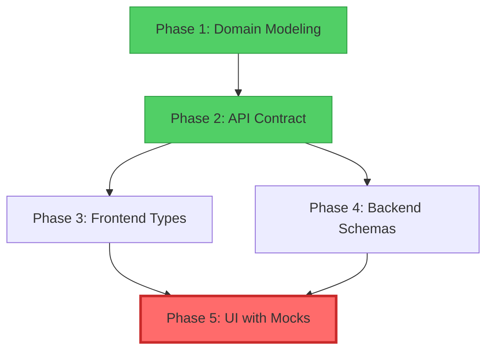

# Self-Assessment Feature Specification

**Status:** In Development
**Created:** 2024-12-18
**Branch:** `feature/self-assessment-implementation`

---

## 📋 Overview

This directory contains all specification documents for the Self-Assessment feature implementation following the Domain-First Development approach.

---

## 🗂️ Documentation Index

### Phase 1: Domain Modeling
📄 **[domain-model.md](./domain-model.md)** - Issue #414
- Business context and problem definition
- Core entities (SelfAssessment, Goal, EvaluationPeriod, User)
- Entity Relationship Diagrams (ERD)
- Business rules and validations
- State transition diagrams
- Open questions for product team

**Status:** 🟡 Draft
**Estimate:** 1-2 days

---

### Phase 2: API Contract Definition
📄 **[api-contract.md](./api-contract.md)** - Issue #415
- API endpoints specification (REST)
- Request/Response schemas (TypeScript notation)
- Error responses and codes
- Validation rules
- Rate limiting
- Permission requirements

**Status:** 🟡 Draft
**Estimate:** 1 day
**Depends on:** Phase 1

---

### Phase 3: Frontend TypeScript Types Review
📄 **[frontend-typescript-types.md](./frontend-typescript-types.md)** - Issue #416
- Review existing types in `frontend/src/api/types/self-assessment.ts`
- Compare with API Contract
- Verify alignment with backend Pydantic schemas
- Document type mappings (TypeScript ↔ Pydantic)
- Add JSDoc comments and examples

**Status:** 🟡 Todo
**Estimate:** 0.5 day
**Depends on:** Phase 2

---

### Phase 4: Backend Pydantic Schemas Review
📄 **[backend-pydantic-schemas.md](./backend-pydantic-schemas.md)** - Issue #417
- Review existing schemas in `backend/app/schemas/self_assessment.py`
- Compare with API Contract
- Add/update field validators for business rules
- Verify alignment with frontend TypeScript types
- Add docstrings and examples
- Create unit tests

**Status:** 🟡 Todo
**Estimate:** 0.5 day
**Depends on:** Phase 2

---

### Phase 5: UI Implementation with Mock Data
📄 **[ui-implementation-with-mocks.md](./ui-implementation-with-mocks.md)** - Issue #418
- Mock data system implementation
- Mock service with CRUD operations
- USE_MOCK switch logic in endpoints
- UI pages and components
- Server actions
- Auto-save functionality
- Form validation

**Status:** 🔴 Todo (CRITICAL)
**Estimate:** 3-5 days
**Depends on:** Phases 1, 2, 3, 4

---

## 🎯 Implementation Flow

**Parallel Work Opportunities:**
- Phase 3 (Frontend Types) and Phase 4 (Backend Schemas) can be done in parallel after Phase 2

---

## 📊 Progress Tracking

| Phase | Document | Status | Issue | Progress |
|-------|----------|--------|-------|----------|
| 1 | Domain Modeling | 🟡 Draft | #414 | 0% |
| 2 | API Contract | 🟡 Draft | #415 | 0% |
| 3 | Frontend Types | ⚪ Todo | #416 | 0% |
| 4 | Backend Schemas | ⚪ Todo | #417 | 0% |
| 5 | UI with Mocks | ⚪ Todo | #418 | 0% |

**Overall Progress:** 0% (0/5 phases complete)

---

## 🔗 Related Resources

### Existing Implementation
- Frontend Types: `frontend/src/api/types/self-assessment.ts`
- Backend Schemas: `backend/app/schemas/self_assessment.py`
- Backend Service: `backend/app/services/self_assessment_service.py`
- Backend Repository: `backend/app/database/repositories/self_assessment_repo.py`
- Frontend Endpoints: `frontend/src/api/endpoints/self-assessments.ts`

### Guides and References
- [Mock Data Implementation Guide](../../docs/development/MOCK_DATA_IMPLEMENTATION_GUIDE.md)
- [API Client Documentation](../../frontend/src/api/README.md)
- [CLAUDE.md](../../../CLAUDE.md) - Project conventions

### GitHub Issues
- [#414 - Domain Modeling](https://github.com/shintairiku/evaluation-system/issues/414)
- [#415 - API Contract](https://github.com/shintairiku/evaluation-system/issues/415)
- [#416 - Frontend Types Review](https://github.com/shintairiku/evaluation-system/issues/416)
- [#417 - Backend Schemas Review](https://github.com/shintairiku/evaluation-system/issues/417)
- [#418 - UI with Mocks](https://github.com/shintairiku/evaluation-system/issues/418)

---

## 🚀 Getting Started

### For Domain Modeling (Phase 1)
1. Read existing implementation:
   - `backend/app/schemas/self_assessment.py`
   - `frontend/src/api/types/self-assessment.ts`
2. Review business requirements with product team
3. Fill out [domain-model.md](./domain-model.md)
4. Create ERD and state diagrams
5. Document business rules

### For API Contract (Phase 2)
1. Review Domain Model (Phase 1)
2. Review existing endpoints: `frontend/src/api/endpoints/self-assessments.ts`
3. Fill out [api-contract.md](./api-contract.md)
4. Get review from frontend and backend teams

### For Types/Schemas Review (Phases 3 & 4)
1. Review API Contract (Phase 2)
2. Compare existing types/schemas with contract
3. Document alignment or required changes
4. Update types/schemas as needed

### For UI Implementation (Phase 5)
1. Complete all previous phases
2. Follow [ui-implementation-with-mocks.md](./ui-implementation-with-mocks.md)
3. Implement mock system first
4. Build UI components
5. Test with mock data

---

## 📝 Notes

- **Mock Data is Critical:** Phase 5 enables frontend development independent of backend
- **Parallel Development:** After API Contract is defined, frontend and backend can work in parallel
- **Type Safety:** Ensure 100% alignment between TypeScript types and Pydantic schemas
- **Testing:** Always test with mock data first before switching to real API

---

## ✅ Definition of Done (Overall)

- [ ] All 5 phases completed
- [ ] Documentation reviewed and approved
- [ ] Types aligned between frontend and backend
- [ ] Mock system implemented and working
- [ ] UI fully functional with mock data
- [ ] All tests passing
- [ ] Code reviewed and merged

---

**Last Updated:** 2024-12-18
**Branch:** `feature/self-assessment-implementation`
