# Domain Model: Self-Assessment Feature

**Status:** Draft
**Last Updated:** 2024-12-18
**Related Issues:** #414

---

## 1. Business Context

### Problem Statement
Employees need a structured way to evaluate their own performance against pre-defined goals before supervisor review. The self-assessment process allows employees to:
- Reflect on their achievements during the evaluation period
- Rate their own performance on a 0-100 scale
- Provide narrative comments about their work
- Submit their evaluation for supervisor review

### Business Value
- **Employee Empowerment**: Employees have a voice in their performance evaluation
- **Better Communication**: Facilitates dialogue between employees and supervisors
- **Fair Process**: Ensures employees can present their perspective before final review
- **Documentation**: Creates a historical record of self-perception vs. supervisor assessment

### Target Users
1. **Employees**: Create and submit self-assessments for their approved goals
2. **Supervisors**: Review employee self-assessments alongside their own evaluations
3. **Admins**: Monitor self-assessment completion rates and compliance

---

## 2. Core Entities

### 2.1. SelfAssessment

**Purpose**: Represents an employee's self-evaluation of a specific goal.

**Key Attributes**:
- `id` (UUID) - Unique identifier
- `goal_id` (UUID) - Reference to the goal being assessed
- `period_id` (UUID) - Reference to the evaluation period
- `self_rating` (Decimal 0-100) - Employee's numerical self-rating (optional until submission)
- `self_comment` (String) - Employee's narrative self-assessment (optional)
- `status` (Enum) - Current state: `draft` or `submitted`
- `submitted_at` (DateTime) - Timestamp when assessment was submitted
- `created_at` (DateTime) - Record creation timestamp
- `updated_at` (DateTime) - Last modification timestamp

**Lifecycle**: draft → submitted

**Cardinality**: One self-assessment per goal (1:1 relationship)

---

### 2.2. Goal

**Purpose**: Represents an employee's performance objective for an evaluation period.

**Key Attributes**:
- `id` (UUID) - Unique identifier
- `user_id` (UUID) - Employee who owns the goal
- `period_id` (UUID) - Evaluation period
- `goal_category` (Enum) - Type: `業績目標` (Performance), `コンピテンシー` (Competency), `コアバリュー` (Core Value)
- `target_data` (JSONB) - Flexible goal details per category
- `weight` (Decimal 0-100) - Goal weight percentage
- `status` (Enum) - `draft`, `submitted`, `approved`, `rejected`
- `approved_by` (UUID) - Supervisor who approved the goal
- `approved_at` (DateTime) - Approval timestamp

**Lifecycle**: draft → submitted → approved/rejected

**Business Rule**: Only **approved** goals can be self-assessed

---

### 2.3. EvaluationPeriod

**Purpose**: Defines a time-bound evaluation cycle (e.g., 2024 Q4, 2025 Fiscal Year).

**Key Attributes**:
- `id` (UUID) - Unique identifier
- `name` (String) - Period name (e.g., "2024 Q4 Review")
- `start_date` (Date) - Period start
- `end_date` (Date) - Period end
- `deadline` (Date) - Assessment submission deadline
- `status` (Enum) - `active`, `closed`

**Business Rule**: Self-assessments can only be created for active periods with approved goals

---

### 2.4. User (Employee)

**Purpose**: Represents an employee in the system.

**Key Attributes**:
- `id` (UUID) - Unique identifier
- `name` (String) - Full name
- `email` (String) - Email address
- `organization_id` (String) - Organization membership
- `supervisor_id` (UUID) - Direct supervisor reference

**Roles in Self-Assessment**:
- **Owner**: Creates self-assessments for their own goals
- **Cannot**: Edit/delete self-assessments of others

---

### 2.5. SupervisorFeedback

**Purpose**: Supervisor's review of an employee's self-assessment.

**Key Attributes**:
- `id` (UUID) - Unique identifier
- `self_assessment_id` (UUID) - Reference to self-assessment
- `supervisor_rating` (Decimal 0-100) - Supervisor's rating
- `supervisor_comment` (String) - Supervisor's feedback
- `status` (Enum) - Review status

**Relationship**: One-to-one with SelfAssessment

---

## 3. Entity Relationships (ERD)

```mermaid
erDiagram
    USER ||--o{ GOAL : "creates"
    USER ||--o{ SELF_ASSESSMENT : "creates"
    EVALUATION_PERIOD ||--o{ GOAL : "contains"
    EVALUATION_PERIOD ||--o{ SELF_ASSESSMENT : "evaluated in"
    GOAL ||--o| SELF_ASSESSMENT : "assesses"
    SELF_ASSESSMENT ||--o| SUPERVISOR_FEEDBACK : "receives"
    USER ||--o{ SUPERVISOR_FEEDBACK : "provides as supervisor"

    USER {
        uuid id PK
        string name
        string email
        string organization_id
        uuid supervisor_id FK
    }

    GOAL {
        uuid id PK
        uuid user_id FK "Employee"
        uuid period_id FK
        string goal_category "業績目標|コンピテンシー|コアバリュー"
        jsonb target_data
        decimal weight "0-100"
        string status "draft|submitted|approved|rejected"
        uuid approved_by FK "Supervisor"
        timestamp approved_at
        timestamp created_at
        timestamp updated_at
    }

    EVALUATION_PERIOD {
        uuid id PK
        string name
        date start_date
        date end_date
        date deadline
        string status "active|closed"
    }

    SELF_ASSESSMENT {
        uuid id PK
        uuid goal_id FK "UNIQUE"
        uuid period_id FK
        decimal self_rating "0-100, nullable"
        string self_comment "nullable"
        string status "draft|submitted"
        timestamp submitted_at "nullable"
        timestamp created_at
        timestamp updated_at
    }

    SUPERVISOR_FEEDBACK {
        uuid id PK
        uuid self_assessment_id FK "UNIQUE"
        decimal supervisor_rating "0-100"
        string supervisor_comment
        string status
        timestamp created_at
    }
```



**Key Relationships**:
- One Goal → One SelfAssessment (1:1, optional)
- One SelfAssessment → One SupervisorFeedback (1:1, optional)
- One User → Many Goals (1:N)
- One User → Many SelfAssessments (1:N)
- One EvaluationPeriod → Many Goals (1:N)
- One EvaluationPeriod → Many SelfAssessments (1:N)

---

## 4. Business Rules

### 4.1. Creation Rules

**Goal Prerequisites**:
- ✅ Self-assessment can only be created for **approved** goals
- ✅ Goal must belong to the current user (employee)
- ✅ Goal's evaluation period must be active
- ✅ **One self-assessment per goal** (unique constraint on `goal_id`)

**Period Constraints**:
- ✅ Can only create self-assessments during active evaluation periods
- ✅ Cannot create assessments after period deadline

---

### 4.2. Rating Validation

**Self-Rating Rules**:
- ✅ Rating range: **0 to 100** (decimal, e.g., 85.5)
- ✅ Rating is **optional** in draft state
- ✅ Rating is **required** for submission
- ✅ Database enforces: `CHECK (self_rating >= 0 AND self_rating <= 100)`

**Comment Rules**:
- ✅ Comment is **always optional** (no length restrictions currently)
- ⚠️ **Open Question**: Should there be a minimum/maximum character count?
- ⚠️ **Open Question**: Should comment be required for certain rating thresholds?

---

### 4.3. Status Transitions

**Draft State**:
- ✅ Editable by employee
- ✅ Auto-saved periodically (frontend behavior)
- ✅ Can be deleted
- ✅ No `submitted_at` timestamp
- ✅ Rating and comment are optional

**Submitted State**:
- ✅ **Read-only** for employee (cannot edit or delete)
- ✅ Must have `submitted_at` timestamp (database constraint)
- ✅ Must have `self_rating` (enforced at submission)
- ✅ Awaiting supervisor feedback
- ⚠️ **Open Question**: Can employee cancel submission within a grace period?

**Database Constraint**:
```sql
CHECK ((status != 'submitted') OR (submitted_at IS NOT NULL))
```

---

### 4.4. Permission Rules

**Employee Permissions**:
- ✅ Can **create** self-assessments for their own approved goals
- ✅ Can **read** their own self-assessments
- ✅ Can **update** their own self-assessments (only in draft state)
- ✅ Can **delete** their own self-assessments (only in draft state)
- ✅ Can **submit** their own self-assessments
- ❌ **Cannot** edit submitted self-assessments
- ❌ **Cannot** view/edit other employees' self-assessments

**Supervisor Permissions**:
- ✅ Can **read** subordinates' self-assessments (all statuses)
- ❌ **Cannot** create/edit/delete subordinates' self-assessments
- ✅ Can **create** supervisor feedback on submitted self-assessments

**Admin Permissions**:
- ✅ Can **read** all self-assessments (organization-wide, read-only)
- ❌ **Cannot** create/edit/delete any self-assessments

---

### 4.5. Data Integrity Rules

**Unique Constraint**:
- ✅ One self-assessment per goal
- ✅ Database index: `idx_self_assessments_goal_unique` on `goal_id`

**Cascade Deletion**:
- ✅ If a goal is deleted → self-assessment is deleted (`ON DELETE CASCADE`)
- ✅ If an evaluation period is deleted → self-assessment is deleted (`ON DELETE CASCADE`)

**Referential Integrity**:
- ✅ `goal_id` must reference an existing goal
- ✅ `period_id` must reference an existing evaluation period

---

### 4.6. Validation Summary Table

| Field | Required? | Constraints | Notes |
|-------|-----------|-------------|-------|
| `goal_id` | ✅ Yes | Must be approved goal owned by user | Unique |
| `period_id` | ✅ Yes | Must be active period | - |
| `self_rating` | Draft: ❌ No<br>Submit: ✅ Yes | 0-100 (decimal) | - |
| `self_comment` | ❌ No | None currently | Optional |
| `status` | ✅ Yes | `draft` or `submitted` | Default: `draft` |
| `submitted_at` | Draft: ❌ No<br>Submit: ✅ Yes | Auto-set on submission | - |

---

## 5. State Transitions

```mermaid
stateDiagram-v2
    [*] --> Draft: Employee creates
    Draft --> Submitted: Employee submits
    Submitted --> [*]: Process complete

    note right of Draft
        ✅ Editable
        ✅ Auto-save enabled
        ✅ Can delete
        ❌ Rating optional
        ❌ submitted_at NULL
    end note

    note right of Submitted
        ❌ Read-only (employee)
        ✅ submitted_at set
        ✅ Rating required
        ✅ Awaiting supervisor review
        🔒 Cannot edit/delete
    end note
```



**State Transition Rules**:

| From State | To State | Trigger | Who | Conditions |
|------------|----------|---------|-----|------------|
| (none) | Draft | Create | Employee | Goal is approved + period is active |
| Draft | Submitted | Submit | Employee | `self_rating` is provided |
| Draft | (deleted) | Delete | Employee | Still in draft state |
| Submitted | (none) | - | - | **No reverse transition** |

**Open Questions**:
- ⚠️ Can employee **cancel** submission within X hours?
- ⚠️ Can supervisor **return** for revision (Submitted → Draft)?
- ⚠️ What happens if goal is rejected **after** self-assessment is submitted?

---

## 6. Open Questions

### 6.1. Submission Flow
- [ ] **Can employee cancel submission?** (e.g., within 1 hour grace period)
- [ ] **Can supervisor return for revision?** If yes:
  - What status does self-assessment return to? (Draft with revisions needed?)
  - Can employee see supervisor's reason for return?
- [ ] **Submission deadline**: What happens to draft assessments after period deadline?
  - Auto-submit with current data?
  - Mark as incomplete?
  - Prevent submission?

### 6.2. Rating and Comment Requirements
- [ ] **Minimum comment length?** (e.g., 10 characters for meaningful feedback)
- [ ] **Maximum comment length?** (e.g., 1000 characters to prevent essays)
- [ ] **Comment required for low ratings?** (e.g., if rating < 50, comment is mandatory)
- [ ] **Comment template or guidance?** Should UI provide prompts?

### 6.3. Notifications
- [ ] **Who gets notified when**:
  - Employee submits self-assessment → Supervisor?
  - Supervisor submits feedback → Employee?
  - Deadline approaching → Employee?
- [ ] **Notification channels**: Email, in-app, both?

### 6.4. Supervisor Feedback Integration
- [ ] **Can supervisor see self-assessment before completing their own review?**
- [ ] **Are self-assessment and supervisor feedback shown side-by-side?**
- [ ] **Can supervisor override self-rating completely?**

### 6.5. Reporting and Analytics
- [ ] **Completion rate tracking**: How to measure % of goals with self-assessments?
- [ ] **Rating discrepancy analysis**: Should system flag large gaps between self-rating and supervisor rating?
- [ ] **Historical trends**: Can employees see their self-ratings over multiple periods?

### 6.6. Edge Cases
- [ ] **What if goal is edited after self-assessment is created?**
  - Invalidate self-assessment?
  - Keep old version?
- [ ] **What if goal is rejected after self-assessment submitted?**
  - Delete self-assessment?
  - Mark as orphaned?
- [ ] **Can employee create self-assessment before all goals are approved?**
  - For approved goals only (current behavior)
  - Wait until all goals approved

### 6.7. Multi-Language Support
- [ ] **Comment language**: Japanese only? Multi-language support needed?
- [ ] **UI localization**: Interface in Japanese? English? Both?

---

## 7. Assumptions (to be validated)

Based on current code analysis:

1. ✅ **One self-assessment per goal** (enforced by unique constraint)
2. ✅ **Two states only**: draft and submitted (no "pending", "approved", "rejected" states for self-assessment itself)
3. ✅ **No edit after submission** (assumed, but not enforced in current code)
4. ✅ **Auto-save in frontend** (not enforced by backend)
5. ⚠️ **No explicit deadline enforcement** (evaluation period has deadline, but unclear if enforced for self-assessments)
6. ⚠️ **No character limits on comments** (unlimited currently)

---

## References

- **API Contract**: [api-contract.md](./api-contract.md)
- **Backend Schema**: `backend/app/schemas/self_assessment.py`
- **Backend Model**: `backend/app/database/models/self_assessment.py`
- **Frontend Types**: `frontend/src/api/types/self-assessment.ts`
- **Backend Service**: `backend/app/services/self_assessment_service.py`
- **Backend Repository**: `backend/app/database/repositories/self_assessment_repo.py`
- **Related**: Goal model (`backend/app/database/models/goal.py`)

---

**Next Steps**:
1. ✅ Review this domain model with product/business team
2. ⏭️ Answer open questions (Section 6)
3. ⏭️ Validate assumptions (Section 7)
4. ⏭️ Proceed to API Contract Definition (#415)
