# Domain Model: Self-Assessment Feature

**Status:** Draft
**Last Updated:** 2024-12-18
**Related Issues:** #414

---

## 1. Business Context

### Problem Statement
Employees need a structured way to evaluate their own performance against approved goals and competencies before supervisor review. The self-assessment process allows employees to:
- Reflect on their achievements during the evaluation period
- Rate their own performance using the company's grading system: **SS, S, A+, A, A-, B, C, D**
- Provide narrative comments for each goal and competency
- Submit their evaluation for supervisor review

**Assessment Scope:**
1. **業績目標 (Performance Goals)**: Created by employee → Approved by supervisor → Self-assessed by employee → Supervisor reviews self-assessment
2. **コンピテンシー (Competency Goals)**: Created by employee → Approved by supervisor → Self-assessed by employee → Supervisor reviews self-assessment
3. **コアバリュー (Core Value Goals)**: **Only available AFTER supervisor approves self-assessments for Performance and Competency goals**

**Sequential Flow:**
```
Employee creates Performance + Competency goals
         ↓
Supervisor reviews and approves goals
         ↓
Employee completes self-assessments (Performance + Competency)
         ↓
Supervisor reviews and approves self-assessments
         ↓
Core Value goals become available
         ↓
Employee completes Core Value self-assessment
```

### Business Value
- **Employee Empowerment**: Employees have a voice in their performance evaluation
- **Better Communication**: Facilitates dialogue between employees and supervisors
- **Fair Process**: Ensures employees can present their perspective before final review
- **Documentation**: Creates a historical record of self-perception vs. supervisor assessment

### Target Users
1. **Employees**: Create and submit self-assessments for their approved goals
2. **Supervisors**: Review employee self-assessments alongside their own evaluations
3. **Admins**: Monitor self-assessment completion rates and compliance

### UI Implementation
- **Employee Self-Assessment Pages**: Located in `/evaluation-input` section
  - Employee creates and submits self-assessments
  - Draft auto-save functionality
  - Letter grade selection (SS, S, A+, A, A-, B, C, D)
  - Comment input for each goal
  - **Badge notification**: Shows count of rejected self-assessments requiring attention

- **Supervisor Review Pages**: Located in `/evaluation-feedback` section
  - Supervisor reviews submitted self-assessments
  - Provides supervisor rating and feedback
  - Approves or rejects employee self-assessments
  - Controls Core Value phase unlock
  - **Badge notification**: Shows count of pending self-assessments to review

### Notification System (Badge Counters)
Following the same pattern as goal-review:
- **When employee submits self-assessment**:
  - Badge counter appears on `/evaluation-feedback` navigation icon (left sidebar)
  - Supervisor sees count of pending self-assessments requiring review

- **When supervisor rejects self-assessment**:
  - Badge counter appears on `/evaluation-input` navigation icon (left sidebar)
  - Employee sees count of rejected self-assessments requiring revision

- **Badge behavior**:
  - Counter increments for each new submitted/rejected item
  - Counter decrements when supervisor approves or employee resubmits
  - Real-time updates via existing notification system

#### Technical Implementation (Following Goal Review Pattern)

**Architecture**: React Context API for state management

**Context Providers** (to be implemented):
- `SelfAssessmentReviewContext` - For supervisor side (pending self-assessments count)
  - Extends pattern from `GoalReviewContext`
  - Query: Count of `self_assessments` with `status = 'submitted'` (awaiting supervisor review)
  - API: Use existing `getSelfAssessmentsAction()` with filter

- `SelfAssessmentListContext` - For employee side (rejected self-assessments count)
  - Extends pattern from `GoalListContext`
  - Query: Count of `self_assessments` with `status = 'draft'` AND `previous_self_assessment_id IS NOT NULL`
  - API: Use existing `getSelfAssessmentsAction()` with filter

**Badge Display**:
- Location: `Sidebar` component (left navigation bar)
- Visual: Red badge with counter (max display: 99+)
- States:
  - Collapsed sidebar: Badge on icon only
  - Expanded sidebar: Badge next to label text
  - Hover: Transition effect

**Update Triggers**:
- Initial load: Auto-fetch on context provider mount
- Manual refresh: Page components call `refreshCount()` on data changes
- Cache: 5-minute cache + `revalidateTag()` on mutations

**Reference Implementation**:
- Pattern: `frontend/src/context/GoalReviewContext.tsx`
- Alternative: `frontend/src/context/GoalListContext.tsx` (with client-side filtering)
- Display: `frontend/src/components/display/sidebar.tsx` (lines 120-153)

---

## 2. Core Entities

### 2.1. SelfAssessment

**Purpose**: Represents an employee's self-evaluation of a specific goal (any category: Performance, Competency, or Core Value).

**Key Attributes**:
- `id` (UUID) - Unique identifier
- `goal_id` (UUID) - Reference to the goal being assessed
- `period_id` (UUID) - Reference to the evaluation period
- **`previous_self_assessment_id`** (UUID, nullable) - Reference to previous self-assessment (for rejection history tracking)
- **`self_rating_code`** (Enum) - Employee's grade: **SS | S | A+ | A | A- | B | C | D** (optional in draft, **required** for submission)
- `self_rating` (Decimal) - Numeric equivalent for calculations (internal, derived from rating_code)
- **`self_comment`** (String) - Employee's narrative self-assessment (optional in draft, **required** for submission)
- `status` (Enum) - Current state: `draft` or `submitted`
- `submitted_at` (DateTime) - Timestamp when assessment was submitted
- `created_at` (DateTime) - Record creation timestamp
- `updated_at` (DateTime) - Last modification timestamp

**Grading System**:
| Grade | Numeric Value | Meaning |
|-------|--------------|---------|
| SS | 7.0 | Exceptional |
| S | 6.0 | Excellent |
| A+ | 5.0 | Very Good+ |
| A | 4.0 | Very Good |
| A- | 3.0 | Good |
| B | 2.0 | Acceptable |
| C | 1.0 | Below Expectations |
| D | 0.0 | Unsatisfactory |

**Lifecycle**: draft → submitted

**Cardinality**: One self-assessment per goal (1:1 relationship)

---

### 2.2. Goal

**Purpose**: Represents an employee's performance objective for an evaluation period.

**Key Attributes**:
- `id` (UUID) - Unique identifier
- `user_id` (UUID) - Employee who owns the goal
- `period_id` (UUID) - Evaluation period
- `goal_category` (Enum) - Type: `業績目標` (Performance), `コンピテンシー` (Competency), `コアバリュー` (Core Value)
- `target_data` (JSONB) - Flexible goal details per category
- `weight` (Decimal 0-100) - Goal weight percentage
- `status` (Enum) - `draft`, `submitted`, `approved`, `rejected`
- `approved_by` (UUID) - Supervisor who approved the goal
- `approved_at` (DateTime) - Approval timestamp

**Lifecycle**: draft → submitted → approved/rejected

**Business Rule**: Only **approved** goals can be self-assessed

---

### 2.3. EvaluationPeriod

**Purpose**: Defines a time-bound evaluation cycle (e.g., 2024 Q4, 2025 Fiscal Year).

**Key Attributes**:
- `id` (UUID) - Unique identifier
- `name` (String) - Period name (e.g., "2024 Q4 Review")
- `start_date` (Date) - Period start
- `end_date` (Date) - Period end
- `deadline` (Date) - Assessment submission deadline
- `status` (Enum) - `active`, `closed`

**Business Rule**: Self-assessments can only be created for active periods with approved goals

---

### 2.4. User (Employee)

**Purpose**: Represents an employee in the system.

**Key Attributes**:
- `id` (UUID) - Unique identifier
- `name` (String) - Full name
- `email` (String) - Email address
- `organization_id` (String) - Organization membership
- `supervisor_id` (UUID) - Direct supervisor reference

**Roles in Self-Assessment**:
- **Owner**: Creates self-assessments for their own goals
- **Cannot**: Edit/delete self-assessments of others

---

### 2.5. SupervisorFeedback

**Purpose**: Supervisor's review and approval of an employee's self-assessment.

**Key Attributes**:
- `id` (UUID) - Unique identifier
- `self_assessment_id` (UUID) - Reference to self-assessment
- `supervisor_rating_code` (Enum) - Supervisor's grade: **SS | S | A+ | A | A- | B | C | D** (required for approval)
- `supervisor_rating` (Decimal) - Numeric equivalent for calculations (0.0-7.0)
- **`supervisor_comment`** (String) - Supervisor's feedback (**optional** for approval, **required** for rejection)
- `status` (Enum) - Review status: `pending`, `approved`, `rejected`
- `reviewed_at` (DateTime) - Timestamp when supervisor completed review
- `created_at` (DateTime) - Record creation timestamp

**Lifecycle**: pending → approved/rejected

**Relationship**: One-to-one with SelfAssessment

**Business Rule**:
- Supervisor must approve ALL Performance and Competency self-assessments before Core Value goals become available
- Status `approved` unlocks Core Value assessment phase

---

## 3. Entity Relationships (ERD)

```mermaid
erDiagram
    USER ||--o{ GOAL : "creates"
    USER ||--o{ SELF_ASSESSMENT : "creates"
    EVALUATION_PERIOD ||--o{ GOAL : "contains"
    EVALUATION_PERIOD ||--o{ SELF_ASSESSMENT : "evaluated in"
    GOAL ||--o| SELF_ASSESSMENT : "assesses"
    SELF_ASSESSMENT ||--o| SUPERVISOR_FEEDBACK : "receives"
    USER ||--o{ SUPERVISOR_FEEDBACK : "provides as supervisor"

    USER {
        uuid id PK
        string name
        string email
        string organization_id
        uuid supervisor_id FK
    }

    GOAL {
        uuid id PK
        uuid user_id FK "Employee"
        uuid period_id FK
        string goal_category "業績目標|コンピテンシー|コアバリュー"
        jsonb target_data
        decimal weight "0-100"
        string status "draft|submitted|approved|rejected"
        uuid approved_by FK "Supervisor"
        timestamp approved_at
        timestamp created_at
        timestamp updated_at
    }

    EVALUATION_PERIOD {
        uuid id PK
        string name
        date start_date
        date end_date
        date deadline
        string status "active|closed"
    }

    SELF_ASSESSMENT {
        uuid id PK
        uuid goal_id FK "UNIQUE"
        uuid period_id FK
        uuid previous_self_assessment_id FK "nullable, points to rejected self-assessment"
        string self_rating_code "SS|S|A+|A|A-|B|C|D, nullable"
        decimal self_rating "0-7, nullable, auto-calculated"
        string self_comment "nullable"
        string status "draft|submitted"
        timestamp submitted_at "nullable"
        timestamp created_at
        timestamp updated_at
    }

    SUPERVISOR_FEEDBACK {
        uuid id PK
        uuid self_assessment_id FK "UNIQUE"
        string supervisor_rating_code "SS|S|A+|A|A-|B|C|D"
        decimal supervisor_rating "0-7, auto-calculated"
        string supervisor_comment
        string status "pending|approved|rejected"
        timestamp reviewed_at "nullable"
        timestamp created_at
    }
```



**Key Relationships**:
- One Goal → One or More SelfAssessments (1:N, for rejection history chain)
- One SelfAssessment → One SupervisorFeedback (1:1, optional)
- One SelfAssessment → One Previous SelfAssessment (self-referential, optional, for rejection history)
- One User → Many Goals (1:N)
- One User → Many SelfAssessments (1:N)
- One EvaluationPeriod → Many Goals (1:N)
- One EvaluationPeriod → Many SelfAssessments (1:N)

---

## 4. Business Rules

### 4.1. Creation Rules

**Goal Prerequisites**:
- ✅ Self-assessment can only be created for **approved** goals
- ✅ Goal must belong to the current user (employee)
- ✅ Goal's evaluation period must be active
- ✅ **One self-assessment per goal** (unique constraint on `goal_id`)

**Goal Category Sequential Rules**:
- ✅ **Performance Goals** (`業績目標`): Can be self-assessed immediately after approval
- ✅ **Competency Goals** (`コンピテンシー`): Can be self-assessed immediately after approval
- ✅ **Core Value Goals** (`コアバリュー`): Can ONLY be self-assessed **after supervisor has approved** self-assessments for ALL Performance and Competency goals in the same period

**Period Constraints**:
- ✅ Can only create self-assessments during active evaluation periods
- ✅ Cannot create assessments after period deadline

---

### 4.2. Rating Validation

**Self-Rating Code Rules**:
- ✅ Rating code must be one of: **SS, S, A+, A, A-, B, C, D**
- ✅ Rating code is **optional** in draft state
- ✅ Rating code is **required** for submission
- ✅ Database stores both:
  - `self_rating_code` (string): The letter grade (e.g., "A+")
  - `self_rating` (decimal): Numeric equivalent (e.g., 5.0) for calculations

**Grade-to-Number Mapping**:
```
SS → 7.0 | S → 6.0 | A+ → 5.0 | A → 4.0
A- → 3.0 | B → 2.0 | C → 1.0  | D → 0.0
```

**Comment Rules**:
- ✅ **Employee self-assessment comment**: **REQUIRED** (mandatory for submission)
- ✅ **Supervisor comment**:
  - **Optional** when approving self-assessment
  - **REQUIRED** when rejecting self-assessment (must provide rejection reason)
- ⚠️ **Open Question**: Should there be a minimum/maximum character count?

---

### 4.3. Status Transitions

**Draft State**:
- ✅ Editable by employee
- ✅ Auto-saved periodically (frontend behavior)
- ✅ Can be deleted
- ✅ No `submitted_at` timestamp
- ✅ Rating and comment are optional

**Submitted State**:
- ✅ Must have `submitted_at` timestamp (database constraint)
- ✅ Must have `self_rating_code` (enforced at submission)
- ✅ Must have `self_comment` (enforced at submission)
- ✅ Awaiting supervisor feedback
- ✅ **Can be edited and resubmitted** by employee if supervisor has not yet reviewed (SupervisorFeedback.status = 'pending' or not created)
- 🔄 **If rejected**: Original self-assessment remains as 'submitted' (immutable history). System creates **NEW self-assessment** in 'draft' status with `previous_self_assessment_id` pointing to rejected version (see Rejection Flow in section 5.2)
- ❌ **Becomes read-only** once supervisor **approves** (SupervisorFeedback.status = 'approved')

**Database Constraint**:
```sql
CHECK ((status != 'submitted') OR (submitted_at IS NOT NULL))
```

---

### 4.4. Permission Rules

**Employee Permissions**:
- ✅ Can **create** self-assessments for their own approved goals
- ✅ Can **read** their own self-assessments
- ✅ Can **update** their own self-assessments (only in draft state)
- ✅ Can **delete** their own self-assessments (only in draft state)
- ✅ Can **submit** their own self-assessments
- ❌ **Cannot** edit submitted self-assessments
- ❌ **Cannot** view/edit other employees' self-assessments

**Supervisor Permissions**:
- ✅ Can **read** subordinates' self-assessments (all statuses)
- ❌ **Cannot** create/edit/delete subordinates' self-assessments
- ✅ Can **create** supervisor feedback on submitted self-assessments

**Admin Permissions**:
- ✅ Can **read** all self-assessments (organization-wide, read-only)
- ❌ **Cannot** create/edit/delete any self-assessments

---

### 4.5. Data Integrity Rules

**Unique Constraint**:
- ✅ One self-assessment per goal
- ✅ Database index: `idx_self_assessments_goal_unique` on `goal_id`
- ⚠️ **Important**: With rejection history pattern, multiple self-assessments can exist for the same goal (original rejected + new drafts), but only ONE active self-assessment per goal at a time. May need to adjust unique constraint logic to allow this pattern.

**Cascade Deletion**:
- ✅ If a goal is deleted → self-assessment is deleted (`ON DELETE CASCADE`)
- ✅ If an evaluation period is deleted → self-assessment is deleted (`ON DELETE CASCADE`)

**Referential Integrity**:
- ✅ `goal_id` must reference an existing goal
- ✅ `period_id` must reference an existing evaluation period
- ✅ `previous_self_assessment_id` (nullable) must reference an existing self-assessment (for rejection history chain)

---

### 4.6. Validation Summary Table

| Field | Required? | Constraints | Notes |
|-------|-----------|-------------|-------|
| `goal_id` | ✅ Yes | Must be approved goal owned by user | See unique constraint note in 4.5 |
| `period_id` | ✅ Yes | Must be active period | - |
| `previous_self_assessment_id` | ❌ No | Must reference existing self-assessment if provided | For rejection history tracking |
| `self_rating_code` | Draft: ❌ No<br>Submit: ✅ Yes | SS\|S\|A+\|A\|A-\|B\|C\|D | Letter grade |
| `self_rating` | Auto-calculated | 0.0-7.0 (decimal) | Numeric equivalent for calculations |
| `self_comment` | Draft: ❌ No<br>Submit: ✅ Yes | String, non-empty | **REQUIRED for submission** |
| `status` | ✅ Yes | `draft` or `submitted` | Default: `draft` |
| `submitted_at` | Draft: ❌ No<br>Submit: ✅ Yes | Auto-set on submission | - |

---

## 5. State Transitions

```mermaid
stateDiagram-v2
    [*] --> Draft: Employee creates
    Draft --> Submitted: Employee submits
    Submitted --> [*]: Process complete

    note right of Draft
        ✅ Editable
        ✅ Auto-save enabled
        ✅ Can delete
        ❌ Grade (rating_code) optional
        ❌ submitted_at NULL
        🔗 May have previous_self_assessment_id (if created from rejection)
    end note

    note right of Submitted
        ✅ submitted_at set
        ✅ Grade + Comment required
        ⏳ Awaiting supervisor review
        🔄 Can edit before review
        🔄 If rejected: stays 'submitted', NEW draft created with previous_self_assessment_id
        🔒 Locked only after approval
    end note
```



**State Transition Rules**:

| From State | To State | Trigger | Who | Conditions |
|------------|----------|---------|-----|------------|
| (none) | Draft | Create | Employee | Goal is approved + period is active |
| Draft | Submitted | Submit | Employee | `self_rating_code` AND `self_comment` are provided |
| Draft | (deleted) | Delete | Employee | Still in draft state |
| Submitted | Draft | Edit | Employee | SupervisorFeedback not yet reviewed (status = 'pending' or not created) |
| Submitted | (immutable) | Rejected | System | SupervisorFeedback.status = 'rejected' → Rejected self-assessment stays 'submitted', NEW draft created with `previous_self_assessment_id` |
| Submitted | (locked) | Approved | System | SupervisorFeedback.status = 'approved' |

**Resubmission Rules**:
- ✅ Employee can edit and resubmit self-assessment **before** supervisor completes review
- 🔄 **If rejected**: Original self-assessment stays 'submitted' (immutable). System creates **NEW draft** with `previous_self_assessment_id` pointing to rejected version
  - Employee can see supervisor's rejection comment from SupervisorFeedback
  - Employee revises NEW draft rating/comment based on feedback
  - Employee resubmits NEW draft for supervisor review again
  - Forms rejection history chain for audit trail
- ❌ Once supervisor **approves**, self-assessment becomes **permanently locked**
- ⚠️ **Open Question**: Should employee receive notification when supervisor locks or rejects the assessment?

### 5.2. SupervisorFeedback State Transitions

```mermaid
stateDiagram-v2
    [*] --> Pending: Supervisor starts review
    Pending --> Approved: Supervisor approves
    Pending --> Rejected: Supervisor rejects
    Approved --> [*]: Process complete
    Rejected --> [*]: Process complete

    note right of Pending
        ✅ Supervisor can edit rating/comment
        ❌ Not yet finalized
        ⏳ Employee waiting
    end note

    note right of Approved
        ✅ Self-assessment locked
        ✅ Counts toward Core Value unlock
        🔓 Unlocks Core Value phase (if all approved)
    end note

    note right of Rejected
        🔄 Original self-assessment stays 'submitted' (immutable)
        ✅ System creates NEW draft with previous_self_assessment_id
        ✅ Employee can see rejection reason
        ⚠️ Blocks Core Value phase
        ✏️ Employee revises NEW draft and resubmits
    end note
```



**SupervisorFeedback Transition Rules**:

| From State | To State | Trigger | Who | Conditions |
|------------|----------|---------|-----|------------|
| (none) | Pending | Create | Supervisor | Self-assessment is submitted |
| Pending | Approved | Approve | Supervisor | `supervisor_rating_code` is provided, `supervisor_comment` is **optional** |
| Pending | Rejected | Reject | Supervisor | `supervisor_comment` is **REQUIRED** (rejection reason mandatory) |
| Approved | (none) | - | - | **No reverse transition** |
| Rejected | (none) | - | - | **No reverse transition** |

**Supervisor Comment Rules**:
- ✅ **Approved**: Comment is optional (supervisor can provide feedback but not mandatory)
- ✅ **Rejected**: Comment is **REQUIRED** (must explain rejection reason to employee)

**Core Value Unlock Logic**:
- Core Value goals become available when **ALL** Performance + Competency self-assessments have `SupervisorFeedback.status = 'approved'`
- If ANY self-assessment is rejected, Core Value phase remains locked until resolution

**Rejection Flow** (Following Goal Review Pattern):
- 🔄 When supervisor rejects (SupervisorFeedback.status = 'rejected'):
  1. **Original self-assessment remains with status = 'submitted'** (immutable history record)
  2. **System creates NEW self-assessment in 'draft' status** with:
     - Same goal_id, period_id
     - Copy of self_rating_code, self_comment from rejected version
     - `previous_self_assessment_id` → points to rejected self-assessment (for history tracking)
  3. Employee can view supervisor's rejection comment from SupervisorFeedback
  4. Employee edits the NEW draft self-assessment
  5. Employee resubmits the NEW self-assessment
  6. Supervisor reviews the NEW self-assessment
  7. Process repeats until approved

**History Tracking**:
- Each rejection creates a new self-assessment linked via `previous_self_assessment_id`
- Chain: Rejected SA1 ← SA2 (draft) → Rejected SA2 ← SA3 (draft) → Approved SA3
- Full rejection history visible by following `previous_self_assessment_id` chain

**Open Questions**:
- ⚠️ Can supervisor **change** approval after approving (Approved → Pending)?
- ⚠️ What happens if supervisor takes too long to review (timeout/auto-approve)?
- ✅ **RESOLVED**: Rejection history is tracked via `previous_self_assessment_id` chain following goal-review pattern

---

## 5.3. Notification System Integration

### Badge Counter Implementation

**Frontend Context Architecture** (React Context API):

| Context | Purpose | Count Logic | API Endpoint |
|---------|---------|-------------|--------------|
| `SelfAssessmentReviewContext` | Supervisor notification | Count `self_assessments` where `status = 'submitted'` | `getSelfAssessmentsAction({ status: 'submitted' })` |
| `SelfAssessmentListContext` | Employee notification | Count `self_assessments` where `status = 'draft' AND previous_self_assessment_id IS NOT NULL` | `getSelfAssessmentsAction({ status: 'draft' })` + client filter |

**Provider Hierarchy**:
```
app/layout.tsx (Root Layout)
  └─ GoalReviewProvider (Global - existing)
     └─ SelfAssessmentReviewProvider (Global - to implement)
        └─ app/(evaluation)/layout.tsx (Evaluation Layout)
           └─ GoalListProvider (Scoped - existing)
              └─ SelfAssessmentListContext (Scoped - to implement)
                 └─ Sidebar + Pages
```

**Sidebar Display Logic** (`frontend/src/components/display/sidebar.tsx`):
```typescript
// Supervisor side - /evaluation-feedback
const { pendingSelfAssessmentsCount } = useSelfAssessmentReviewContext();
{pendingSelfAssessmentsCount > 0 && (
  <Badge variant="destructive">
    {pendingSelfAssessmentsCount > 99 ? '99+' : pendingSelfAssessmentsCount}
  </Badge>
)}

// Employee side - /evaluation-input
const { rejectedSelfAssessmentsCount } = useSelfAssessmentListContext();
{rejectedSelfAssessmentsCount > 0 && (
  <Badge variant="destructive">
    {rejectedSelfAssessmentsCount > 99 ? '99+' : rejectedSelfAssessmentsCount}
  </Badge>
)}
```

**Cache Strategy**:
- **Cache Tag**: `CACHE_TAGS.SELF_ASSESSMENTS` (already exists)
- **Duration**: 5 minutes (DYNAMIC)
- **Revalidation**: Automatic on mutations via `revalidateTag('SELF_ASSESSMENTS')`
- **Manual Refresh**: Pages call `refreshPendingSelfAssessmentsCount()` on data changes

**Update Flow**:
1. **Employee submits self-assessment**:
   - Backend creates `self_assessment` with `status = 'submitted'`
   - Revalidates `SELF_ASSESSMENTS` cache tag
   - Supervisor's `SelfAssessmentReviewContext` refreshes count
   - Badge appears on `/evaluation-feedback` icon

2. **Supervisor rejects self-assessment**:
   - Backend creates `supervisor_feedback` with `status = 'rejected'`
   - Backend creates NEW `self_assessment` with `status = 'draft'` and `previous_self_assessment_id`
   - Revalidates `SELF_ASSESSMENTS` cache tag
   - Employee's `SelfAssessmentListContext` refreshes count
   - Badge appears on `/evaluation-input` icon

3. **Supervisor approves self-assessment**:
   - Backend updates `supervisor_feedback` to `status = 'approved'`
   - Revalidates `SELF_ASSESSMENTS` cache tag
   - Supervisor's count decrements (no longer `submitted`)
   - Badge counter updates or disappears

**Reference Files**:
- Context template: `frontend/src/context/GoalReviewContext.tsx`
- Alternative pattern: `frontend/src/context/GoalListContext.tsx`
- Sidebar integration: `frontend/src/components/display/sidebar.tsx` (lines 120-153)
- API layer: `frontend/src/api/server-actions/self-assessments.ts` (already exists)

---

## 6. Open Questions

### 6.1. Submission Flow
- [x] ~~**Can employee cancel submission?**~~ → ✅ **RESOLVED**: Employee can resubmit before supervisor reviews
- [x] ~~**After rejection**~~ → ✅ **RESOLVED**: Original self-assessment stays 'submitted', system creates NEW draft with `previous_self_assessment_id` pointing to rejected version (following goal-review pattern)
- [x] ~~**Rejection history**~~ → ✅ **RESOLVED**: Full rejection history tracked via `previous_self_assessment_id` chain
- [ ] **Submission deadline**: What happens to draft assessments after period deadline?
  - Auto-submit with current data?
  - Mark as incomplete?
  - Prevent submission?
- [ ] **Rejection cycle limit**: Is there a maximum number of reject-revise-resubmit cycles?
- [ ] **UI for rejection history**: How should UI display the rejection history chain to employees and supervisors?

### 6.2. Comment Requirements
- [x] ~~**Employee comment required?**~~ → ✅ **RESOLVED**: REQUIRED for submission
- [x] ~~**Supervisor comment required?**~~ → ✅ **RESOLVED**: Optional for approval, REQUIRED for rejection
- [ ] **Minimum comment length?** (e.g., 10 characters for meaningful feedback)
- [ ] **Maximum comment length?** (e.g., 1000 characters to prevent essays)
- [ ] **Comment template or guidance?** Should UI provide prompts?

### 6.3. Notifications
- [x] ~~**Who gets notified when**~~ → ✅ **RESOLVED**: Badge counter notification system (following goal-review pattern):
  - **Employee submits self-assessment** → Badge counter appears on `/evaluation-feedback` icon in left navigation bar for supervisor (showing count of pending self-assessments)
  - **Supervisor rejects self-assessment** → Badge counter appears on `/evaluation-input` icon in left navigation bar for employee (showing count of rejected self-assessments to review)
  - Same logic already implemented for goal review
- [ ] **Notification channels**: Email notifications needed in addition to badge counters?

### 6.4. Supervisor Feedback Integration
- [ ] **Can supervisor see self-assessment before completing their own review?**
- [ ] **Are self-assessment and supervisor feedback shown side-by-side?**
- [ ] **Can supervisor override self-rating completely?**

### 6.5. Reporting and Analytics
- [ ] **Completion rate tracking**: How to measure % of goals with self-assessments?
- [ ] **Rating discrepancy analysis**: Should system flag large gaps between self-rating and supervisor rating?
- [ ] **Historical trends**: Can employees see their self-ratings over multiple periods?

### 6.6. Edge Cases
- [ ] **What if goal is edited after self-assessment is created?**
  - Invalidate self-assessment?
  - Keep old version?
- [ ] **What if goal is rejected after self-assessment submitted?**
  - Delete self-assessment?
  - Mark as orphaned?
- [ ] **Can employee create self-assessment before all goals are approved?**
  - For approved goals only (current behavior)
  - Wait until all goals approved

### 6.7. Multi-Language Support
- [ ] **Comment language**: Japanese only? Multi-language support needed?
- [ ] **UI localization**: Interface in Japanese? English? Both?

### 6.8. Core Value Sequential Flow
- [ ] **Unlock trigger**: Does Core Value phase unlock automatically when all Performance+Competency self-assessments are approved?
- [ ] **Notification**: How is employee notified that Core Value goals are now available?
- [ ] **Partial approval**: What if only some Performance/Competency self-assessments are approved? Does employee wait for all?
- [ ] **Rejection handling**: If supervisor rejects a Performance self-assessment after Core Value is already completed, what happens?
  - Invalidate Core Value assessment?
  - Lock Core Value in current state?
  - Allow Core Value to remain valid?
- [ ] **Multiple Core Value goals**: Can employee have multiple Core Value goals, or just one?
- [ ] **Core Value approval**: Does Core Value self-assessment also require supervisor approval, or is it final after employee submission?

---

## 7. Assumptions (to be validated)

Based on current code analysis:

1. ✅ **One self-assessment per goal** (enforced by unique constraint on `goal_id`)
2. ✅ **Two states only for SelfAssessment**: draft and submitted (no "pending", "approved", "rejected" states for self-assessment entity itself)
3. ✅ **SupervisorFeedback has three states**: pending, approved, rejected (approval state tracked separately)
4. ⚠️ **Resubmission allowed**: Employee can edit and resubmit before supervisor reviews - **Current code does NOT allow this**
5. ⚠️ **Rejection history pattern**: Following goal-review pattern where rejected self-assessment stays 'submitted' and system creates NEW draft with `previous_self_assessment_id` - **Current code does NOT implement this pattern**
6. ⚠️ **Rejection history field**: `previous_self_assessment_id` field needed for tracking rejection history chain - **Current database model does NOT have this field**
7. ✅ **Auto-save in frontend** (not enforced by backend)
8. ⚠️ **Employee comment REQUIRED**: Must provide comment on submission - **Current code makes it optional**
9. ⚠️ **Supervisor comment conditionally required**: Optional for approval, REQUIRED for rejection - **Current code does NOT enforce this**
10. ⚠️ **No explicit deadline enforcement** (evaluation period has deadline, but unclear if enforced for self-assessments)
11. ⚠️ **No character limits on comments** (unlimited currently)
12. ⚠️ **Grading system**: Letter grades (SS, S, A+, A, A-, B, C, D) with numeric equivalents (0.0-7.0) - **Current code uses 0-100 scale and needs migration**
13. ⚠️ **Sequential flow**: Core Value goals require ALL Performance + Competency self-assessments to be approved first - **Current code does not enforce this sequencing**
14. ✅ **Badge notification system**: Follows existing goal-review pattern with React Context API for badge counters in sidebar navigation - **Implementation documented in section 5.3**
15. ⚠️ **Badge counter contexts**: Need to implement `SelfAssessmentReviewContext` (supervisor) and `SelfAssessmentListContext` (employee) following existing `GoalReviewContext` and `GoalListContext` patterns - **Not yet implemented**

---

## References

- **API Contract**: [api-contract.md](./api-contract.md)
- **Backend Schema**: `backend/app/schemas/self_assessment.py`
- **Backend Model**: `backend/app/database/models/self_assessment.py`
- **Frontend Types**: `frontend/src/api/types/self-assessment.ts`
- **Backend Service**: `backend/app/services/self_assessment_service.py`
- **Backend Repository**: `backend/app/database/repositories/self_assessment_repo.py`
- **Related**: Goal model (`backend/app/database/models/goal.py`)

---

**Next Steps**:
1. ✅ Review this domain model with product/business team
2. ⏭️ Answer open questions (Section 6)
3. ⏭️ Validate assumptions (Section 7)
4. ⏭️ Proceed to API Contract Definition (#415)
