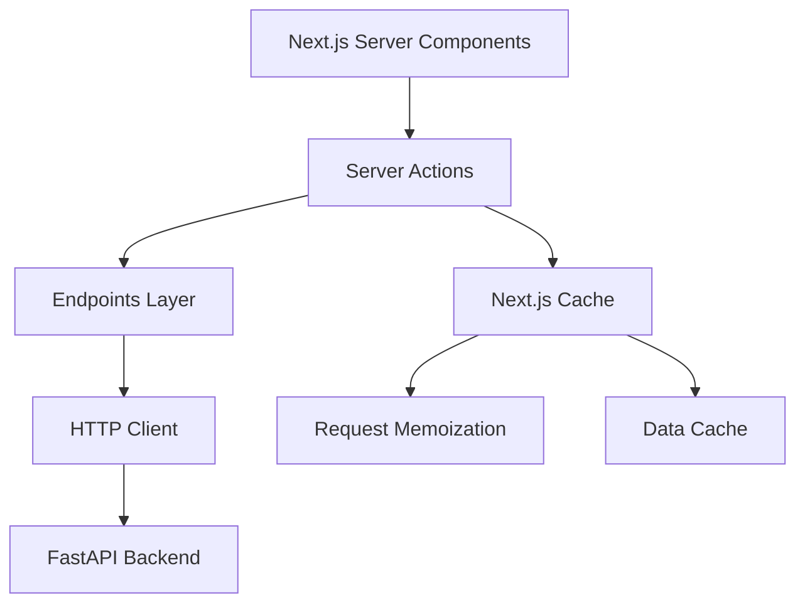

# 設計書: Server Actions Standardization and Implementation

## 1. 概要

このドキュメントは、要件定義書に基づいてサーバーアクションの標準化と実装の技術的な設計を記述します。統一されたアーキテクチャパターン、API統合方法、キャッシュ戦略、エラーハンドリングを定義し、すべてのバックエンドAPIエンドポイントに対する一貫したフロントエンド実装を提供します。

## 2. アーキテクチャ設計

### 2.1. システム構成図


### 2.2. 技術スタック
- **フロントエンド:** Next.js 15 (15.3.2, App Router), TypeScript, Server Actions
- **API統合:** Endpoints Pattern, HTTP Client with Clerk Auth
- **キャッシュ:** Next.js built-in caching (Request Memoization, Data Cache)
- **バックエンド:** FastAPI, Python (既存)

### 2.3. レイヤー構成
1. **Server Actions Layer** (`/src/api/server-actions/`): SSR/SEO用のサーバーサイド関数
2. **Endpoints Layer** (`/src/api/endpoints/`): 1:1 バックエンドAPI対応
3. **HTTP Client Layer** (`/src/api/client/`): 認証とエラーハンドリング
4. **Types Layer** (`/src/api/types/`): TypeScript型定義

## 3. データ構造設計

### 3.1. 標準化されたサーバーアクションレスポンス型
```typescript
interface ServerActionResponse<T = unknown> {
  success: boolean;
  data?: T;
  error?: string;
}
```

### 3.2. エンドポイントAPI構造
```typescript
interface EndpointApi {
  get<T>(): Promise<ApiResponse<T>>;
  getById<T>(id: UUID): Promise<ApiResponse<T>>;
  create<T>(data: CreateType): Promise<ApiResponse<T>>;
  update<T>(id: UUID, data: UpdateType): Promise<ApiResponse<T>>;
  delete(id: UUID): Promise<ApiResponse<void>>;
}
```

## 4. APIエンドポイント設計

### 4.1. 欠落している endpoints ファイル
実装が必要なエンドポイントファイル:

#### `/api/endpoints/departments.ts`
```typescript
export const departmentsApi = {
  getDepartments: () => Promise<ApiResponse<Department[]>>,
  getDepartmentById: (id: UUID) => Promise<ApiResponse<DepartmentDetail>>,
  createDepartment: (data: DepartmentCreate) => Promise<ApiResponse<Department>>,
  updateDepartment: (id: UUID, data: DepartmentUpdate) => Promise<ApiResponse<Department>>,
  deleteDepartment: (id: UUID) => Promise<ApiResponse<void>>,
}
```

#### `/api/endpoints/roles.ts`
```typescript
export const rolesApi = {
  getRoles: () => Promise<ApiResponse<RoleDetail[]>>,
  getRoleById: (id: UUID) => Promise<ApiResponse<RoleDetail>>,
  createRole: (data: RoleCreate) => Promise<ApiResponse<RoleDetail>>,
  updateRole: (id: UUID, data: RoleUpdate) => Promise<ApiResponse<RoleDetail>>,
  deleteRole: (id: UUID) => Promise<ApiResponse<void>>,
  reorderRoles: (data: RoleReorderRequest) => Promise<ApiResponse<void>>,
}
```

#### 追加実装が必要なエンドポイント
- stages.ts
- evaluation-periods.ts  
- competencies.ts
- self-assessments.ts
- supervisor-reviews.ts
- supervisor-feedbacks.ts

### 4.2. 標準化されたサーバーアクション構造
```typescript
export async function get[Resource]sAction(
  params?: PaginationParams
): Promise<ServerActionResponse<[Resource]List>> {
  try {
    const response = await [resource]Api.get[Resource]s(params);
    
    if (!response.success || !response.data) {
      return {
        success: false,
        error: response.error || 'Failed to fetch [resources]',
      };
    }
    
    return {
      success: true,
      data: response.data,
    };
  } catch (error) {
    console.error('Get [resources] action error:', error);
    return {
      success: false,
      error: 'An unexpected error occurred while fetching [resources]',
    };
  }
}
```

## 5. キャッシュ戦略設計

### 5.1. Request Memoization
```typescript
import { cache } from 'react';

export const getCachedUsers = cache(async (params?: PaginationParams) => {
  return getUsersAction(params);
});
```

### 5.2. Data Cache with Revalidation
```typescript
export async function getUsersAction(params?: PaginationParams) {
  return fetch(endpoint, {
    next: { 
      revalidate: 300, // 5 minutes cache
      tags: ['users'] 
    }
  });
}

// For mutations
export async function updateUserAction(id: UUID, data: UserUpdate) {
  const result = await usersApi.updateUser(id, data);
  
  if (result.success) {
    revalidateTag('users');
  }
  
  return result;
}
```

### 5.3. キャッシュタグ戦略
| リソース | タグ | 再検証トリガー |
|---|---|---|
| Users | `['users']` | Create/Update/Delete operations |
| Goals | `['goals', `goals-${userId}`]` | Goal mutations |
| Departments | `['departments']` | Department mutations |
| Roles | `['roles']` | Role mutations |

## 6. エラーハンドリング設計

### 6.1. 標準化されたエラーレスポンス
```typescript
interface ErrorResponse {
  success: false;
  error: string;
  statusCode?: number;
}
```

### 6.2. エラー処理パターン
```typescript
try {
  const response = await api.call();
  
  if (!response.success || !response.data) {
    return {
      success: false,
      error: response.error || 'Default error message',
    };
  }
  
  return { success: true, data: response.data };
} catch (error) {
  console.error('[Action] error:', error);
  return {
    success: false,
    error: error instanceof Error ? error.message : 'Unexpected error occurred',
  };
}
```

## 7. 型定義設計

### 7.1. 型ファイル構造
```
/types/
├── common.ts          (UUID, Pagination, BaseResponse)
├── user.ts            (User related types)
├── goal.ts            (Goal related types)  
├── department.ts      (新規: Department types)
├── role.ts            (新規: Role types)
├── stage.ts           (新規: Stage types)
├── evaluation.ts      (Evaluation types)
├── competency.ts      (Competency types)
└── index.ts           (All exports)
```

### 7.2. 標準化されたCRUD型パターン
```typescript
// For each resource
interface [Resource] {
  id: UUID;
  // ... resource properties
  created_at: string;
  updated_at: string;
}

interface [Resource]Create {
  // ... required fields for creation
}

interface [Resource]Update {
  // ... optional fields for update
}

interface [Resource]Detail extends [Resource] {
  // ... additional detail fields
}
```

## 8. 実装ガイドライン

### 8.1. ファイル命名規則
- Endpoints: `[resource]s.ts` (plural)
- Server Actions: `[resource]s.ts` (plural)  
- Types: `[resource].ts` (singular)

### 8.2. 関数命名規則
- Server Actions: `[action][Resource]Action` (e.g., `getUserAction`, `createUserAction`)
- Endpoints: `[action][Resource]` (e.g., `getUser`, `createUser`)

### 8.3. インポート順序
1. React/Next.js imports
2. Third-party libraries  
3. Local imports (endpoints, types, utils)
4. Type imports (with `type` keyword)

### 8.4. JSDoc コメント規則
```typescript
/**
 * Server action to get all users with pagination
 * This function runs on the server side for SSR
 * 
 * @param params - Optional pagination parameters
 * @returns Promise resolving to server action response with user list
 */
```