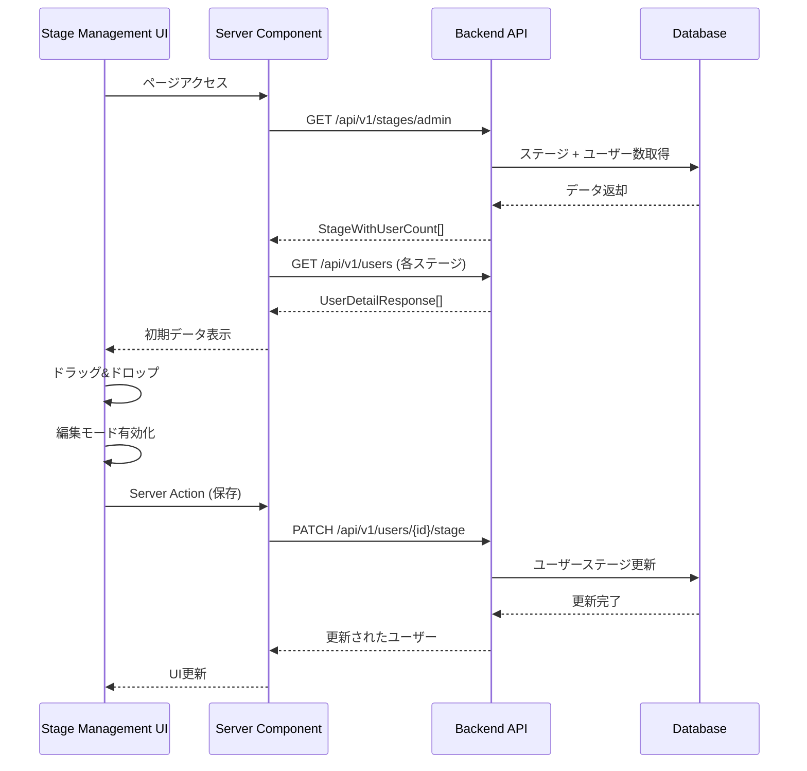

# Design Document

## Overview

ステージ・コンピテンシー管理機能は、既存のバックエンドAPIを活用し、管理者がユーザーのステージを視覚的に管理し、コンピテンシーを編集できるフロントエンド機能を提供します。この設計では、Next.js 15のApp Routerパターン、Server Components、Server Actionsを活用し、ドラッグ&ドロップによる直感的なユーザー体験を実現します。

## Architecture

### システム構成

```mermaid
graph TB
    subgraph "Frontend (Next.js 15)"
        A[Stage Management Page] --> B[User Card Components]
        A --> C[Stage Column Components]
        D[Competency Management Page] --> E[Competency Grid]
        D --> F[Competency Modal]
        
        B --> G[Drag & Drop Handler]
        E --> H[Modal State Manager]
    end
    
    subgraph "Backend APIs (FastAPI)"
        I[/api/v1/stages]
        J[/api/v1/competencies]
        K[/api/v1/users]
        L[New: /api/v1/users/stage - Admin Only]
    end
    
    subgraph "Database"
        M[(Users Table)]
        N[(Stages Table)]
        O[(Competencies Table)]
    end
    
    A --> I
    A --> K
    D --> I
    D --> J
    G --> L
    F --> J
    
    I --> N
    J --> O
    K --> M
    L --> M
```

### ルーティング構造

```
/admin/
├── stage-management/          # ステージ管理ページ（管理者専用）
│   └── page.tsx
└── competency-management/     # コンピテンシー管理ページ（管理者・ビューワー）
    └── page.tsx
```

### アクセス制御マトリックス

| ページ | 管理者 | ビューワー | その他 |
|--------|--------|-----------|--------|
| ステージ管理 | 完全アクセス | 403エラー | 403エラー |
| コンピテンシー管理 | 完全アクセス（編集可） | 読み取り専用 | 403エラー |

## Components and Interfaces

### 1. バックエンドAPI拡張

#### 新規エンドポイント: UpdateUserStage

```python
# backend/app/api/v1/users.py に追加
@router.patch("/{user_id}/stage", response_model=UserDetailResponse)
async def update_user_stage(
    user_id: UUID,
    stage_update: UserStageUpdate,
    context: AuthContext = Depends(require_admin),  # 管理者のみ
    session: AsyncSession = Depends(get_db_session)
):
    """Update user's stage (admin only)."""
```

#### 新規スキーマ

```python
# backend/app/schemas/user.py に追加
class UserStageUpdate(BaseModel):
    stage_id: UUID = Field(..., description="New stage ID for the user")

class BatchUserStageUpdate(BaseModel):
    updates: List[UserStageUpdateItem] = Field(..., min_items=1, max_items=50)

class UserStageUpdateItem(BaseModel):
    user_id: UUID
    stage_id: UUID
```

### 2. フロントエンドコンポーネント設計

#### ステージ管理ページ構造

```typescript
// app/(admin)/stage-management/page.tsx
interface StageManagementPageProps {}

interface StageData {
  id: string;
  name: string;
  description: string;
  created_at: string;
  updated_at: string;
  users: UserCardData[];
}

interface UserCardData {
  id: string;
  name: string;
  employee_code: string;
  job_title: string;
  email: string;
}
```

#### コンポーネント階層

```
StageManagementPage
├── StageHeader (ステージ情報表示)
├── StageGrid
│   ├── StageColumn (各ステージ)
│   │   ├── StageColumnHeader
│   │   └── UserCardList
│   │       └── UserCard (ドラッグ可能)
│   └── EditModeControls (保存/キャンセル)
└── LoadingState / ErrorState
```

#### コンピテンシー管理ページ構造

```typescript
// app/(admin)/competency-management/page.tsx
interface CompetencyManagementPageProps {}

interface CompetencyData {
  id: string;
  name: string;
  description: string;
  stage_id: string;
  created_at: string;
  updated_at: string;
}

interface StageWithCompetencies {
  stage: StageData;
  competencies: CompetencyData[];
}

interface UserPermissions {
  isAdmin: boolean;
  isViewer: boolean;
  canEdit: boolean;
}
```

### 3. 状態管理設計

#### ステージ管理の状態

```typescript
interface StageManagementState {
  stages: StageData[];
  isEditMode: boolean;
  pendingChanges: UserStageChange[];
  isLoading: boolean;
  error: string | null;
}

interface UserStageChange {
  userId: string;
  fromStageId: string;
  toStageId: string;
}
```

#### コンピテンシー管理の状態

```typescript
interface CompetencyManagementState {
  stagesWithCompetencies: StageWithCompetencies[];
  selectedCompetency: CompetencyData | null;
  isModalOpen: boolean;
  isLoading: boolean;
  error: string | null;
}
```

## Data Models

### 既存モデルの活用

- **Stage**: 既存の `Stage` スキーマを使用
- **Competency**: 既存の `Competency` スキーマを使用  
- **User**: 既存の `UserDetailResponse` スキーマを使用

### 新規データフロー

#### ステージ管理データフロー



## Error Handling

### バックエンドエラーハンドリング

```python
# 新規エンドポイントのエラーハンドリング
try:
    service = UserService(session)
    result = await service.update_user_stage(user_id, stage_update, context)
    return result
except NotFoundError as e:
    raise HTTPException(status_code=404, detail=str(e))
except PermissionDeniedError as e:
    raise HTTPException(status_code=403, detail=str(e))
except ValidationError as e:
    raise HTTPException(status_code=422, detail=str(e))
```

### フロントエンドエラーハンドリング

```typescript
// Server Actions でのエラーハンドリング
async function updateUserStages(changes: UserStageChange[]) {
  try {
    const results = await Promise.all(
      changes.map(change => 
        fetch(`/api/v1/users/${change.userId}/stage`, {
          method: 'PATCH',
          body: JSON.stringify({ stage_id: change.toStageId })
        })
      )
    );
    
    // 成功時の処理
    revalidatePath('/admin/stage-management');
    return { success: true };
  } catch (error) {
    // エラー時の処理
    return { 
      success: false, 
      error: error instanceof Error ? error.message : 'Unknown error' 
    };
  }
}
```

## Testing Strategy

### バックエンドテスト

```python
# tests/api/test_user_stage_update.py
class TestUserStageUpdate:
    async def test_update_user_stage_admin_success(self):
        """管理者によるユーザーステージ更新の成功テスト"""
        
    async def test_update_user_stage_non_admin_forbidden(self):
        """非管理者によるアクセス拒否テスト"""
        
    async def test_update_user_stage_invalid_stage_id(self):
        """無効なステージIDでの更新テスト"""
```

### フロントエンドテスト

```typescript
// __tests__/stage-management.test.tsx
describe('Stage Management Page', () => {
  test('displays stages and users correctly', async () => {
    // ステージとユーザーの表示テスト
  });
  
  test('enables edit mode on drag and drop', async () => {
    // ドラッグ&ドロップによる編集モード有効化テスト
  });
  
  test('saves changes when save button is clicked', async () => {
    // 保存ボタンクリック時の変更保存テスト
  });
});

// __tests__/competency-management.test.tsx  
describe('Competency Management Page', () => {
  test('opens modal when competency is clicked', async () => {
    // コンピテンシークリック時のモーダル表示テスト
  });
  
  test('updates competency when save is clicked', async () => {
    // コンピテンシー更新テスト
  });
});
```

### E2Eテスト

```typescript
// e2e/stage-management.spec.ts
test('admin can drag and drop users between stages', async ({ page }) => {
  // 管理者によるユーザーのドラッグ&ドロップテスト
});

test('non-admin cannot access edit features', async ({ page }) => {
  // 非管理者の編集機能アクセス制限テスト
});
```

## Security Considerations

### 権限管理

1. **ステージ管理ページ**: `require_admin` デコレータによる管理者専用アクセス
2. **コンピテンシー管理ページ**: 管理者（編集可能）とビューワー（読み取り専用）のアクセス制御
3. **フロントエンド**: Server Componentsでの厳格な権限確認と403エラーハンドリング
4. **API**: 既存のRBAC（Role-Based Access Control）システムの活用

### データ検証

1. **入力検証**: Pydanticスキーマによる型安全性
2. **SQLインジェクション対策**: SQLAlchemyのORM使用
3. **XSS対策**: Next.jsの自動エスケープ機能

### セッション管理

1. **認証**: 既存のClerk認証システムの活用
2. **セッション**: サーバーサイドでの認証コンテキスト管理
3. **トークン**: JWTトークンによる安全な通信

## Performance Considerations

### データ取得最適化

1. **ページネーション**: 大量ユーザー対応
2. **キャッシング**: Next.jsのキャッシュ機能活用
3. **ストリーミング**: Suspenseによる段階的ローディング

### UI最適化

1. **仮想化**: 大量データ表示時の仮想スクロール
2. **デバウンス**: ドラッグ&ドロップ操作の最適化
3. **楽観的更新**: UI応答性向上

## Accessibility

1. **キーボードナビゲーション**: ドラッグ&ドロップの代替操作
2. **スクリーンリーダー**: ARIAラベルとロール
3. **カラーコントラスト**: WCAG 2.1 AA準拠
4. **フォーカス管理**: モーダル内でのフォーカストラップ