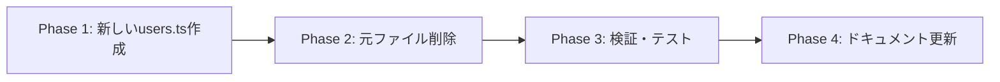

# 設計書: Frontend User Server Action Standardization

## 1. 概要

このドキュメントは、users server actionをgoals server actionと同一のパターンに統一するための技術設計を記述します。現在の重複した実装パターンを解消し、一貫性のあるAPIレイヤーアーキテクチャを構築します。

## 2. アーキテクチャ設計

### 2.1. 現在の構成と問題点

```mermaid
graph TD
    A[Server Actions] --> B[users.ts - delegates to endpoints]
    A --> C[goals.ts - direct HTTP client]
    B --> D[endpoints/users.ts]
    D --> E[getHttpClient()]
    C --> E
    E --> F[Backend APIs]
```

**問題点:**
- 実装パターンの不整合（users: endpoints経由 vs goals: direct HTTP client）
- 不要な中間層（endpoints/users.ts）
- 重複したコード構造

### 2.2. 目標アーキテクチャ

```mermaid
graph TD
    A[Server Actions] --> B[users.ts - direct HTTP client]
    A --> C[goals.ts - direct HTTP client] 
    B --> D[getHttpClient()]
    C --> D
    D --> E[API_ENDPOINTS constants]
    D --> F[Backend APIs]
```

### 2.3. 技術スタック（変更なし）
- **フロントエンド:** Next.js App Router, TypeScript
- **HTTP Client:** 統一HTTP Client (`getHttpClient()`)
- **API設定:** 中央集約型定数 (`API_ENDPOINTS`)

## 3. コンポーネント設計

### 3.1. Server Action ファイル構造

```typescript
// 統一されたServer Action構造
'use server';

// 必要なimportsのみ
import { API_ENDPOINTS } from '../constants/config';
import { getHttpClient } from '../client/http-client';
import type { /* 必要な型定義 */ } from '../types/user';

// 各アクションの実装
export async function actionName(params): Promise<StandardResponse> {
  try {
    const http = getHttpClient();
    // API呼び出し
    // エラーハンドリング
    // 統一レスポンス形式
  } catch (e) {
    // 統一エラーハンドリング
  }
}
```

### 3.2. 削除対象ファイル

- `frontend/src/api/endpoints/users.ts` → **削除**
  - 理由: Server Actionが直接HTTP Clientを使用するため不要
  - 影響: Server Action以外での使用がないことを確認済み

## 4. 実装パターン設計

### 4.1. 基本的なCRUD操作パターン

#### GET リクエスト（一覧取得）
```typescript
export async function getUsersAction(params?: {
  page?: number;
  limit?: number;
  // その他のフィルターパラメータ
}): Promise<{ success: boolean; data?: UserListResponse; error?: string }> {
  try {
    const http = getHttpClient();
    const query = new URLSearchParams();
    
    // パラメータ構築
    if (params?.page) query.append('page', String(params.page));
    if (params?.limit) query.append('limit', String(params.limit));
    
    // エンドポイント構築
    const endpoint = query.toString() 
      ? `${API_ENDPOINTS.USERS.LIST}?${query.toString()}`
      : API_ENDPOINTS.USERS.LIST;
    
    // API呼び出し
    const res = await http.get<UserListResponse>(endpoint);
    
    if (!res.success || !res.data) {
      return { success: false, error: res.errorMessage || 'Failed to fetch users' };
    }
    
    return { success: true, data: res.data };
  } catch (e) {
    const error = e instanceof Error ? e.message : 'Failed to fetch users';
    return { success: false, error };
  }
}
```

#### POST リクエスト（作成）
```typescript
export async function createUserAction(data: UserCreateRequest): Promise<{
  success: boolean;
  data?: UserResponse;
  error?: string;
}> {
  try {
    const http = getHttpClient();
    const res = await http.post<UserResponse>(API_ENDPOINTS.USERS.CREATE, data);
    if (!res.success || !res.data) {
      return { success: false, error: res.errorMessage || 'Failed to create user' };
    }
    return { success: true, data: res.data };
  } catch (e) {
    return { success: false, error: e instanceof Error ? e.message : 'Failed to create user' };
  }
}
```

### 4.2. 統一されたレスポンス形式

```typescript
// 成功時（データあり）
type SuccessResponseWithData<T> = {
  success: true;
  data: T;
  error?: never;
}

// 成功時（データなし - 削除など）
type SuccessResponseNoData = {
  success: true;
  data?: never;
  error?: never;
}

// エラー時
type ErrorResponse = {
  success: false;
  data?: never;
  error: string;
}

type StandardResponse<T = void> = T extends void 
  ? SuccessResponseNoData | ErrorResponse
  : SuccessResponseWithData<T> | ErrorResponse;
```

### 4.3. エラーハンドリングパターン

```typescript
// 統一されたエラーハンドリング
try {
  const res = await http.method<ResponseType>(endpoint, data);
  
  if (!res.success || !res.data) {
    return { 
      success: false, 
      error: res.errorMessage || 'Default error message' 
    };
  }
  
  return { success: true, data: res.data };
} catch (e) {
  return { 
    success: false, 
    error: e instanceof Error ? e.message : 'Generic error message' 
  };
}
```

## 5. 移行計画

### 5.1. 段階的移行アプローチ



### 5.2. 依存関係分析

```typescript
// 影響を受けるファイル
frontend/src/api/server-actions/users.ts    // 🔄 リファクタリング対象
frontend/src/api/endpoints/users.ts         // 🗑️ 削除対象

// 依存関係チェック
// server-actions/users.ts を使用しているファイル:
// - pages/components where server actions are used
// - no direct imports to endpoints/users.ts found outside of server-actions
```

### 5.3. 品質保証

- **型安全性**: すべての型定義は`../types/`から import
- **一貫性**: goals.ts と同じパターンを厳密に適用
- **パフォーマンス**: 不要な中間層削除により軽微な改善を期待
- **バンドルサイズ**: endpoints/users.ts削除により削減

## 6. 実装詳細

### 6.1. 必要な型定義インポート

```typescript
import type { UUID } from '../types/common';
import type {
  UserListResponse,
  UserDetailResponse, 
  UserCreateRequest,
  UserUpdateRequest,
  UserExistsResponse,
  ProfileOptionsResponse,
} from '../types/user';
```

### 6.2. 実装する関数一覧

- `getUsersAction` - ユーザー一覧取得
- `getUserByIdAction` - 特定ユーザー取得
- `createUserAction` - ユーザー作成
- `updateUserAction` - ユーザー更新
- `deleteUserAction` - ユーザー削除
- `checkUserExistsAction` - ユーザー存在確認
- `getProfileOptionsAction` - プロフィールオプション取得
- `searchUsersAction` - ユーザー検索（現在のフィルタリング機能を維持）

### 6.3. 検索機能の処理方法

現在の `searchUsersAction` のサーバーサイドフィルタリング機能を維持しつつ、統一されたパターンで実装します。将来的にバックエンドが検索パラメータをサポートした際の拡張性も考慮します。