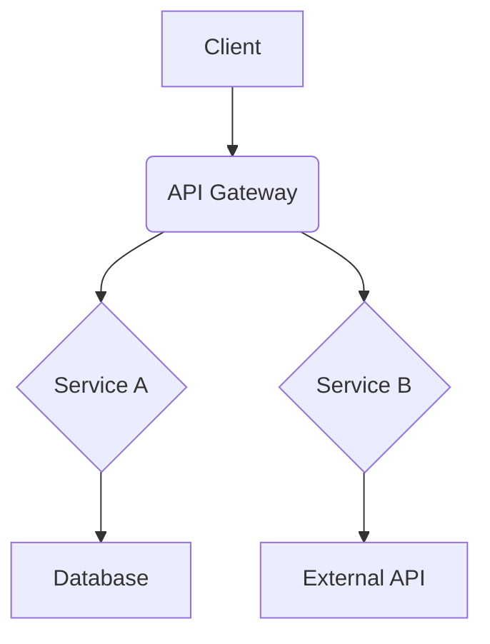
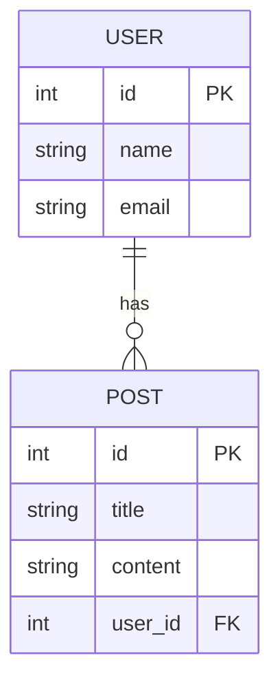

# 設計書: [プロジェクト名]

## 1. 概要
[このドキュメントは、要件定義書に基づいてシステムの設計を記述するものです。技術的な意思決定、アーキテクチャ、コンポーネント間のインタラクションなどを明確にします。]

## 2. アーキテクチャ設計
[システム全体のアーキテクチャ図や、主要な技術選定（フレームワーク、データベース、ライブラリなど）とその理由を記述します。]

### 2.1. システム構成図


### 2.2. 技術スタック
- **フロントエンド:** [例: Next.js, TypeScript, Tailwind CSS]
- **バックエンド:** [例: FastAPI, Python, PostgreSQL]
- **インフラ:** [例: Docker, AWS ECS, S3]

## 3. データベース設計
[データベースのスキーマ、テーブル定義、リレーションシップなどを記述します。ER図を含めると分かりやすくなります。]

### 3.1. ER図


### 3.2. テーブル定義: `users`
| カラム名 | データ型 | 説明 | 制約 |
|---|---|---|---|
| `id` | `INTEGER` | ユーザーID | `PRIMARY KEY` |
| `name` | `VARCHAR(255)` | 氏名 | `NOT NULL` |
| `email` | `VARCHAR(255)` | メールアドレス | `NOT NULL`, `UNIQUE` |
| `created_at` | `TIMESTAMP` | 作成日時 | `DEFAULT CURRENT_TIMESTAMP` |

## 4. APIエンドポイント設計
[各APIエンドポイントの仕様を記述します。リクエスト、レスポンス、認証要件などを明確にします。]

### `POST /api/users`
- **説明:** 新規ユーザーを作成します。
- **認証:** 不要
- **リクエストボディ:**
  ```json
  {
    "name": "string",
    "email": "string"
  }
  ```
- **レスポンス (201 Created):**
  ```json
  {
    "id": 1,
    "name": "John Doe",
    "email": "john.doe@example.com"
  }
  ```
- **エラーレスポンス (400 Bad Request):**
  ```json
  {
    "error": "Invalid email format"
  }
  ```

## 5. UI/UX設計
[画面のワイヤーフレームやモックアップへのリンク、主要なUIコンポーネントの設計などを記述します。]

- **ログイン画面:** [Figma, Sketchなどのデザインツールへのリンク]
- **ダッシュボード:** [Figma, Sketchなどのデザインツールへのリンク]
- **主要コンポーネント:**
  - **ボタン:** [プライマリ、セカンダリなどのバリエーションを定義]
  - **フォーム:** [入力フィールド、ラベル、バリデーションメッセージのスタイルを定義]
