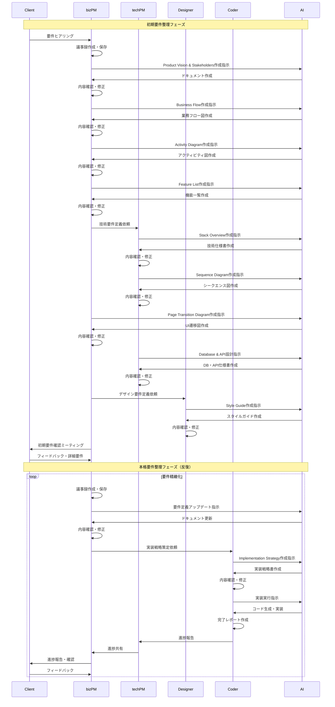

# AI活用開発テンプレート

## 概要

このテンプレートは、AIを最大限活用しながら効率的な開発プロセスを実現するためのドキュメント構造とワークフローを提供します。要件定義から実装まで、人間とAIの役割を明確に分離し、品質と効率を両立させることを目的としています。

## 想定される役割

- **bizPM**: ビジネスプロダクトマネージャー（要件整理、クライアント対応）
- **techPM**: テクニカルプロダクトマネージャー（技術要件、アーキテクチャ設計）
- **デザイナー**: UI/UXデザイナー（デザイン要件、スタイルガイド）
- **coder**: エンジニア（実装、コード生成）

## 開発フロー概要

1. **初期要件整理** - 基本情報とコア要件の明確化
2. **本格要件整理** - 詳細要件の反復的な精緻化
3. **実装** - 確定要件に基づく開発実行

### ワークフローシーケンス図



## 使い方

### 初期要件整理フェーズ

#### 1. プロジェクト開始
- **担当**: bizPM
- **人間の作業**: 
  - GitHubからテンプレートをclone
  - docs/README.mdを読む
  - クライアントとミーティングを実施
  - 議事録を`docs/requirement-definition/06-reference/external-meeting`に保存

#### 2. 基本要件定義
- **担当**: bizPM
- **人間の作業**: 
  - `docs/prompt-template/bizPM/write-ProductVision&Stakeholders-prompt.md`を参照
  - 議事録をもとに以下ファイルの作成をAIに指示
    - `docs/requirement-definition/01-basic/01-product-vision.md`
    - `docs/requirement-definition/01-basic/02-stakeholders.md`
    - `docs/requirement-definition/01-basic/12-business-flow.md`
    - `docs/requirement-definition/01-basic/11-activity-diagram.md`
    - `docs/requirement-definition/04-feature/01-feature-list.md`
    - `docs/requirement-definition/04-feature/sample/biz-spec.md`（複数）
- **AIの作業**: 
  - 指示に従い上記ファイルを作成
- **人間の作業**: 
  - 内容を確認し修正が必要な箇所を修正

#### 3. 技術要件定義
- **担当**: techPM
- **人間の作業**: 
  - `docs/prompt-template/techPM/write-StackOverview-prompt.md`を参照
  - プロダクトビジョンをもとに以下ファイルの作成をAIに指示
    - `docs/requirement-definition/02-tech/01-stack-overview.md`
    - `docs/requirement-definition/01-basic/13-sequence-diagram.md`
- **AIの作業**: 
  - 指示に従いファイルを作成
- **人間の作業**: 
  - 内容を確認し修正が必要な箇所を修正

#### 4. UI/UX要件定義
- **担当**: bizPM
- **人間の作業**: 
  - `docs/prompt-template/bizPM/write-PageTransactionDiagram-prompt.md`を参照
  - 既存要件をもとに`docs/requirement-definition/03-ui&design/01-page-transition-diagram.md`の作成をAIに指示
- **AIの作業**: 
  - 指示に従いファイルを作成
- **人間の作業**: 
  - 内容を確認し修正が必要な箇所を修正

#### 5. データベース・API設計
- **担当**: techPM
- **人間の作業**: 
  - `docs/prompt-template/techPM/write-Database-prompt.md`と`docs/prompt-template/techPM/write-API-prompt.md`を参照
  - 既存情報をもとに以下の作成をAIに指示
    - `docs/requirement-definition/02-tech/database`
    - `docs/requirement-definition/02-tech/api`
- **AIの作業**: 
  - 指示に従いファイルを作成
- **人間の作業**: 
  - 内容を確認し修正が必要な箇所を修正

#### 6. スタイルガイド作成
- **担当**: デザイナー
- **人間の作業**: 
  - `docs/prompt-template/designer/write-StyleGuide-prompt.md`を参照
  - プロダクトビジョンをもとに`docs/requirement-definition/03-ui&design/02-style-guide.md`の作成をAIに指示
- **AIの作業**: 
  - 指示に従いファイルを作成
- **人間の作業**: 
  - 内容を確認し修正が必要な箇所を修正

#### 7. 初期要件確認
- **担当**: bizPM
- **人間の作業**: 
  - 以下の資料をもとにクライアントとミーティングを実施
    - 01-product-vision
    - 02-stakeholders
    - 12-business-flow
    - 11-activity-diagram
    - 13-sequence-diagram
    - 01-feature-list
    - 01-stack-overview
    - biz-spec
    - 01-page-transition-diagram
    - 02-style-guide
  - 前提の確認と詳細要件の聞き取り

### 本格要件整理フェーズ（反復実行）

#### 1. 議事録管理
- **担当**: bizPM
- **人間の作業**: 
  - クライアントとの議事録を`docs/requirement-definition/06-reference/external-meeting`に保存

#### 2. 要件定義アップデート
- **担当**: bizPM
- **人間の作業**: 
  - `docs/prompt-template/bizPM/rewrite-definition-prompt.md`を参照
  - 以下ファイルのアップデートをAIに指示
    - 01-page-transition-diagram
    - database
    - API
    - 04-feature
- **AIの作業**: 
  - 指示に従いファイルを更新

#### 3. 実装戦略策定
- **担当**: coder
- **人間の作業**: 
  - `docs/prompt-template/corder/write-ImprimentationStorategy-prompt.md`を参照
  - 確定した機能要件から`docs/implementation-strategy`の作成をAIに指示
- **AIの作業**: 
  - 指示に従いファイルを作成
- **人間の作業**: 
  - 内容を確認し修正が必要な箇所を修正

#### 4. 実装実行
- **担当**: coder
- **人間の作業**: 
  - 実装戦略に基づく順次実行をAIに指示
- **AIの作業**: 
  - 順次実装を実行
  - 完了時にレポートを作成・保存
- **人間の作業**: 
  - techPMがレポート内容をbizPMに伝達
  - bizPMがクライアントとミーティングを実施

## 人間とAIの役割分担

### 人間の役割
- **戦略的判断**: 要件の妥当性判断、優先度決定
- **コミュニケーション**: クライアントとのミーティング、チーム間調整
- **品質管理**: AIが生成したドキュメントの確認・修正
- **指示出し**: 適切なプロンプトテンプレートを使用したAIへの指示

### AIの役割
- **ドキュメント作成**: 要件定義、技術仕様、設計書の作成
- **コード生成**: 実装戦略に基づくコード生成
- **構造化**: 情報の整理・体系化
- **レポート作成**: 進捗・完了レポートの生成

## ディレクトリ構造

```
docs/
├── README.md (このファイル)
├── implementation-strategy/
│   └── README.md
├── prompt-template/
│   ├── bizPM/
│   ├── techPM/
│   ├── designer/
│   └── corder/
└── requirement-definition/
    ├── 01-basic/
    ├── 02-tech/
    ├── 03-ui&design/
    ├── 04-feature/
    ├── 05-process/
    └── 06-reference/
```

## 注意事項

- 各フェーズの完了時には必ず人間による確認・承認を行う
- AIが生成したドキュメントは必ず内容の妥当性を検証する
- クライアントとの合意事項は必ず議事録として残す
- 要件変更時は関連する全ドキュメントの整合性を確認する
- 資料は日本語で作成し、UTF-8エンコーディングで保存する
- **文字化け対策**: 日本語文字を含むファイルは作成後に必ず内容を確認し、文字化けがある場合は即座に修正する
- **ドキュメント責務の分離**: 同じ情報を複数のドキュメントに記載すると要件変更時の保守が困難になるため、1つの情報は1つのドキュメントに記載し、他では参照のみにする

---

このテンプレートを使用することで、人間とAIが効率的に協働し、高品質な開発プロセスを実現できます。