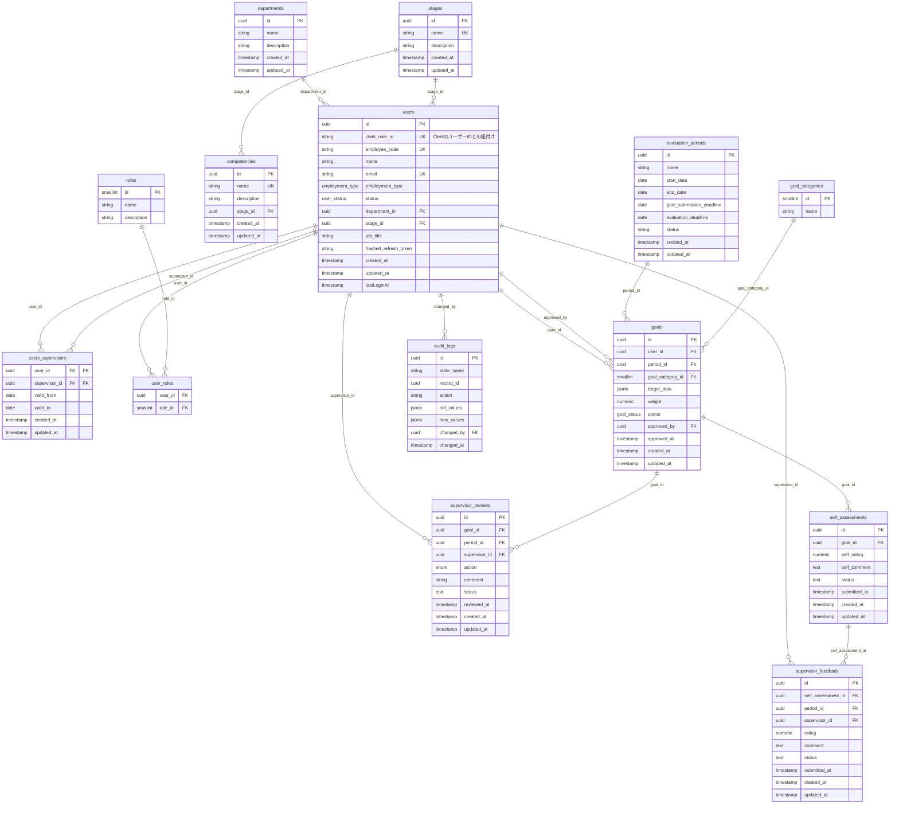

データベーステーブル一覧

### 1. users（ユーザー情報）

| **カラム名** | **型** | **備考** |
| --- | --- | --- |
| id | uuid | 主キー、自動生成 |
| department_id | uuid | 部門ID、外部キー |
| stage_id | uuid | ステージID、外部キー |
| clerk_user_id | text | ClerkユーザーID、ユニーク（Null許容） |
| name | text | 氏名（例：山田 花子） |
| email | text | メールアドレス（例：[yamada@company.com](https://replit.com/@yamashita98syot/PerformancePortal)）、ユニーク |
| employee_code | text | 社員コード（例：EMP001、PT001）、ユニーク |
| employment_type | enum | 雇用形態（auditor: 管理者、supervisor: 上司、employee: 正社員、parttime: パート, etc.） |
| status | enum | ステータス（active: 有効、inactive: 無効） |
| password | text | パスワード（ハッシュ化、Clerk使用時はNull許容） |
| job_title | text | 役職 (例: 主任, スーパーバイザー) (Null許容) |
| last_login_at | timestamp | 最終ログイン日時 (Null許容) |
| created_at | timestamp | 作成日時 |
| updated_at | timestamp | 更新日時 |

### 2. departments（部門情報）

| **カラム名** | **型** | **備考** |
| --- | --- | --- |
| id | uuid | 主キー、自動生成 |
| name | text | 部門名（例：営業部、人事部） |
| description | text | 部門の説明 (Null許容) |
| created_at | timestamp | 作成日時 |
| updated_at | timestamp | 更新日時 |

### 3. stages（ステージ情報）

| **カラム名** | **型** | **備考** |
| --- | --- | --- |
| id | uuid | 主キー、自動生成 |
| name | text | ステージ名（例：S1, S2, M1）、ユニーク |
| description | text | ステージの説明 (Null許容) |
| created_at | timestamp | 作成日時 |
| updated_at | timestamp | 更新日時 |

### 4. competencies（コンピテンシー情報）

| **カラム名** | **型** | **備考** |
| --- | --- | --- |
| id | uuid | 主キー、自動生成 |
| stage_id | uuid | ステージID、外部キー |
| name | text | コンピテンシー名（例：問題解決能力）、ユニーク |
| description | text | コンピテンシーの説明 (Null許容) |
| created_at | timestamp | 作成日時 |
| updated_at | timestamp | 更新日時 |

### 5. users_supervisors（上司-部下関係）

| **カラム名** | **型** | **備考** |
| --- | --- | --- |
| user_id | uuid | 部下のユーザーID、外部キー、複合主キー |
| supervisor_id | uuid | 上司のユーザーID、外部キー、複合主キー |
| valid_from | date | 関係開始日（例：2024-01-01） |
| valid_to | date | 関係終了日（nullの場合は現在も有効） |
| created_at | timestamp | 作成日時 |
| updated_at | timestamp | 更新日時 |

### 6. roles（役割・権限）

| **カラム名** | **型** | **備考** |
| --- | --- | --- |
| id | smallint | 主キー |
| name | text | 役割名（例：admin、supervisor、employee） |
| description | text | 役割の説明 |
補足：
- バックエンドのファイルにて、役割に対応する権限リストを定義。

### 7. user_roles（ユーザー-役割の関連）

| **カラム名** | **型** | **備考** |
| --- | --- | --- |
| user_id | uuid | ユーザーID、外部キー |
| role_id | smallint | 役割ID、外部キー |

### 8. evaluation_periods（評価期間）

| **カラム名** | **型** | **備考** |
| --- | --- | --- |
| id | uuid | 主キー、自動生成 |
| name | text | 期間名（例：2024年第1四半期） |
| period_type | text | 期間の種類（例：half-term, monthly, quarterly, yearly, other） |
| start_date | date | 開始日（例：2024-01-01） |
| end_date | date | 終了日（例：2024-03-31） |
| goal_submission_deadline | date | 目標提出期限（例：2024-01-31） |
| evaluation_deadline | date | 評価提出期限（例：2024-04-15） |
| status | text | 期間ステータス（upcoming: 開始前、active: 進行中、completed: 完了） |
| created_at | timestamp | 作成日時 |
| updated_at | timestamp | 更新日時 |
補足：期間は月別、四半期別、年別、その他の選択肢がある。

### 9. goal_categories（目標カテゴリ）

| **カラム名** | **型** | **備考** |
| --- | --- | --- |
| id | smallint | 主キー |
| name | text | カテゴリ名（例： `performance`:業績目標,  `competency`: コンピテンシー,  `core_value`: コアバリュー） |

### 10. goals（目標）

| **カラム名** | **型** | **備考** |
| --- | --- | --- |
| id | uuid | 主キー、自動生成 |
| user_id | uuid | ユーザーID、外部キー |
| period_id | uuid | 評価期間ID、外部キー |
| goal_category_id | smallint | 目標カテゴリID, 外部キー (goal_categories.id) |
| target_data | jsonb | タイプ別目標データ。詳細は後述。 |
| weight | numeric | この個別目標の重み（業績目標の場合、同一ユーザー・期間・目標カテゴリ内の合計が100%になる必要がある） |
| status | enum | ステータス（draft: 下書き、pending_approval: 提出済み・承認待ち、approved: 承認済み、rejected: 差し戻し） |
| approved_by | uuid | 承認者ID、外部キー（nullの場合は未承認） |
| approved_at | timestamp | 承認日時 |
| created_at | timestamp | 作成日時 |
| updated_at | timestamp | 更新日時 |

### 11. supervisor_reviews（目標レビュー）

| **カラム名** | **型** | **備考** |
| --- | --- | --- |
| id | uuid | 主キー、自動生成 |
| goal_id | uuid | 目標ID、外部キー |
| period_id | uuid | 評価期間ID、外部キー（検索性能向上のため追加） |
| supervisor_id | uuid | 上司ID（users.id）、外部キー |
| action | enum | レビューアクション（APPROVED: 承認、REJECTED: 差し戻し、PENDING: 保留） |
| comment | text | レビューコメント |
| status | text | 状態（'draft': 下書き、'submitted': 提出済み）。デフォルト 'draft' |
| reviewed_at | timestamp | レビュー実施日時（提出時に設定、Null許容） |
| created_at | timestamp | 作成日時 |
| updated_at | timestamp | 更新日時 |

### 12. self_assessments（自己評価）

| **カラム名** | **型** | **備考** |
| --- | --- | --- |
| id | uuid | 主キー、自動生成 |
| goal_id | uuid | 目標ID、外部キー |
| period_id | uuid | 評価期間ID、外部キー |
| self_rating | numeric | 自己評価点（0-100点、コアバリューの場合はNull許容） |
| self_comment | text | 自己評価コメント |
| status | text | 状態（'draft', 'submitted'）。デフォルト 'draft' |
| submitted_at | timestamp | 提出日時 (Null許容) |
| created_at | timestamp | 作成日時 |
| updated_at | timestamp | 更新日時 |

### 13. supervisor_feedback（上司フィードバック）

| **カラム名** | **型** | **備考** |
| --- | --- | --- |
| id | uuid | 主キー、自動生成 |
| self_assessment_id | uuid | 自己評価ID、外部キー |
| period_id | uuid | 評価期間ID、外部キー（検索性能向上のため追加） |
| supervisor_id | uuid | 上司ID、外部キー |
| rating | numeric | 上司評価点（0-100点、コアバリューの場合はNull許容） |
| comment | text | フィードバックコメント |
| status | text | 状態（'draft', 'submitted'）。デフォルト 'draft' |
| submitted_at | timestamp | 提出日時 (Null許容) |
| created_at | timestamp | 作成日時 |
| updated_at | timestamp | 更新日時 |

### 14. audit_logs（監査ログ）

| **カラム名** | **型** | **備考** |
| --- | --- | --- |
| id | uuid | 主キー、自動生成 |
| table_name | text | テーブル名 |
| record_id | uuid | レコードID |
| action | text | アクション（例：insert、update、delete） |
| old_values | jsonb | 変更前の値 |
| new_values | jsonb | 変更後の値 |
| changed_by | uuid | 変更者ID |
| changed_at | timestamp | 変更日時 |
