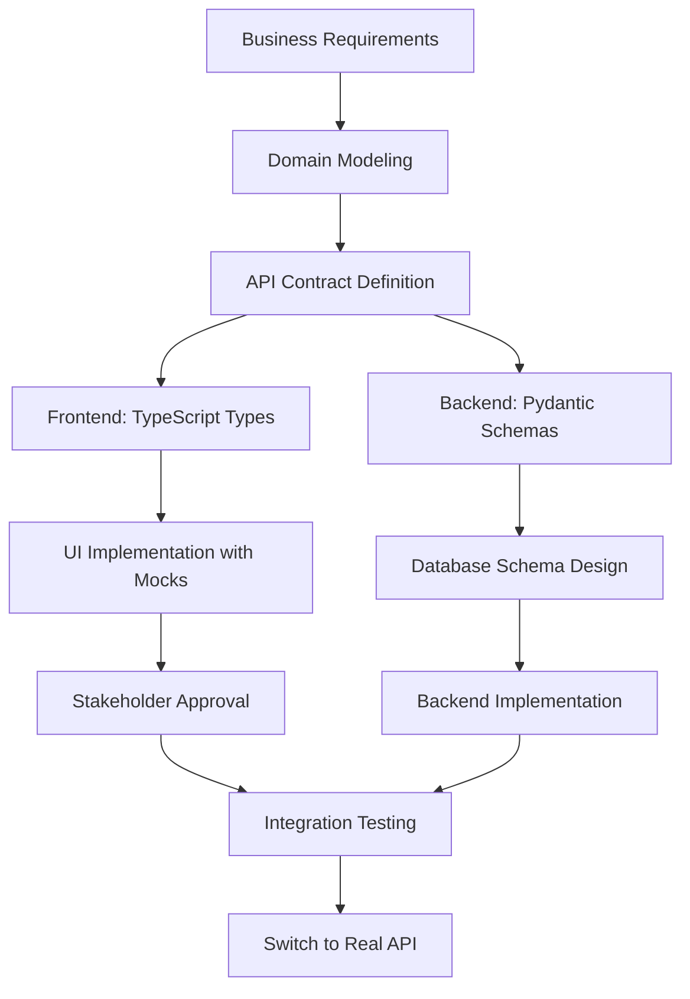
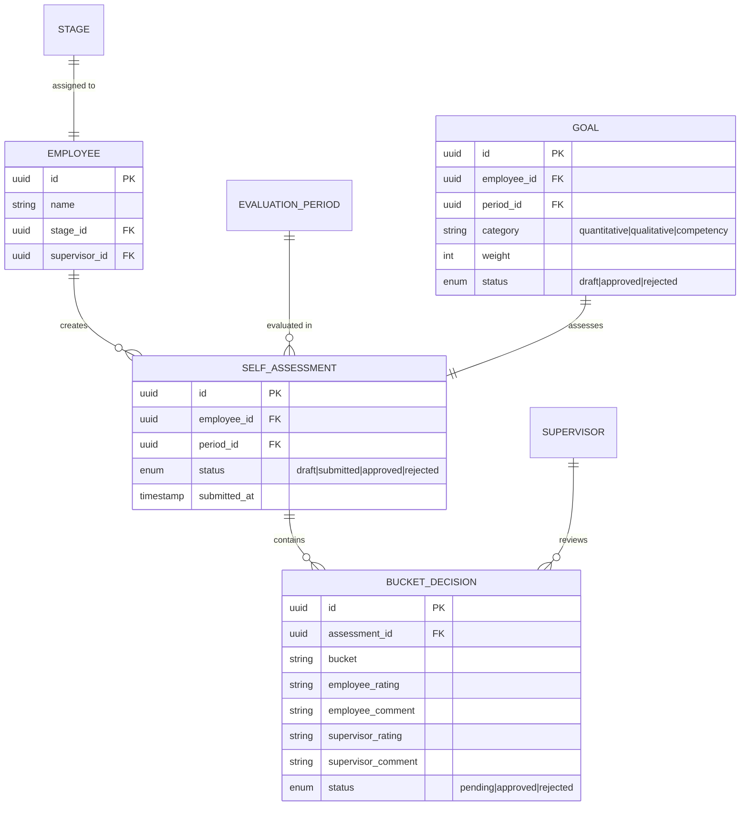
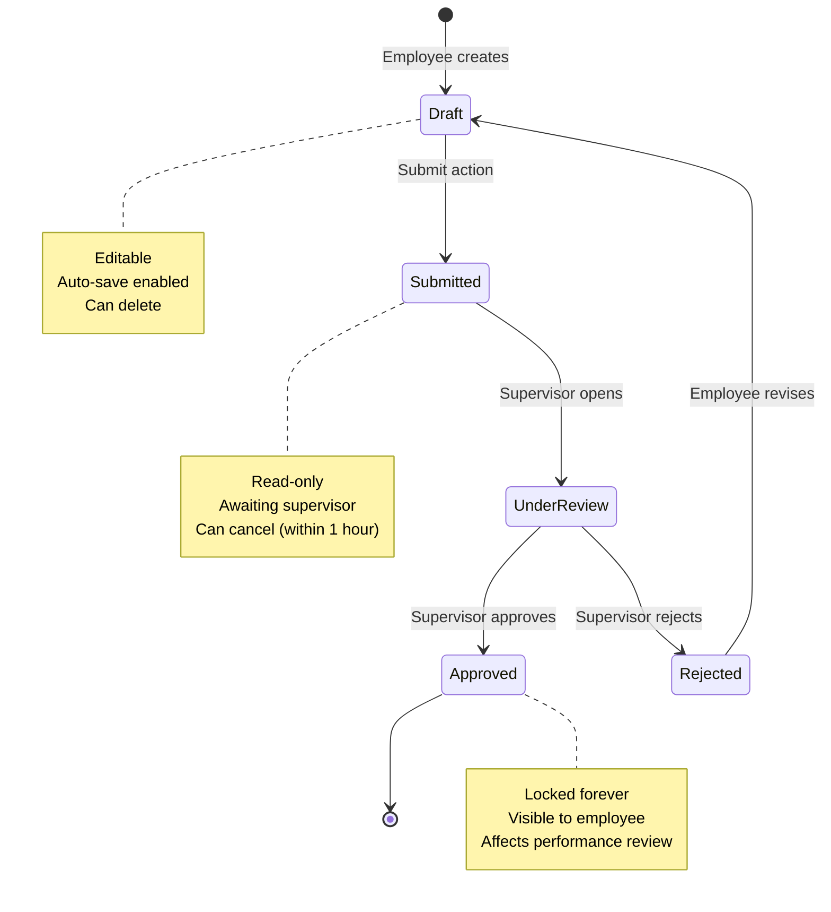

# Mock Data Implementation Guide

**Last Updated:** 2024-12-01
**Status:** Standard Practice
**Audience:** All Frontend Developers

---

## 📖 Table of Contents

1. [Overview](#overview)
2. [Development Workflow](#development-workflow)
3. [When to Use Mock Data](#when-to-use-mock-data)
4. [Domain Modeling](#domain-modeling)
5. [API Contract Definition](#api-contract-definition)
6. [Architecture Pattern](#architecture-pattern)
7. [Step-by-Step Implementation](#step-by-step-implementation)
8. [File Structure](#file-structure)
9. [Best Practices](#best-practices)
10. [Testing Strategy](#testing-strategy)
11. [Database Design](#database-design)
12. [Backend Implementation](#backend-implementation)
13. [Migration to Real API](#migration-to-real-api)
14. [Common Pitfalls](#common-pitfalls)

---

## 📋 Overview

This project follows a **Domain-First Development** approach where features are designed from business requirements down to implementation. This methodology ensures:

- ✅ Clear business logic before any code is written
- ✅ Well-defined API contracts that both frontend and backend follow
- ✅ Parallel development (Frontend with mocks + Backend with real DB)
- ✅ Early stakeholder approval on UI/UX
- ✅ Database schema aligned with domain model
- ✅ Zero refactoring when switching from mock → real API

### Key Principles

1. **Domain Model First**: Understand the business entities, their relationships, and behaviors
2. **API Contract as Source of Truth**: Both frontend types and backend schemas derive from the contract
3. **Mock Data Replicates Contract**: Frontend can develop independently with realistic mock data
4. **Database Design from Domain**: Schema reflects the domain model and API needs
5. **Seamless Migration**: Switching from mock to real API requires only an environment variable change

---

## 🔄 Development Workflow



### Recommended Flow

```
1. Domain Modeling (1-2 days)
   ├─ Define business entities
   ├─ Map relationships
   └─ Document business rules

2. API Contract Definition (1 day)
   ├─ Define endpoints (REST)
   ├─ Request/Response schemas
   └─ Error responses

3. Frontend Development (3-5 days)
   ├─ Generate TypeScript types from contract
   ├─ Create mock data based on contract
   └─ Implement UI with mocks

4. Stakeholder Approval (1-2 days)
   └─ Demo with mock data

5. Database Design (1 day)
   ├─ ERD based on domain model
   └─ Migrations

6. Backend Implementation (3-5 days)
   ├─ Repositories (DB layer)
   ├─ Services (Business logic)
   └─ API endpoints

7. Integration (1 day)
   └─ Change environment variable
   └─ Test real API flows
```

---

## 🎯 When to Use Mock Data

### ✅ Use Mock Data When:

- **No backend exists yet** - Feature is completely new
- **Database doesn't exist** - Still defining schema
- **Prototyping for approval** - Need stakeholder sign-off on UI/UX
- **Parallel development** - Frontend and backend teams working simultaneously
- **Backend is unstable** - API endpoints under heavy development
- **Offline development** - Working without backend connection
- **Demo purposes** - Presenting to clients without production data

### ❌ Don't Use Mock Data When:

- Backend is stable and available
- Testing real API integration
- In production builds
- Feature is already using real API
- Need to test actual database constraints

---

## 🎨 Domain Modeling

Domain modeling is the **first and most critical step**. It defines the business logic, entities, and relationships before any code is written.

### Step 1: Identify Business Entities

List all the core entities in your feature domain.

**Example: Self-Assessment Feature**

```markdown
### Core Entities

1. **SelfAssessment**
   - Purpose: Employee's self-evaluation of their goals
   - Lifecycle: draft → submitted → reviewed → approved/rejected

2. **Goal**
   - Purpose: Objectives employee is evaluated against
   - Categories: Quantitative, Qualitative, Competency

3. **EvaluationPeriod**
   - Purpose: Time-bound evaluation cycle
   - Example: 2024 Q4 Review

4. **Stage**
   - Purpose: Employee's organizational level
   - Determines: Weight distribution (quantitative, qualitative, competency)

5. **Rating**
   - Purpose: Scoring system for assessments
   - Scale: SS, S, A+, A, A-, B, C, D
   - Numeric: 7, 6, 5, 4, 3, 2, 1, 0

6. **BucketDecision**
   - Purpose: Supervisor's review per goal category
   - Contains: Employee rating, supervisor rating, comments
```

### Step 2: Define Relationships

Map how entities relate to each other.



### Step 3: Document Business Rules

List all validation rules, constraints, and behaviors.

```markdown
### Business Rules

#### Self-Assessment Submission
- ✅ Can only submit if all approved goals have ratings
- ✅ Draft is auto-saved every 30 seconds
- ✅ Once submitted, cannot be edited (unless rejected)
- ✅ Submission triggers notification to supervisor

#### Rating Calculation
- ✅ Bucket contribution = (avg rating × bucket weight) / 100
- ✅ Final score = sum of all bucket contributions
- ✅ Final grade = map score to rating threshold

#### Stage Weights
- ✅ Stage 1-4: quantitative 40%, qualitative 40%, competency 20%
- ✅ Stage 5-6: quantitative 50%, qualitative 30%, competency 20%
- ✅ If weight = 0%, hide that bucket from UI

#### Supervisor Review
- ✅ Can approve, reject, or return for revision
- ✅ Rejection requires comment (minimum 10 characters)
- ✅ Approved assessments are locked (read-only)
```

### Step 4: Define States and Transitions

Document the lifecycle of key entities.



### Step 5: Create Domain Model Document

Save in `.kiro/specs/{feature-name}/domain-model.md`

```markdown
# Domain Model: Self-Assessment Feature

## Business Context
[Describe the business problem this feature solves]

## Entities
[List all entities with descriptions]

## Relationships
[ERD diagram]

## Business Rules
[All validation and business logic]

## State Transitions
[Lifecycle diagrams]

## Open Questions
[Any unclear requirements]
```

---

## 📜 API Contract Definition

Once the domain is clear, define the API contract **before** writing any code. This contract is the source of truth for both frontend and backend.

### Step 1: Define Endpoints

List all HTTP endpoints with methods, paths, and purpose.

```markdown
# API Contract: Self-Assessment Feature

## Base URL
`/api/v1/self-assessments`

## Endpoints

### 1. Get Self-Assessment Context
**Purpose:** Fetch goals, draft data, stage weights for employee to complete assessment

```http
GET /self-assessments/context
Query Parameters:
  - period_id (optional): UUID - defaults to current period

Response 200:
{
  "goals": Goal[],
  "draft": DraftEntry[],
  "summary": Summary | null,
  "stage_weights": {
    "quantitative": int,
    "qualitative": int,
    "competency": int
  },
  "review_status": "pending" | "approved" | "rejected" | null
}
```

### 2. Save Draft
**Purpose:** Auto-save employee's work-in-progress

```http
POST /self-assessments/draft

Request Body:
{
  "entries": [
    {
      "goal_id": UUID,
      "bucket": string,
      "rating_code": string?,
      "comment": string?
    }
  ]
}

Response 200:
{
  "success": true,
  "updated_at": ISO8601 timestamp
}
```

### 3. Submit Self-Assessment
**Purpose:** Finalize and send to supervisor for review

```http
POST /self-assessments/submit

Request Body:
{
  "entries": [
    {
      "goal_id": UUID,
      "bucket": string,
      "rating_code": string,
      "comment": string?
    }
  ]
}

Response 200:
{
  "id": UUID,
  "submitted_at": ISO8601 timestamp,
  "final_rating": string,
  "weighted_total": number,
  "per_bucket": [
    {
      "bucket": string,
      "weight": int,
      "avg_score": number,
      "contribution": number
    }
  ],
  "flags": {
    "fail": boolean,
    "notes": string[]
  }
}

Response 400: Validation errors
Response 409: Already submitted
```
```

### Step 2: Define Schemas

Define request/response object structures in detail.

```typescript
// API Contract Schemas (in TypeScript notation)

interface Goal {
  id: UUID;
  goal_category: string;
  weight: number;
  status: 'draft' | 'approved' | 'rejected';
  target_data: {
    title?: string;
    goal_description?: string;
    achievement_criteria_text?: string;
    competency_ids?: number[];
    selected_ideal_actions?: Record<string, string[]>;
  };
  submitted_at?: string;
}

interface DraftEntry {
  goal_id: UUID;
  bucket: string;
  rating_code?: string; // SS, S, A+, A, A-, B, C, D
  comment?: string;
  previous_self_assessment_id?: UUID | null;
  supervisor_comment?: string | null;
}

interface StageWeights {
  quantitative: number; // 0-100
  qualitative: number;  // 0-100
  competency: number;   // 0-100
}

interface Summary {
  submitted_at: string;
  final_rating: string;
  weighted_total: number;
  per_bucket?: BucketContribution[];
  flags?: {
    fail: boolean;
    notes: string[];
  };
}

interface BucketContribution {
  bucket: string;
  weight: number;
  avg_score: number;
  contribution: number;
}
```

### Step 3: Define Error Responses

Standardize error formats.

```typescript
// Standard Error Response
interface ApiError {
  success: false;
  error: string;           // User-friendly message
  error_code?: string;     // Machine-readable code
  error_message?: string;  // Detailed technical message
  details?: any;           // Additional context
}

// Example Error Codes
enum ErrorCode {
  VALIDATION_ERROR = 'VALIDATION_ERROR',
  NOT_FOUND = 'NOT_FOUND',
  ALREADY_SUBMITTED = 'ALREADY_SUBMITTED',
  MISSING_RATINGS = 'MISSING_RATINGS',
  INSUFFICIENT_PERMISSIONS = 'INSUFFICIENT_PERMISSIONS',
}
```

### Step 4: Create API Contract Document

Save in `.kiro/specs/{feature-name}/api-contract.md`

````markdown
# API Contract: Self-Assessment Feature

**Version:** 1.0
**Last Updated:** 2024-12-01
**Status:** Draft

## Overview
[Brief description of API purpose]

## Authentication
All endpoints require Clerk JWT authentication via `Authorization: Bearer <token>` header.

## Base URL
`/api/v1/self-assessments`

## Endpoints
[Detailed endpoint specifications]

## Schemas
[TypeScript interface definitions]

## Error Responses
[Standard error format]

## Validation Rules
- `rating_code` must be one of: SS, S, A+, A, A-, B, C, D
- `comment` max length: 500 characters
- `bucket` must match goal category

## Rate Limiting
- Draft save: 1 request per second per user
- Submit: 1 request per minute per user

## Changelog
- 2024-12-01: Initial draft
````

### Step 5: Validate Contract with Team

Before implementing, review with:
- ✅ Frontend team (can they build UI from this?)
- ✅ Backend team (is this implementable?)
- ✅ Product/Business (does this match requirements?)

---

## 🏗️ Architecture Pattern

### Current Project Architecture

```
┌─────────────────────────────────────────────────────────┐
│                    Page Component (RSC)                  │
│                   app/*/page.tsx                         │
└────────────────────┬────────────────────────────────────┘
                     │
                     ▼
┌─────────────────────────────────────────────────────────┐
│                  Server Actions                          │
│              api/server-actions/*.ts                     │
│         (Handles caching, revalidation)                  │
└────────────────────┬────────────────────────────────────┘
                     │
                     ▼
┌─────────────────────────────────────────────────────────┐
│               Endpoint Functions                         │
│                api/endpoints/*.ts                        │
│        ┌─────────────────────────────────┐              │
│        │  if (USE_MOCK) → Mock Service   │              │
│        │  else → HTTP Client             │              │
│        └─────────────────────────────────┘              │
└────────────┬──────────────────────┬─────────────────────┘
             │                      │
             ▼                      ▼
┌────────────────────┐   ┌──────────────────────┐
│   Mock Service     │   │    HTTP Client       │
│   (Local Data)     │   │  (Backend API)       │
└────────────────────┘   └──────────────────────┘
```

### Key Points

1. **Pages** always call **Server Actions** (never mock directly)
2. **Server Actions** always call **Endpoint Functions** (never HTTP client directly)
3. **Endpoint Functions** contain the mock/real switch logic
4. **Mock Services** simulate API behavior (delay, errors, state)

---

## 📝 Step-by-Step Implementation

### Step 1: Define TypeScript Types

**Location:** `frontend/src/api/types/`

```typescript
// frontend/src/api/types/my-feature.ts
import type { UUID } from './common';

export interface MyFeatureContext {
  items: MyItem[];
  metadata: Metadata;
  summary: Summary | null;
}

export interface MyItem {
  id: UUID;
  name: string;
  status: 'draft' | 'submitted' | 'approved';
  createdAt: string;
}

// ... other interfaces
```

**Export in index:**

```typescript
// frontend/src/api/types/index.ts
export * from './my-feature';
```

### Step 2: Add Endpoint Constants

**Location:** `frontend/src/api/constants/config.ts`

```typescript
export const API_ENDPOINTS = {
  // ... existing endpoints

  MY_FEATURE: {
    CONTEXT: '/my-feature/context',
    DRAFT: '/my-feature/draft',
    SUBMIT: '/my-feature/submit',
    BY_ID: (id: string) => `/my-feature/${id}`,
  },
} as const;
```

### Step 3: Create Mock Data (JSON)

**Location:** `frontend/src/api/mocks/data/`

```json
// frontend/src/api/mocks/data/my-feature-items.json
{
  "user001": [
    {
      "id": "item-1",
      "name": "Example Item 1",
      "status": "approved",
      "createdAt": "2024-01-15T10:00:00Z"
    },
    {
      "id": "item-2",
      "name": "Example Item 2",
      "status": "draft",
      "createdAt": "2024-01-16T10:00:00Z"
    }
  ],
  "user002": [
    {
      "id": "item-3",
      "name": "Example Item 3",
      "status": "submitted",
      "createdAt": "2024-01-17T10:00:00Z"
    }
  ]
}
```

### Step 4: Create TypeScript Scenarios

**Location:** `frontend/src/api/mocks/scenarios/`

```typescript
// frontend/src/api/mocks/scenarios/my-feature.scenarios.ts
import itemsData from '../data/my-feature-items.json';
import type { MyFeatureContext } from '@/api/types';

export const scenarios = {
  draft: {
    items: itemsData.user001.filter(item => item.status === 'draft'),
    metadata: { count: 1, page: 1 },
    summary: null
  } as MyFeatureContext,

  submitted: {
    items: itemsData.user001,
    metadata: { count: 2, page: 1 },
    summary: {
      totalItems: 2,
      submittedAt: new Date().toISOString()
    }
  } as MyFeatureContext,

  approved: {
    items: itemsData.user001.filter(item => item.status === 'approved'),
    metadata: { count: 1, page: 1 },
    summary: {
      totalItems: 1,
      approvedAt: new Date().toISOString()
    }
  } as MyFeatureContext,
} as const;

export type ScenarioKey = keyof typeof scenarios;
```

### Step 5: Create Mock Service

**Location:** `frontend/src/api/mocks/services/`

```typescript
// frontend/src/api/mocks/services/my-feature.mock.service.ts
import { scenarios, type ScenarioKey } from '../scenarios/my-feature.scenarios';
import type { ApiResponse, MyFeatureContext, MyItem } from '@/api/types';

// Simulate network latency
const delay = (ms: number) => new Promise(resolve => setTimeout(resolve, ms));

class MockMyFeatureService {
  private currentScenario: ScenarioKey = 'draft';
  private localState: Map<string, MyItem[]> = new Map();

  /**
   * Set scenario for testing different states
   */
  setScenario(scenario: ScenarioKey) {
    this.currentScenario = scenario;
  }

  /**
   * Get feature context (simulates GET /my-feature/context)
   */
  async getContext(userId?: string): Promise<ApiResponse<MyFeatureContext>> {
    await delay(500); // Simulate network latency

    try {
      const data = scenarios[this.currentScenario];

      return {
        success: true,
        data,
      };
    } catch (error) {
      return {
        success: false,
        error: 'Failed to fetch context',
        errorMessage: 'Mock service error',
      };
    }
  }

  /**
   * Save draft (simulates POST /my-feature/draft)
   */
  async saveDraft(items: Partial<MyItem>[]): Promise<ApiResponse<{ updatedAt: string }>> {
    await delay(300);

    try {
      // Store in local state
      const userId = 'user001';
      this.localState.set(userId, items as MyItem[]);

      return {
        success: true,
        data: {
          updatedAt: new Date().toISOString(),
        },
      };
    } catch (error) {
      return {
        success: false,
        error: 'Failed to save draft',
      };
    }
  }

  /**
   * Submit items (simulates POST /my-feature/submit)
   */
  async submit(items: MyItem[]): Promise<ApiResponse<MyFeatureContext>> {
    await delay(800);

    try {
      // Validate items
      if (items.length === 0) {
        return {
          success: false,
          error: 'No items to submit',
        };
      }

      // Update scenario to submitted
      this.currentScenario = 'submitted';

      return {
        success: true,
        data: scenarios.submitted,
      };
    } catch (error) {
      return {
        success: false,
        error: 'Failed to submit',
      };
    }
  }

  /**
   * Simulate error scenarios (for testing error handling)
   */
  async simulateError(statusCode: number): Promise<ApiResponse<never>> {
    await delay(200);

    return {
      success: false,
      error: `Mock error ${statusCode}`,
      errorMessage: 'Simulated error for testing',
    };
  }
}

export const mockMyFeatureService = new MockMyFeatureService();
```

### Step 6: Create Endpoint Functions with Switch

**Location:** `frontend/src/api/endpoints/`

```typescript
// frontend/src/api/endpoints/my-feature.ts
import { getHttpClient } from '../client/http-client';
import { mockMyFeatureService } from '../mocks/services/my-feature.mock.service';
import { API_ENDPOINTS } from '../constants/config';
import type { ApiResponse, MyFeatureContext, MyItem } from '../types';

// Environment variable controls mock vs real
const USE_MOCK = process.env.NEXT_PUBLIC_USE_MOCK_MY_FEATURE === 'true';

const httpClient = getHttpClient();

export const myFeatureApi = {
  /**
   * Get feature context
   */
  getContext: async (userId?: string): Promise<ApiResponse<MyFeatureContext>> => {
    if (USE_MOCK) {
      return mockMyFeatureService.getContext(userId);
    }

    // Real implementation (when backend is ready)
    const endpoint = userId
      ? `${API_ENDPOINTS.MY_FEATURE.CONTEXT}?userId=${userId}`
      : API_ENDPOINTS.MY_FEATURE.CONTEXT;

    return httpClient.get<MyFeatureContext>(endpoint);
  },

  /**
   * Save draft
   */
  saveDraft: async (items: Partial<MyItem>[]): Promise<ApiResponse<{ updatedAt: string }>> => {
    if (USE_MOCK) {
      return mockMyFeatureService.saveDraft(items);
    }

    // Real implementation
    return httpClient.post<{ updatedAt: string }>(
      API_ENDPOINTS.MY_FEATURE.DRAFT,
      { items }
    );
  },

  /**
   * Submit items
   */
  submit: async (items: MyItem[]): Promise<ApiResponse<MyFeatureContext>> => {
    if (USE_MOCK) {
      return mockMyFeatureService.submit(items);
    }

    // Real implementation
    return httpClient.post<MyFeatureContext>(
      API_ENDPOINTS.MY_FEATURE.SUBMIT,
      { items }
    );
  },
};
```

### Step 7: Create Server Actions

**Location:** `frontend/src/api/server-actions/`

```typescript
// frontend/src/api/server-actions/my-feature.ts
'use server';

import { cache } from 'react';
import { revalidateTag } from 'next/cache';
import { myFeatureApi } from '../endpoints/my-feature';
import { CACHE_TAGS } from '../utils/cache';
import type { MyFeatureContext, MyItem } from '../types';

/**
 * Server action to get feature context with caching
 */
export const getMyFeatureContextAction = cache(async (
  userId?: string
): Promise<{ success: boolean; data?: MyFeatureContext; error?: string }> => {
  try {
    const response = await myFeatureApi.getContext(userId);

    if (!response.success || !response.data) {
      return {
        success: false,
        error: response.error || 'Failed to fetch context',
      };
    }

    return {
      success: true,
      data: response.data,
    };
  } catch (error) {
    console.error('Get context action error:', error);
    return {
      success: false,
      error: 'An unexpected error occurred',
    };
  }
});

/**
 * Server action to save draft with cache revalidation
 */
export async function saveMyFeatureDraftAction(
  items: Partial<MyItem>[]
): Promise<{ success: boolean; data?: { updatedAt: string }; error?: string }> {
  try {
    const response = await myFeatureApi.saveDraft(items);

    if (!response.success || !response.data) {
      return {
        success: false,
        error: response.error || 'Failed to save draft',
      };
    }

    // Revalidate cache
    revalidateTag(CACHE_TAGS.MY_FEATURE);

    return {
      success: true,
      data: response.data,
    };
  } catch (error) {
    console.error('Save draft action error:', error);
    return {
      success: false,
      error: 'An unexpected error occurred',
    };
  }
}

/**
 * Server action to submit items
 */
export async function submitMyFeatureAction(
  items: MyItem[]
): Promise<{ success: boolean; data?: MyFeatureContext; error?: string }> {
  try {
    const response = await myFeatureApi.submit(items);

    if (!response.success || !response.data) {
      return {
        success: false,
        error: response.error || 'Failed to submit',
      };
    }

    // Revalidate related caches
    revalidateTag(CACHE_TAGS.MY_FEATURE);

    return {
      success: true,
      data: response.data,
    };
  } catch (error) {
    console.error('Submit action error:', error);
    return {
      success: false,
      error: 'An unexpected error occurred',
    };
  }
}
```

### Step 8: Use in Page Components

**Location:** `frontend/src/app/`

```typescript
// frontend/src/app/(feature)/my-feature/page.tsx
import { getMyFeatureContextAction } from '@/api/server-actions/my-feature';
import { MyFeatureView } from '@/feature/my-feature/display/MyFeatureView';

export default async function MyFeaturePage() {
  const result = await getMyFeatureContextAction();

  if (!result.success || !result.data) {
    return <div>Error: {result.error}</div>;
  }

  return <MyFeatureView initialData={result.data} />;
}
```

**Client Component:**

```typescript
// frontend/src/feature/my-feature/display/MyFeatureView.tsx
'use client';

import { useState } from 'react';
import { saveMyFeatureDraftAction, submitMyFeatureAction } from '@/api/server-actions/my-feature';
import type { MyFeatureContext, MyItem } from '@/api/types';

interface Props {
  initialData: MyFeatureContext;
}

export function MyFeatureView({ initialData }: Props) {
  const [items, setItems] = useState(initialData.items);
  const [saving, setSaving] = useState(false);

  const handleSaveDraft = async () => {
    setSaving(true);
    const result = await saveMyFeatureDraftAction(items);
    if (result.success) {
      // Show success message
    }
    setSaving(false);
  };

  const handleSubmit = async () => {
    const result = await submitMyFeatureAction(items);
    if (result.success) {
      // Show success and update UI
    }
  };

  return (
    <div>
      {/* Your UI here */}
      <button onClick={handleSaveDraft} disabled={saving}>
        Save Draft
      </button>
      <button onClick={handleSubmit}>Submit</button>
    </div>
  );
}
```

### Step 9: Add Environment Variable

**Location:** `.env.local`

```bash
# Enable mock data for My Feature
NEXT_PUBLIC_USE_MOCK_MY_FEATURE=true
```

---

## 📁 File Structure

```
frontend/
├── src/
│   ├── api/
│   │   ├── mocks/
│   │   │   ├── data/                    # Static JSON files
│   │   │   │   ├── my-feature-items.json
│   │   │   │   └── users.json
│   │   │   │
│   │   │   ├── scenarios/               # TypeScript scenarios
│   │   │   │   └── my-feature.scenarios.ts
│   │   │   │
│   │   │   └── services/                # Mock services
│   │   │       └── my-feature.mock.service.ts
│   │   │
│   │   ├── endpoints/
│   │   │   └── my-feature.ts            # Switch logic here
│   │   │
│   │   ├── server-actions/
│   │   │   └── my-feature.ts
│   │   │
│   │   ├── types/
│   │   │   ├── my-feature.ts
│   │   │   └── index.ts
│   │   │
│   │   └── constants/
│   │       └── config.ts                # API_ENDPOINTS
│   │
│   ├── app/
│   │   └── (feature)/
│   │       └── my-feature/
│   │           └── page.tsx
│   │
│   └── feature/
│       └── my-feature/
│           ├── display/
│           │   └── MyFeatureView.tsx
│           └── components/
│
└── .env.local                           # Environment variables
```

---

## 🎯 Best Practices

### 1. Always Follow the Layer Pattern

```typescript
// ❌ WRONG - Component accessing mock directly
import { mockData } from '@/api/mocks/data/items.json';
function MyComponent() {
  return <div>{mockData}</div>;
}

// ✅ CORRECT - Component using server action
import { getItemsAction } from '@/api/server-actions/items';
async function MyComponent() {
  const result = await getItemsAction();
  return <div>{result.data}</div>;
}
```

### 2. Simulate Realistic Behavior

```typescript
// ✅ Add latency
await delay(500);

// ✅ Simulate errors
if (Math.random() < 0.1) {
  return { success: false, error: 'Random error' };
}

// ✅ Validate input
if (!items || items.length === 0) {
  return { success: false, error: 'No items provided' };
}
```

### 3. Keep Mock and Real Types Identical

```typescript
// ✅ Both return same type
mockService.getContext(): Promise<ApiResponse<MyFeatureContext>>
httpClient.get<MyFeatureContext>(): Promise<ApiResponse<MyFeatureContext>>
```

### 4. Use Scenarios for Different States

```typescript
// ✅ Easy to test different UI states
mockService.setScenario('draft');
mockService.setScenario('submitted');
mockService.setScenario('approved');
```

### 5. Document Mock Data Source

```typescript
/**
 * Mock data based on:
 * - Design spec: .kiro/specs/my-feature/design.md
 * - Refactor branch: feat/my-feature-refactor
 * - Backend contract: backend/app/schemas/my_feature.py
 */
```

---

## 🧪 Testing Strategy

### Unit Tests (Mock Service)

```typescript
// __tests__/api/mocks/my-feature.mock.service.test.ts
import { mockMyFeatureService } from '@/api/mocks/services/my-feature.mock.service';

describe('Mock My Feature Service', () => {
  it('should return draft scenario data', async () => {
    mockMyFeatureService.setScenario('draft');
    const result = await mockMyFeatureService.getContext();

    expect(result.success).toBe(true);
    expect(result.data?.items).toHaveLength(1);
    expect(result.data?.items[0].status).toBe('draft');
  });

  it('should simulate save draft', async () => {
    const result = await mockMyFeatureService.saveDraft([{ name: 'Test' }]);

    expect(result.success).toBe(true);
    expect(result.data?.updatedAt).toBeDefined();
  });
});
```

### Integration Tests (Endpoint Switch)

```typescript
// __tests__/api/endpoints/my-feature.test.ts
import { myFeatureApi } from '@/api/endpoints/my-feature';

describe('My Feature API', () => {
  it('should use mock when env var is true', async () => {
    process.env.NEXT_PUBLIC_USE_MOCK_MY_FEATURE = 'true';

    const result = await myFeatureApi.getContext();

    expect(result.success).toBe(true);
    // Verify it's mock data
  });
});
```

---

## 🔄 Migration to Real API

### Step 1: Verify Types Match Backend

```typescript
// Compare frontend types with backend schemas
// frontend/src/api/types/my-feature.ts ↔ backend/app/schemas/my_feature.py

interface MyFeatureContext {
  items: MyItem[];  // ← Must match backend MyFeatureContextSchema
  metadata: Metadata;
  summary: Summary | null;
}
```

### Step 2: Implement Real Endpoints in Backend

```python
# backend/app/api/v1/my_feature.py
@router.get("/my-feature/context")
async def get_context(
    user_id: Optional[str] = None,
    db: AsyncSession = Depends(get_db),
) -> MyFeatureContextSchema:
    # Implementation
    pass
```

### Step 3: Update Environment Variable

```bash
# .env.local
# NEXT_PUBLIC_USE_MOCK_MY_FEATURE=true  # ← Comment out or set to false
NEXT_PUBLIC_USE_MOCK_MY_FEATURE=false
```

### Step 4: Test Integration

```bash
# 1. Start backend
cd backend && docker-compose up

# 2. Start frontend
cd frontend && npm run dev

# 3. Test all flows
# - Draft → Submit → Approve workflow
# - Error handling
# - Edge cases
```

### Step 5: Remove Mock Code (Optional)

```bash
# After confirming real API works, you can optionally remove:
rm -rf frontend/src/api/mocks/services/my-feature.mock.service.ts
rm -rf frontend/src/api/mocks/scenarios/my-feature.scenarios.ts
rm -rf frontend/src/api/mocks/data/my-feature-items.json

# OR keep them for:
# - Future testing
# - Demo purposes
# - Offline development
```

---

## ⚠️ Common Pitfalls

### 1. ❌ Bypassing Server Actions

```typescript
// ❌ WRONG
import { mockMyFeatureService } from '@/api/mocks/services/my-feature.mock.service';

function MyComponent() {
  const data = await mockMyFeatureService.getContext(); // Direct access!
}

// ✅ CORRECT
import { getMyFeatureContextAction } from '@/api/server-actions/my-feature';

function MyComponent() {
  const data = await getMyFeatureContextAction(); // Via server action
}
```

### 2. ❌ Different Types for Mock vs Real

```typescript
// ❌ WRONG
// Mock returns: { items: Item[], count: number }
// Real returns: { data: Item[], total: number }

// ✅ CORRECT
// Both return: { items: Item[], metadata: { count: number } }
```

### 3. ❌ No Latency Simulation

```typescript
// ❌ WRONG - instant response
async getContext() {
  return { success: true, data: mockData };
}

// ✅ CORRECT - realistic latency
async getContext() {
  await delay(500);
  return { success: true, data: mockData };
}
```

### 4. ❌ Forgetting to Update API_ENDPOINTS

```typescript
// ❌ WRONG - hardcoded URLs in endpoint
return httpClient.get('/my-feature/context');

// ✅ CORRECT - use constant
return httpClient.get(API_ENDPOINTS.MY_FEATURE.CONTEXT);
```

### 5. ❌ Not Handling Errors in Mock

```typescript
// ❌ WRONG - mock never fails
async submit(items: MyItem[]) {
  return { success: true, data: mockData };
}

// ✅ CORRECT - validate and return errors
async submit(items: MyItem[]) {
  if (!items || items.length === 0) {
    return { success: false, error: 'No items to submit' };
  }
  return { success: true, data: mockData };
}
```

---

## 🗄️ Database Design

Once the domain model and API contract are validated, design the database schema. The schema should reflect the domain model and support all API operations efficiently.

### Step 1: Create ERD from Domain Model

Based on your domain entities and relationships, create a detailed ERD.

**Tools:**
- [dbdiagram.io](https://dbdiagram.io) - Online ERD tool
- [DrawSQL](https://drawsql.app) - Database diagram tool
- Mermaid (in markdown) - For documentation

**Example ERD:**

```sql
// Use DBML syntax (dbdiagram.io)
Table self_assessments {
  id uuid [pk, default: `gen_random_uuid()`]
  organization_id varchar(50) [not null, ref: > organizations.id]
  user_id uuid [not null, ref: > users.id]
  period_id uuid [not null, ref: > evaluation_periods.id]
  stage_id uuid [ref: > stages.id] // Snapshot at submission time
  status varchar(20) [not null, default: 'draft'] // draft, submitted, approved, rejected
  submitted_at timestamptz
  created_at timestamptz [not null, default: `now()`]
  updated_at timestamptz [not null, default: `now()`]

  indexes {
    (organization_id, user_id, period_id) [unique]
    (organization_id, status)
    (user_id, period_id)
  }
}

Table self_assessment_entries {
  id uuid [pk, default: `gen_random_uuid()`]
  organization_id varchar(50) [not null]
  assessment_id uuid [not null, ref: > self_assessments.id]
  goal_id uuid [not null, ref: > goals.id]
  bucket varchar(50) [not null] // quantitative, qualitative, competency
  rating_code varchar(5) // SS, S, A+, A, A-, B, C, D
  self_rating decimal(3,1) // Numeric score (0-7)
  comment text
  created_at timestamptz [not null, default: `now()`]
  updated_at timestamptz [not null, default: `now()`]

  indexes {
    (assessment_id, goal_id) [unique]
    (organization_id, assessment_id)
  }
}

Table bucket_decisions {
  id uuid [pk, default: `gen_random_uuid()`]
  organization_id varchar(50) [not null]
  assessment_id uuid [not null, ref: > self_assessments.id]
  bucket varchar(50) [not null]
  employee_rating varchar(5) [not null]
  employee_comment text
  employee_contribution decimal(5,2) // Weighted contribution
  supervisor_rating varchar(5)
  supervisor_comment text
  status varchar(20) [not null, default: 'pending']
  created_at timestamptz [not null, default: `now()`]
  updated_at timestamptz [not null, default: `now()`]

  indexes {
    (organization_id, assessment_id, bucket) [unique]
    (organization_id, status)
  }
}
```

### Step 2: Write Migration

Create an Alembic migration file.

**Location:** `backend/app/database/migrations/versions/`

```python
"""Add self assessment tables

Revision ID: 012_self_assessments
Revises: 011_previous_migration
Create Date: 2024-12-01 10:00:00.000000
"""

from alembic import op
import sqlalchemy as sa
from sqlalchemy.dialects import postgresql

revision = '012_self_assessments'
down_revision = '011_previous_migration'
branch_labels = None
depends_on = None

def upgrade() -> None:
    # Create self_assessments table
    op.create_table(
        'self_assessments',
        sa.Column('id', postgresql.UUID(as_uuid=True), primary_key=True,
                  server_default=sa.text('gen_random_uuid()')),
        sa.Column('organization_id', sa.String(50), nullable=False),
        sa.Column('user_id', postgresql.UUID(as_uuid=True), nullable=False),
        sa.Column('period_id', postgresql.UUID(as_uuid=True), nullable=False),
        sa.Column('stage_id', postgresql.UUID(as_uuid=True)),
        sa.Column('status', sa.String(20), nullable=False, server_default='draft'),
        sa.Column('submitted_at', sa.TIMESTAMP(timezone=True)),
        sa.Column('created_at', sa.TIMESTAMP(timezone=True), nullable=False,
                  server_default=sa.text('now()')),
        sa.Column('updated_at', sa.TIMESTAMP(timezone=True), nullable=False,
                  server_default=sa.text('now()')),

        # Foreign keys
        sa.ForeignKeyConstraint(['organization_id'], ['organizations.id'], ondelete='CASCADE'),
        sa.ForeignKeyConstraint(['user_id'], ['users.id'], ondelete='CASCADE'),
        sa.ForeignKeyConstraint(['period_id'], ['evaluation_periods.id'], ondelete='CASCADE'),
        sa.ForeignKeyConstraint(['stage_id'], ['stages.id'], ondelete='SET NULL'),

        # Unique constraint
        sa.UniqueConstraint('organization_id', 'user_id', 'period_id',
                           name='uq_self_assessment_user_period')
    )

    # Create indexes
    op.create_index('ix_self_assessments_org_status', 'self_assessments',
                    ['organization_id', 'status'])
    op.create_index('ix_self_assessments_user_period', 'self_assessments',
                    ['user_id', 'period_id'])

    # Create self_assessment_entries table
    op.create_table(
        'self_assessment_entries',
        # ... similar structure
    )

    # Create bucket_decisions table
    op.create_table(
        'bucket_decisions',
        # ... similar structure
    )

def downgrade() -> None:
    op.drop_table('bucket_decisions')
    op.drop_table('self_assessment_entries')
    op.drop_table('self_assessments')
```

### Step 3: Validate Schema Against API Contract

Ensure database can support all API operations:

```markdown
## Schema Validation Checklist

### GET /self-assessments/context
- ✅ Can join `goals` + `self_assessment_entries` for draft
- ✅ Can fetch stage weights via `stage_id`
- ✅ Can check review status via `bucket_decisions.status`

### POST /self-assessments/draft
- ✅ Can upsert entries via unique constraint on (assessment_id, goal_id)
- ✅ Updated_at triggers automatic timestamp

### POST /self-assessments/submit
- ✅ Can create bucket_decisions in single transaction
- ✅ Can calculate contributions from entries + stage weights
- ✅ Status transition from draft → submitted is valid

### Performance
- ✅ Index on (organization_id, user_id, period_id) for context query
- ✅ Index on (organization_id, status) for supervisor pending list
- ✅ Foreign keys have indexes for join performance
```

### Step 4: Seed Data (Optional)

Create seed data for testing backend logic.

```python
# backend/app/database/seeds/self_assessment_seeds.py

async def seed_self_assessments(db: AsyncSession):
    """Seed test self-assessments"""

    # Get test users and periods
    user = await db.execute(select(User).where(User.email == 'test@example.com'))
    period = await db.execute(select(EvaluationPeriod).where(EvaluationPeriod.name == '2024 Q4'))

    # Create draft assessment
    draft_assessment = SelfAssessment(
        organization_id='org-001',
        user_id=user.scalars().first().id,
        period_id=period.scalars().first().id,
        status='draft',
    )
    db.add(draft_assessment)
    await db.flush()

    # Add entries
    # ...

    await db.commit()
```

---

## ⚙️ Backend Implementation

After database is ready, implement the backend following the established architecture.

### Project Backend Architecture

```
backend/app/
├── api/v1/
│   └── self_assessments.py          # API endpoints (thin layer)
├── services/
│   └── self_assessment_service.py   # Business logic
├── database/
│   ├── models/
│   │   └── self_assessment.py       # SQLAlchemy models
│   └── repositories/
│       └── self_assessment_repo.py  # Database queries
└── schemas/
    └── self_assessment.py           # Pydantic schemas (API contract)
```

### Step 1: Create Pydantic Schemas

**Location:** `backend/app/schemas/self_assessment.py`

```python
"""
Pydantic schemas for Self-Assessment API

These schemas MUST match the API contract defined in:
.kiro/specs/self-assessment-ui-mock/api-contract.md
"""

from pydantic import BaseModel, Field, field_validator
from typing import Optional, List
from datetime import datetime
from uuid import UUID

class GoalData(BaseModel):
    """Goal target data (JSONB field)"""
    title: Optional[str] = None
    goal_description: Optional[str] = None
    achievement_criteria_text: Optional[str] = None
    competency_ids: Optional[List[int]] = None
    selected_ideal_actions: Optional[dict[str, List[str]]] = None

class GoalResponse(BaseModel):
    """Goal in self-assessment context"""
    id: UUID
    goal_category: str
    weight: int
    status: str
    target_data: GoalData
    submitted_at: Optional[datetime] = None

    class Config:
        from_attributes = True

class DraftEntryRequest(BaseModel):
    """Single draft entry from frontend"""
    goal_id: UUID
    bucket: str
    rating_code: Optional[str] = None
    comment: Optional[str] = Field(None, max_length=500)

    @field_validator('rating_code')
    @classmethod
    def validate_rating_code(cls, v: Optional[str]) -> Optional[str]:
        if v is None:
            return v
        valid_ratings = {'SS', 'S', 'A+', 'A', 'A-', 'B', 'C', 'D'}
        if v not in valid_ratings:
            raise ValueError(f'rating_code must be one of {valid_ratings}')
        return v

class StageWeights(BaseModel):
    """Stage weight distribution"""
    quantitative: int = Field(ge=0, le=100)
    qualitative: int = Field(ge=0, le=100)
    competency: int = Field(ge=0, le=100)

class SelfAssessmentContextResponse(BaseModel):
    """Response for GET /self-assessments/context"""
    goals: List[GoalResponse]
    draft: List[DraftEntryRequest]
    summary: Optional[dict] = None  # TODO: Create SummaryResponse schema
    stage_weights: StageWeights
    review_status: Optional[str] = None

class SaveDraftRequest(BaseModel):
    """Request for POST /self-assessments/draft"""
    entries: List[DraftEntryRequest]

class SaveDraftResponse(BaseModel):
    """Response for POST /self-assessments/draft"""
    success: bool = True
    updated_at: datetime

class BucketContribution(BaseModel):
    """Per-bucket contribution calculation"""
    bucket: str
    weight: int
    avg_score: float
    contribution: float

class SubmitAssessmentRequest(BaseModel):
    """Request for POST /self-assessments/submit"""
    entries: List[DraftEntryRequest]

    @field_validator('entries')
    @classmethod
    def validate_entries_have_ratings(cls, v: List[DraftEntryRequest]) -> List[DraftEntryRequest]:
        if not v:
            raise ValueError('entries cannot be empty')
        for entry in v:
            if not entry.rating_code:
                raise ValueError(f'All entries must have rating_code for submission')
        return v

class SubmitAssessmentResponse(BaseModel):
    """Response for POST /self-assessments/submit"""
    id: UUID
    submitted_at: datetime
    final_rating: str
    weighted_total: float
    per_bucket: List[BucketContribution]
    flags: dict  # { "fail": bool, "notes": List[str] }
```

### Step 2: Create Repository

**Location:** `backend/app/database/repositories/self_assessment_repo.py`

```python
"""
Self-Assessment Repository

Handles all database queries for self-assessments.
Follows the repository pattern used in the project.
"""

from sqlalchemy import select, and_
from sqlalchemy.ext.asyncio import AsyncSession
from sqlalchemy.orm import selectinload
from typing import Optional, List
from uuid import UUID

from app.database.models import SelfAssessment, SelfAssessmentEntry, Goal, Stage
from app.database.repositories.base import BaseRepository

class SelfAssessmentRepository(BaseRepository[SelfAssessment]):
    """Repository for self-assessment operations"""

    def __init__(self, db: AsyncSession, organization_id: str):
        super().__init__(SelfAssessment, db, organization_id)

    async def get_context(
        self,
        user_id: UUID,
        period_id: UUID
    ) -> tuple[List[Goal], List[SelfAssessmentEntry], Optional[SelfAssessment]]:
        """
        Get all data needed for self-assessment page
        Returns: (approved_goals, draft_entries, existing_assessment)
        """

        # Get approved goals for this period
        goals_query = (
            select(Goal)
            .where(
                and_(
                    Goal.organization_id == self.organization_id,
                    Goal.user_id == user_id,
                    Goal.period_id == period_id,
                    Goal.status == 'approved'
                )
            )
            .order_by(Goal.goal_category, Goal.created_at)
        )
        goals_result = await self.db.execute(goals_query)
        goals = goals_result.scalars().all()

        # Get existing assessment (if any)
        assessment_query = (
            select(SelfAssessment)
            .options(selectinload(SelfAssessment.entries))
            .where(
                and_(
                    SelfAssessment.organization_id == self.organization_id,
                    SelfAssessment.user_id == user_id,
                    SelfAssessment.period_id == period_id
                )
            )
        )
        assessment_result = await self.db.execute(assessment_query)
        assessment = assessment_result.scalars().first()

        draft_entries = assessment.entries if assessment else []

        return goals, draft_entries, assessment

    async def save_draft(
        self,
        user_id: UUID,
        period_id: UUID,
        entries_data: List[dict]
    ) -> SelfAssessment:
        """
        Save or update draft entries
        Uses upsert pattern for entries
        """
        # Get or create assessment
        assessment = await self.get_by_user_and_period(user_id, period_id)
        if not assessment:
            assessment = SelfAssessment(
                organization_id=self.organization_id,
                user_id=user_id,
                period_id=period_id,
                status='draft'
            )
            self.db.add(assessment)
            await self.db.flush()

        # Upsert entries
        for entry_data in entries_data:
            # Check if entry exists
            existing = await self.db.execute(
                select(SelfAssessmentEntry).where(
                    and_(
                        SelfAssessmentEntry.assessment_id == assessment.id,
                        SelfAssessmentEntry.goal_id == entry_data['goal_id']
                    )
                )
            )
            entry = existing.scalars().first()

            if entry:
                # Update existing
                entry.rating_code = entry_data.get('rating_code')
                entry.comment = entry_data.get('comment')
            else:
                # Create new
                entry = SelfAssessmentEntry(
                    organization_id=self.organization_id,
                    assessment_id=assessment.id,
                    **entry_data
                )
                self.db.add(entry)

        await self.db.commit()
        await self.db.refresh(assessment)
        return assessment
```

### Step 3: Create Service

**Location:** `backend/app/services/self_assessment_service.py`

```python
"""
Self-Assessment Service

Contains business logic for self-assessments.
Orchestrates repositories and applies business rules.
"""

from uuid import UUID
from typing import Optional
from sqlalchemy.ext.asyncio import AsyncSession

from app.database.repositories.self_assessment_repo import SelfAssessmentRepository
from app.database.repositories.stage_repo import StageRepository
from app.schemas.self_assessment import (
    SelfAssessmentContextResponse,
    SaveDraftRequest,
    SaveDraftResponse,
    SubmitAssessmentRequest,
    SubmitAssessmentResponse,
)

class SelfAssessmentService:
    """Service layer for self-assessment feature"""

    def __init__(self, db: AsyncSession, organization_id: str):
        self.db = db
        self.organization_id = organization_id
        self.repo = SelfAssessmentRepository(db, organization_id)
        self.stage_repo = StageRepository(db, organization_id)

    async def get_context(
        self,
        user_id: UUID,
        period_id: Optional[UUID] = None
    ) -> SelfAssessmentContextResponse:
        """Get all context data for self-assessment page"""

        # If no period provided, get current period
        if not period_id:
            # TODO: Get current period from EvaluationPeriodService
            pass

        # Get goals and draft
        goals, draft_entries, assessment = await self.repo.get_context(user_id, period_id)

        # Get stage weights for user
        # TODO: Get user's stage and fetch weights
        stage_weights = await self.stage_repo.get_weights_for_user(user_id)

        # Convert draft entries to response format
        draft_responses = [
            {
                'goal_id': entry.goal_id,
                'bucket': entry.bucket,
                'rating_code': entry.rating_code,
                'comment': entry.comment,
            }
            for entry in draft_entries
        ]

        return SelfAssessmentContextResponse(
            goals=[GoalResponse.from_orm(g) for g in goals],
            draft=draft_responses,
            summary=None,  # TODO: Get summary if submitted
            stage_weights=stage_weights,
            review_status=assessment.status if assessment else None
        )

    async def save_draft(
        self,
        user_id: UUID,
        period_id: UUID,
        request: SaveDraftRequest
    ) -> SaveDraftResponse:
        """Save draft entries (auto-save)"""

        entries_data = [entry.model_dump() for entry in request.entries]
        assessment = await self.repo.save_draft(user_id, period_id, entries_data)

        return SaveDraftResponse(
            success=True,
            updated_at=assessment.updated_at
        )

    async def submit(
        self,
        user_id: UUID,
        period_id: UUID,
        request: SubmitAssessmentRequest
    ) -> SubmitAssessmentResponse:
        """Submit self-assessment for supervisor review"""

        # 1. Validate all entries have ratings
        # (Already validated by Pydantic)

        # 2. Save entries
        await self.save_draft(user_id, period_id, SaveDraftRequest(entries=request.entries))

        # 3. Calculate scores
        # TODO: Implement scoring logic

        # 4. Create bucket decisions
        # TODO: Implement bucket decision creation

        # 5. Update assessment status to 'submitted'
        assessment = await self.repo.get_by_user_and_period(user_id, period_id)
        assessment.status = 'submitted'
        assessment.submitted_at = datetime.now()
        await self.db.commit()

        # 6. Return summary
        return SubmitAssessmentResponse(
            id=assessment.id,
            submitted_at=assessment.submitted_at,
            final_rating='A',  # TODO: Calculate
            weighted_total=4.0,  # TODO: Calculate
            per_bucket=[],  # TODO: Calculate
            flags={'fail': False, 'notes': []}
        )
```

### Step 4: Create API Endpoints

**Location:** `backend/app/api/v1/self_assessments.py`

```python
"""
Self-Assessment API Endpoints

Thin layer that handles HTTP concerns only.
Business logic delegated to SelfAssessmentService.
"""

from fastapi import APIRouter, Depends, HTTPException, Query
from sqlalchemy.ext.asyncio import AsyncSession
from typing import Optional
from uuid import UUID

from app.api.dependencies import get_current_user, get_db, get_organization_id
from app.services.self_assessment_service import SelfAssessmentService
from app.schemas.self_assessment import (
    SelfAssessmentContextResponse,
    SaveDraftRequest,
    SaveDraftResponse,
    SubmitAssessmentRequest,
    SubmitAssessmentResponse,
)

router = APIRouter(prefix="/self-assessments", tags=["self-assessments"])

@router.get("/context", response_model=SelfAssessmentContextResponse)
async def get_self_assessment_context(
    period_id: Optional[UUID] = Query(None),
    current_user=Depends(get_current_user),
    db: AsyncSession = Depends(get_db),
    organization_id: str = Depends(get_organization_id),
):
    """
    Get self-assessment context for employee

    Returns goals, draft data, stage weights, and review status.
    """
    service = SelfAssessmentService(db, organization_id)
    return await service.get_context(current_user.id, period_id)

@router.post("/draft", response_model=SaveDraftResponse)
async def save_self_assessment_draft(
    request: SaveDraftRequest,
    period_id: UUID = Query(...),
    current_user=Depends(get_current_user),
    db: AsyncSession = Depends(get_db),
    organization_id: str = Depends(get_organization_id),
):
    """
    Save draft entries (auto-save)

    Idempotent operation - can be called repeatedly.
    """
    service = SelfAssessmentService(db, organization_id)
    return await service.save_draft(current_user.id, period_id, request)

@router.post("/submit", response_model=SubmitAssessmentResponse)
async def submit_self_assessment(
    request: SubmitAssessmentRequest,
    period_id: UUID = Query(...),
    current_user=Depends(get_current_user),
    db: AsyncSession = Depends(get_db),
    organization_id: str = Depends(get_organization_id),
):
    """
    Submit self-assessment for supervisor review

    Validates that all entries have ratings.
    Creates bucket decisions and locks the assessment.
    """
    service = SelfAssessmentService(db, organization_id)
    return await service.submit(current_user.id, period_id, request)
```

### Step 5: Register Router

**Location:** `backend/app/api/v1/__init__.py`

```python
from fastapi import APIRouter
from app.api.v1 import (
    # ... existing imports
    self_assessments,
)

api_router = APIRouter()

# ... existing includes
api_router.include_router(self_assessments.router)
```

---

## 📚 Additional Resources

- [Architecture Compatibility Analysis](../../.kiro/specs/self-assessment-ui-mock/00-architecture-compatibility.md)
- [API Client Documentation](../api/README.md)
- [Server Actions Best Practices](../server-actions/README.md)
- [Testing Guide](../testing/README.md)

---

## 🤝 Contributing

When implementing new features with mock data:

1. ✅ Follow this guide exactly
2. ✅ Create specs in `.kiro/specs/{feature-name}/`
3. ✅ Document mock data source and scenarios
4. ✅ Add tests for mock service
5. ✅ Update this guide if you find better patterns

---

## 📝 Complete Implementation Checklist

Copy this checklist when implementing a new feature following Domain-First approach:

```markdown
## Phase 1: Domain Modeling (1-2 days)
- [ ] Document business requirements
- [ ] Identify core entities
- [ ] Define relationships (ERD diagram)
- [ ] Document business rules and validations
- [ ] Define state transitions and lifecycles
- [ ] Create domain-model.md in `.kiro/specs/{feature-name}/`
- [ ] Review with product/business team

## Phase 2: API Contract Definition (1 day)
- [ ] Define all REST endpoints (method, path, purpose)
- [ ] Define request/response schemas in TypeScript notation
- [ ] Define error responses and codes
- [ ] Document validation rules
- [ ] Create api-contract.md in `.kiro/specs/{feature-name}/`
- [ ] Review contract with frontend and backend teams

## Phase 3: Frontend Implementation with Mocks (3-5 days)
- [ ] Define TypeScript types in `/api/types/` (based on contract)
- [ ] Add endpoints to `API_ENDPOINTS` in `/api/constants/config.ts`
- [ ] Create JSON mock data in `/api/mocks/data/`
- [ ] Create TypeScript scenarios in `/api/mocks/scenarios/`
- [ ] Implement mock service in `/api/mocks/services/`
  - [ ] Add latency simulation
  - [ ] Add error scenarios
  - [ ] Add state management
- [ ] Create endpoint functions with USE_MOCK switch in `/api/endpoints/`
- [ ] Create server actions in `/api/server-actions/`
- [ ] Implement page components using server actions
- [ ] Implement feature-specific components
- [ ] Add environment variable `NEXT_PUBLIC_USE_MOCK_{FEATURE}=true` to `.env.local`
- [ ] Write unit tests for mock service
- [ ] Write component tests

## Phase 4: Stakeholder Approval (1-2 days)
- [ ] Deploy demo with mock data
- [ ] Get stakeholder/supervisor approval on UI/UX
- [ ] Gather feedback and iterate if needed
- [ ] Document approved design decisions

## Phase 5: Database Design (1 day)
- [ ] Create ERD from domain model (use dbdiagram.io or DrawSQL)
- [ ] Write Alembic migration file
- [ ] Define indexes for performance
- [ ] Validate schema supports all API operations
- [ ] Create seed data scripts (optional)
- [ ] Review database design with backend team

## Phase 6: Backend Implementation (3-5 days)
- [ ] Create Pydantic schemas in `backend/app/schemas/` (match API contract)
- [ ] Create SQLAlchemy models in `backend/app/database/models/`
- [ ] Create repository in `backend/app/database/repositories/`
  - [ ] Implement all database queries
  - [ ] Apply organization scoping
- [ ] Create service in `backend/app/services/`
  - [ ] Implement business logic
  - [ ] Orchestrate repositories
  - [ ] Apply business rules
- [ ] Create API endpoints in `backend/app/api/v1/`
  - [ ] Thin layer, delegate to service
  - [ ] Add authentication/authorization
- [ ] Register router in `backend/app/api/v1/__init__.py`
- [ ] Write backend unit tests
- [ ] Write API integration tests

## Phase 7: Integration and Migration (1 day)
- [ ] Run backend locally with docker-compose
- [ ] Update environment variable: `NEXT_PUBLIC_USE_MOCK_{FEATURE}=false`
- [ ] Test all workflows end-to-end
- [ ] Verify error handling matches mock behavior
- [ ] Verify performance is acceptable
- [ ] Test edge cases and error scenarios
- [ ] Update documentation if needed
- [ ] Deploy to staging environment
- [ ] QA testing
- [ ] Deploy to production
```

---

## 🎓 Summary: The Complete Flow

```
1. Business Requirements
   └─> Domain Model (entities, relationships, rules)
       └─> API Contract (endpoints, schemas, errors)
           ├─> Frontend (TypeScript types + Mock service)
           │   └─> UI Implementation
           │       └─> Stakeholder Approval ✅
           │
           └─> Database Design (ERD + Migration)
               └─> Backend (Schemas + Repo + Service + API)
                   └─> Integration Testing
                       └─> Environment Variable Switch
                           └─> Production Deployment 🚀
```

### Key Benefits of This Approach

1. ✅ **Clear contracts before coding** - Reduces misunderstandings
2. ✅ **Parallel development** - Frontend and backend teams work independently
3. ✅ **Early feedback** - Stakeholders see UI before backend investment
4. ✅ **Type safety** - Contract ensures frontend/backend alignment
5. ✅ **Seamless migration** - One environment variable to switch
6. ✅ **Testable** - Mock service allows thorough frontend testing
7. ✅ **Maintainable** - Domain model documents business logic
8. ✅ **Scalable** - Clear separation of concerns

---

**Questions?** Contact the frontend/backend team or create an issue in GitHub.

**Contributing:** If you find improvements to this workflow, please update this guide and share with the team!
