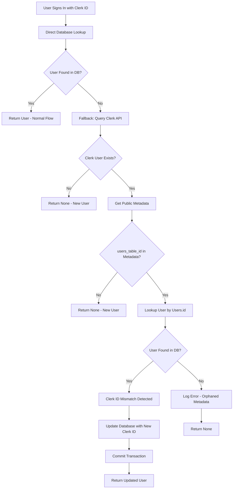
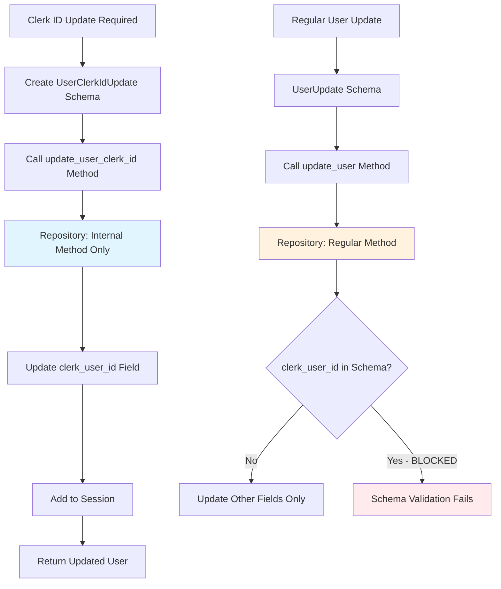
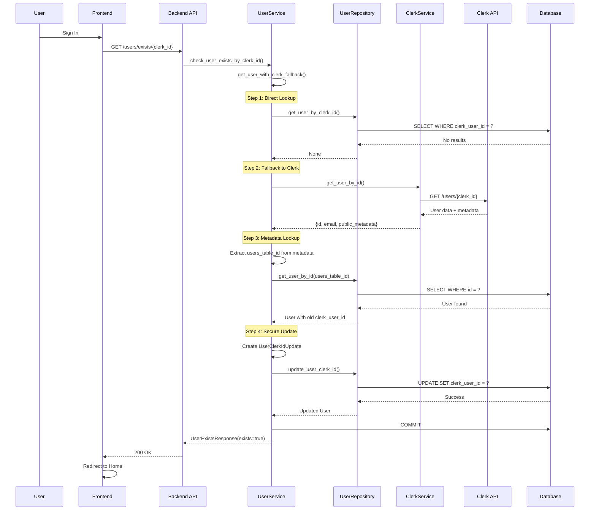
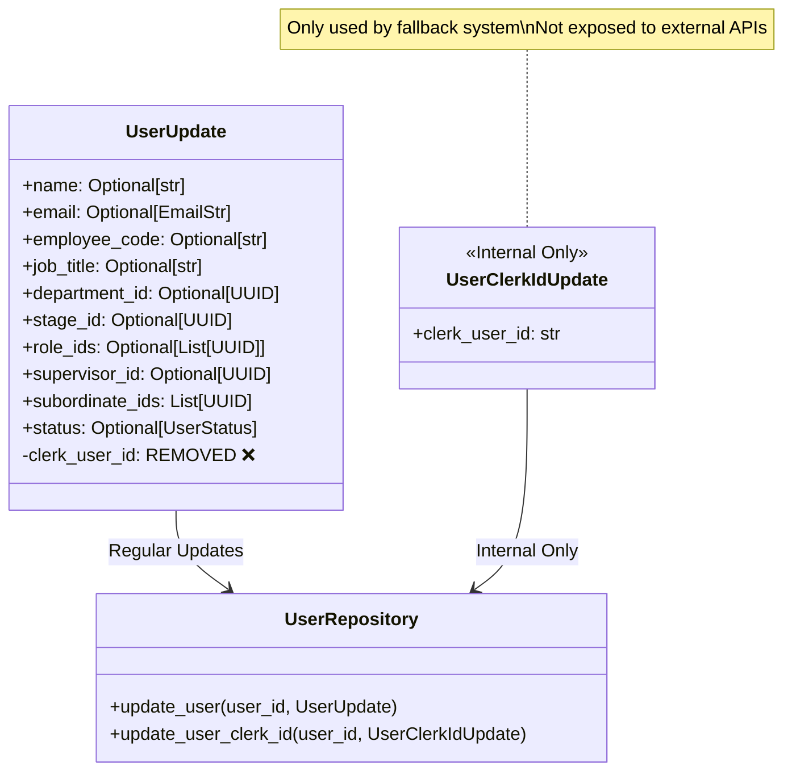
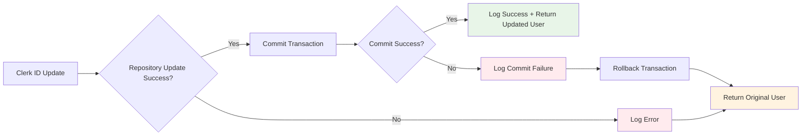

## Authentication Bypass Logic Implementation

Updated: 2025-07-30
latest PR: 

### Overview
The authentication bypass logic handles scenarios where Clerk User IDs change (ID renewal), ensuring existing users are not treated as new users. This system uses Clerk's public metadata as a fallback lookup mechanism.

### Core Components

#### 1. Enhanced User Lookup System

#### 2. Database Update Security Flow

#### 3. Authentication Flow with Bypass

#### 4. Schema Security Architecture

### Implementation Details

#### Security Measures
1. **Schema Separation**: `clerk_user_id` removed from `UserUpdate` schema
2. **Internal Method**: `update_user_clerk_id()` only accessible by fallback system
3. **Dedicated Schema**: `UserClerkIdUpdate` for internal clerk ID updates only
4. **Transaction Safety**: All updates wrapped in database transactions
5. **Audit Trail**: Comprehensive logging of all clerk ID changes

#### Error Handling

#### Metadata Management
- **Storage**: Users.id stored in Clerk's `public_metadata.users_table_id`
- **Creation**: Set during user profile completion
- **Usage**: Fallback lookup when clerk_user_id changes
- **Security**: Public metadata (read-only for users)

### Testing Strategy
1. **Unit Tests**: Mock Clerk API responses and database operations
2. **Integration Tests**: End-to-end authentication flow testing
3. **Security Tests**: Verify clerk_user_id cannot be updated via regular APIs
4. **Edge Cases**: Handle network failures, invalid metadata, orphaned records

### Monitoring and Alerting
- **Metrics**: Clerk ID mismatch detection frequency
- **Logs**: All fallback activations with old/new clerk IDs
- **Alerts**: Failed clerk ID updates, orphaned metadata
- **Performance**: Fallback system usage patterns

---

*This implementation plan addresses the architectural issues and provides a robust solution for handling Clerk ID changes while maintaining data integrity.*