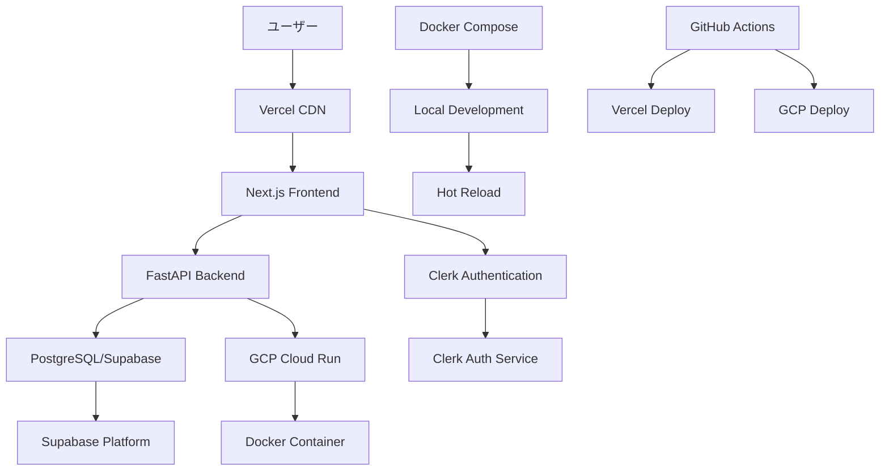

<!-- docs/requirement-definition/02-tech/01-tech-overview.md -->
# 技術スタック概要

## リビジョン履歴

| バージョン | 日付 | 変更者 | 変更内容 | 承認状況 | 承認者 | 次回レビュー予定 |
|------------|------|--------|----------|----------|--------|------------------|
| v1.0 | 2025-07-15 | 有野嵐 | 初版作成 | 🔄 レビュー中 | 大野司 | 2025-08-15 |
| - | - | - | - | - | - | - |
| - | - | - | - | - | - | - |

## 1. システム全体構成図



## 2. 技術スタック

### 2.1 フロントエンド
- **メインフレームワーク**: Next.js 14 (App Router)
  - 理由: SSR/SSG対応、SEO最適化、優れた開発体験
- **言語**: TypeScript
  - 理由: 型安全性、大規模開発の保守性向上
- **UIライブラリ**: shadcn/ui + Tailwind CSS
  - 理由: モダンなデザインシステム、カスタマイズ性、高い生産性

### 2.2 バックエンド
- **メインフレームワーク**: FastAPI
  - 理由: 高速な開発、自動API文書生成、型ヒント対応
- **言語**: Python 3.12
  - 理由: 開発効率、豊富なライブラリ、AI機能統合の容易さ
- **API仕様**: OpenAPI 3.0 (自動生成)
  - 理由: 標準化されたAPI文書、フロントエンドとの連携効率化

### 2.3 データベース・ストレージ
- **データベース**: PostgreSQL (Supabase)
  - 理由: ACID特性、複雑なクエリ対応、JSON型サポート
- **ストレージ**: Supabase Storage
  - 理由: データベースとの統合、簡単なファイル管理

### 2.4 認証・認可
- **認証システム**: Clerk
  - 理由: 簡単な実装、多要素認証対応、優れたUX

### 2.5 インフラ
- **フロントエンド**: Vercel
  - 理由: Next.js最適化、自動デプロイ、グローバルCDN
- **バックエンド**: Google Cloud Platform (Cloud Run)
  - 理由: サーバーレス、オートスケーリング、コスト効率
- **コンテナ技術**: Docker
  - 理由: 環境の一貫性、デプロイの簡素化
- **CI/CD**: GitHub Actions
  - 理由: GitHub統合、無料枠、豊富なエコシステム

## 3. 開発環境

### 3.1 ローカル開発構成
```
┌─────────────────────────────────────────────────────┐
│                Docker Compose                       │
├─────────────────────────────────────────────────────┤
│  ┌─────────────────┐  ┌─────────────────────────────┐│
│  │   Frontend      │  │         Backend             ││
│  │  (Next.js)      │  │       (FastAPI)             ││
│  │  Port: 3000     │  │       Port: 8000            ││
│  └─────────────────┘  └─────────────────────────────┘│
│           │                      │                   │
│           └──────────────────────┼───────────────────┘
│                                  │
│  ┌─────────────────────────────────────────────────┐ │
│  │            PostgreSQL                           │ │
│  │            Port: 5432                           │ │
│  └─────────────────────────────────────────────────┘ │
└─────────────────────────────────────────────────────┘
```

### 3.2 開発ツール
- **IDE**: VS Code (推奨)
- **パッケージ管理**: npm/yarn (Frontend), pip (Backend)
- **コード品質**: ESLint, Prettier (Frontend), Ruff, mypy (Backend)
- **テストツール**: Jest, Playwright (Frontend), pytest (Backend)

## 4. 本番環境構成

```
┌─────────────────────────────────────────────────────┐
│                   Internet                          │
└─────────────────────┬───────────────────────────────┘
                      │
┌─────────────────────▼───────────────────────────────┐
│                Vercel CDN                           │
│            (Next.js Frontend)                       │
└─────────────────────┬───────────────────────────────┘
                      │
┌─────────────────────▼───────────────────────────────┐
│                  Clerk Auth                         │
└─────────────────────┬───────────────────────────────┘
                      │
┌─────────────────────▼───────────────────────────────┐
│              GCP Cloud Run                          │
│            (FastAPI Backend)                        │
└─────────────────────┬───────────────────────────────┘
                      │
┌─────────────────────▼───────────────────────────────┐
│              Supabase Platform                      │
│         (PostgreSQL + Storage)                      │
└─────────────────────────────────────────────────────┘
```

## 5. データフロー

### 5.1 ユーザー認証フロー
1. ユーザーがフロントエンドでログインボタンをクリック
2. Clerkの認証画面にリダイレクト
3. 認証成功後、JWTトークンを取得
4. フロントエンドでトークンを保存
5. バックエンドAPIリクエスト時にトークンを送信
6. バックエンドでトークンを検証

### 5.2 評価データ処理フロー
1. フロントエンドで評価データを入力
2. バックエンドAPIに評価データを送信
3. バックエンドでデータバリデーション
4. PostgreSQLに評価データを保存
5. 必要に応じてAI評価処理を実行
6. 結果をフロントエンドに返却

## 6. セキュリティ

### 6.1 認証・認可
- **認証方式**: JWT (Clerk提供)
- **認可方式**: ロールベースアクセス制御 (RBAC)

### 6.2 通信・データ保護
- **通信暗号化**: HTTPS (TLS 1.3)
- **データ保護**: PostgreSQL暗号化、Supabase RLS
- **入力検証**: Pydantic バリデーション、フロントエンド検証

## 7. 外部システム連携

### 7.1 Clerk認証サービス
- **連携方式**: REST API + JWT
- **同期頻度**: リアルタイム
- **データ形式**: JSON

### 7.2 AI評価サービス (将来実装)
- **連携方式**: REST API
- **同期頻度**: 評価提出時
- **データ形式**: JSON

## 8. 監視・運用

### 8.1 監視
- **システム監視**: Vercel Analytics, GCP Monitoring
- **ログ管理**: GCP Cloud Logging
- **エラー監視**: Sentry (予定)

### 8.2 運用
- **デプロイ方式**: Git push による自動デプロイ
- **バックアップ**: Supabase 自動バックアップ
- **障害対応**: GitHub Issues によるトラッキング

---

**この技術スタック概要は、開発チームの技術選択指針として活用する。**